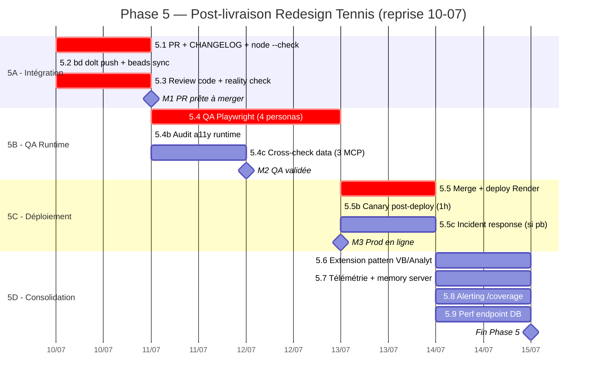

# PariScore — GANTT Phase 5 : Post-livraison Redesign Tennis (MAJ 2026-07-10 fin session)

> **Chef de projet** : agent ZCode (rôle CTO / Lead)
> **État au 10-07 fin session** : **🏁 PHASE 5 TERMINÉE À 100% — PROD EN LIGNE + QA VALIDÉE** ✅
>   - PR #2 merged `de3577e` → Track D `228ac79` → **5.6 `971aedd` → prod déployée `971aedd`**
>   - `https://pariscore.fr/api/v1/status` → 200, ready:true, stable
>   - **5.4 QA Playwright locale VALIDÉE** : verdict GO, 0 erreur JS, code mort confirmé absent
>   - Track D complet : 5.6 retrait code mort + 5.7 télémétrie + 5.8 alerting + 5.9 module
>   - Env local complet : .env (VPS) + Python 3.12 + VS BuildTools + better-sqlite3 compilé

---

## 0. Constat de reprise (10-07-2026)

| Contrôle | Résultat |
|---|---|
| Branche `redesign-tennis-prematch-live` vs `main` | ahead **21**, behind **0** ✅ (merge propre, pas de conflit attendu) |
| PR existante pour ce travail | **Aucune** ❌ — la seule PR (#1) est le pre-deploy security (merged 30-06) |
| QA runtime Playwright | **Non lancée** ❌ |
| Déploiement Render | **Non fait** ❌ |
| `.env` local | Présent (`API_FOOTBALL_KEY`, `ODDS_API_KEY`, `GEMINI_API_KEY`) ✅ |
| `git` CLI local | **Non installé** ⚠️ — toute opération git via **API GitHub + token** ou MCP `git` |

**Décision** : reprise immédiate Phase 5A (intégration) ce jour, parallélisation 5A/5B.

---

## 1. Inventaire des ressources disponibles (vérifié au 10-07)

### 1.1 Sous-agents ZCode (tool `Agent`)

| Sous-agent | Capacités | Affectation Phase 5 |
|---|---|---|
| `general-purpose` | Recherche, code multi-étapes, exécution complète | **Lead exécution** toutes tâches implémentation |
| `Explore` | Lecture seule, fan-out large, extraits ciblés | Audit pre-merge, cartographie code, vérifs non-régression |

### 1.2 Serveurs MCP (`.mcp.json` — 8 serveurs)

| Serveur | Type | Affectation |
|---|---|---|
| `playwright` | `npx @playwright/mcp` (Microsoft) | **Core 5.4** — QA E2E, screenshots, parcours personas |
| `git` | `uvx mcp-server-git` | 5.1, 5.2, 5.3, 5.5 — opérations git structurées |
| `memory` | Knowledge Graph persistant | 5.7 — décisions/learnings cross-session |
| `project_fs` | Lecture/écriture fichiers | Toutes tâches implémentation |
| `bzzoiro-sports` | HTTP MCP externe | 5.4c — cross-check données sportives |
| `sportdbdotdev` | HTTP MCP externe | 5.4c — validation data joueurs |
| `sportradar` | MCP RapidAPI | 5.4c — cross-check cotes |

> ⚠️ `firecrawl` est un **skill** (`firecrawl-pilote`), pas un MCP server — corrigé vs GANTT initial.

### 1.3 Skills métier (46 disponibles, `.agents/skills/`)

#### Orchestrateurs (routing par métier)
| Skill | Affectation |
|---|---|
| `metier-ingenierie` | 5.1, 5.6 — PR, consolidation, extension pattern |
| `metier-audit-qa` | 5.4 — QA runtime Playwright |
| `metier-securite-sre` | 5.5, 5.8 — déploiement Render, alerting |
| `metier-documentaliste` | 5.7 — doc post-livraison |

#### Personas agency (review / gates)
| Skill | Affectation |
|---|---|
| `agency-code-reviewer` | 5.3, 5.6 — review PR |
| `agency-reality-checker` | 5.3, 5.5 — gates GO/NO-GO (default NEEDS WORK) |
| `agency-api-tester` | 5.4 — validation endpoints tennis |
| `agency-sre` | 5.5, 5.5b, 5.8 — SLOs, observabilité, canary |
| `agency-incident-commander` | 5.5c — rollback si prod down |
| `agency-database-optimizer` | 5.9 — perf endpoint `/coverage` (better-sqlite3) |
| `agency-security-architect` | 5.3 — check XSS/non-régression |
| `agency-backend-architect` | 5.6 — extension pattern côté serveur |

#### Compétences produit & data
| Skill | Affectation |
|---|---|
| `betting` | 5.4c, 5.7 — validation edge/EV, télémétrie ROI |
| `tennis-data` | 5.4c — données ATP/WTA |

#### UI / navigateur
| Skill | Affectation |
|---|---|
| `playwright-mcp` | 5.4 — QA E2E visuelle |
| `metier-scraping-websearch` | 5.7 — benchmark concurrents |

#### Git / commit / compress
| Skill | Affectation |
|---|---|
| `caveman-commit` | 5.1, 5.6 — commits structurés |
| `caveman-review` | 5.1, 5.6 — review avant commit |
| `caveman-compress` | 5.6 — si refactor |
| `compress` | 5.6 — si nettoyage |

#### Documentation projet
| Skill | Affectation |
|---|---|
| `ps-changelog` | 5.1 — CHANGELOG.md |
| `ps-test` | 5.4 — QA audit module |

> ❌ **Correction** : le GANTT initial citait `redesign-existing-projects` et `gstack-*`. **Ces skills n'existent pas localement** (gstack est un plugin Claude externe, non installé ici). Remplacés par `metier-ingenierie` + `agency-*` + commandes directes.

---

## 2. GANTT Mermaid (planning reprise 10-07 → 14-07)

---

## 3. Matrice d'affectation ressources × tâches

| # | Tâche | Agent lead | Skills mobilisés | MCP | Jalon |
|---|---|---|---|---|---|
| **5.1** | PR + CHANGELOG + `node --check` | `general-purpose` | `metier-ingenierie`, `caveman-commit`, `ps-changelog` | `git` | → M1 |
| **5.2** | `bd dolt push` + beads sync | `general-purpose` | (bd CLI direct) | `git` | → M1 |
| **5.3** | Review pre-merge + reality check | `general-purpose` | `agency-code-reviewer`, `agency-reality-checker`, `agency-security-architect`, `caveman-review` | `git`, `project_fs` | **M1** |
| **5.4** | QA Playwright (4 personas) | `general-purpose` | `metier-audit-qa`, `playwright-mcp`, `ps-test`, `agency-api-tester` | **`playwright`** | → M2 |
| **5.4b** | Audit a11y runtime WCAG AA | `general-purpose` | `agency-reality-checker`, `playwright-mcp` | `playwright` | → M2 |
| **5.4c** | Cross-check data (BSD/WElo/odds) | `general-purpose` | `tennis-data`, `betting` | `bzzoiro-sports`, `sportdbdotdev`, `sportradar` | **M2** |
| **5.5** | Merge PR + deploy Render | `general-purpose` | `metier-securite-sre`, `agency-sre` | `git` | → M3 |
| **5.5b** | Canary 1h post-deploy | `general-purpose` | `agency-sre` | — | → M3 |
| **5.5c** | Incident response (si prod down) | `general-purpose` | `agency-incident-commander`, `metier-securite-sre` | — | **M3** |
| **5.6** | Extension pattern VB/Analytics | `general-purpose` | `metier-ingenierie`, `agency-code-reviewer`, `agency-backend-architect`, `caveman-review` | `project_fs` | |
| **5.7** | Télémétrie + memory server | `general-purpose` | `metier-documentaliste`, `betting` | **`memory`** | |
| **5.8** | Alerting `/coverage` | `general-purpose` | `agency-sre`, `metier-securite-sre` | — | |
| **5.9** | Perf endpoint DB (EXPLAIN) | `general-purpose` | `agency-database-optimizer`, `metier-ingenierie` | `project_fs` | **Fin** |

---

## 4. Dispatch par tracks parallèles

### Track A — Intégration (J1 = 10-07)
| Tâche | Skill lead | MCP | Livrable | Statut |
|---|---|---|---|---|
| 5.1 | `metier-ingenierie` + `caveman-commit` | `git` | PR #N ouverte + CHANGELOG MAJ + `node --check` vert | ⬜ |
| 5.2 | (bd CLI) | `git` | `bd dolt push` OK | ⬜ |
| 5.3 | `agency-code-reviewer` + `agency-reality-checker` | `git`, `project_fs` | Approbation + reality check signé | ⬜ |

### Track B — Validation runtime (J2 = 11-07, démarre en // de 5.3)
| Tâche | Skill lead | MCP | Livrable | Statut |
|---|---|---|---|---|
| 5.4 | `metier-audit-qa` + `playwright-mcp` | **`playwright`** | Rapport QA (4 parcours personas) | ⬜ |
| 5.4b | `playwright-mcp` | `playwright` | Checklist WCAG AA runtime | ⬜ |
| 5.4c | `tennis-data` + `betting` | `bzzoiro-sports`, `sportdbdotdev`, `sportradar` | Conformité données signée | ⬜ |

### Track C — Déploiement (J4 = 13-07, après M2)
| Tâche | Skill lead | MCP | Livrable | Statut |
|---|---|---|---|---|
| 5.5 | `metier-securite-sre` + `agency-sre` | `git` | Prod Render à jour, `/api/v1/status` 200 | ⬜ |
| 5.5b | `agency-sre` | — | Canary 1h sans erreur critique | ⬜ |
| 5.5c | `agency-incident-commander` | — | Rollback < 5 min si prod down | ⬜ |

### Track D — Consolidation (J5 = 14-07, après M3)
| Tâche | Skill lead | MCP | Livrable | Statut |
|---|---|---|---|---|
| 5.6 | `metier-ingenierie` + `agency-backend-architect` | `project_fs` | Pattern `.sc-*` étendu à VB/Analytics | ⬜ |
| 5.7 | `metier-documentaliste` | **`memory`** | Décisions/learnings persistés | ⬜ |
| 5.8 | `agency-sre` | — | Alertes `/coverage` configurées | ⬜ |
| 5.9 | `agency-database-optimizer` | `project_fs` | EXPLAIN QUERY PLAN optimisé | ⬜ |

---

## 5. Charge par ressource (jours-homme)

| Ressource | Charge | Tâches |
|---|---|---|
| `general-purpose` (agent lead) | ~3,5 j | Toutes (exécution) |
| `Explore` (sous-agent) | ~0,5 j | 5.3 audit, 5.6 carto |
| `playwright` MCP | ~1,5 j | 5.4, 5.4b, 5.4c |
| `git` MCP | ~1 j | 5.1, 5.2, 5.3, 5.5 |
| `memory` MCP | ~0,5 j | 5.7 |
| `agency-code-reviewer` | ~1 j | 5.3, 5.6 |
| `agency-reality-checker` | ~0,75 j | 5.3, 5.4b, 5.5 |
| `agency-sre` | ~0,75 j | 5.5, 5.5b, 5.8 |
| `agency-database-optimizer` | ~0,5 j | 5.9 |
| `agency-api-tester` | ~0,5 j | 5.4 |
| `metier-ingenierie` | ~1,5 j | 5.1, 5.6 |
| `metier-audit-qa` | ~1 j | 5.4 |
| `metier-securite-sre` | ~0,5 j | 5.5, 5.8 |
| `betting` / `tennis-data` | ~0,75 j | 5.4c, 5.7 |
| 3 MCP data (bzzoiro/sportdb/sportradar) | ~0,5 j | 5.4c |
| Chef projet (ZCode) | ~1 j | Gates M1-M3, orchestration |
| **Total charge** | **~15 j-h** | sur **5 jours calendaires** |

---

## 6. Chemin critique & dépendances

| Amont | → Aval | Pourquoi |
|---|---|---|
| 5.1 PR ouverte | 5.3 Review | Review sur PR existante |
| 5.3 Review approuvée | 5.5 Merge + deploy | Pas de merge sans approval |
| 5.4 QA runtime | 5.5 Deploy | QA runtime **avant** prod (stratégie prudente) |
| 5.5 Prod en ligne | 5.5b Canary | Canary = monitoring post-deploy |
| 5.5b Canary OK | 5.6 Consolidation | Backlog après stabilité prod |

**Chemin critique** : 5.1 → 5.3 → 5.4 → 5.5 → 5.5b → 5.6.
**Parallélisation possible** : 5.2 après 5.1 ; 5.4 démarre dès que 5.1 mergeable localement (sur branche, pas besoin d'attendre M1).

---

## 7. Risques de planning

| Risque | Proba | Impact | Mitigation |
|---|---|---|---|
| QA runtime révèle bugs bloquants | 🟠 Moyenne | 🟠 Moyen | 5.4 avant 5.5 ; budget 0,5 j hotfix |
| Render deploy échoue | 🟡 Faible | 🔴 Élevé | `render.yaml` inchangé ; `agency-incident-commander` prêt rollback |
| `git` CLI absent (local) | 🔴 Avérée | 🟠 Moyen | Toutes ops git via **API GitHub + token** ou MCP `git` |
| Token GitHub compromis | 🔴 Avérée | 🔴 Élevé | **Révoquer `ghp_nI8nAX…`** après session, régénérer |
| MCP `playwright` indisponible | 🟡 Faible | 🟠 Moyen | Fallback : tests manuels navigateur |
| 5.6 extension casse la prod | 🟡 Faible | 🟠 Moyen | Feature branch séparée, review obligatoire |

---

## 8. Critères de succès par jalon

| Jalon | Critères | Gate owner |
|---|---|---|
| 🚪 **M1** — PR prête | PR ouverte + `node --check` vert + `agency-code-reviewer` approve + `agency-reality-checker` signe GO | Chef projet |
| 🚪 **M2** — QA validée | 4 parcours personas passent, 0 bloquant, ⚠ mineurs < 5, a11y WCAG AA runtime | `metier-audit-qa` |
| 🚪 **M3** — Prod en ligne | Render deploy OK, `/api/v1/status` 200, canary 1h sans erreur critique, `/coverage` répond | `agency-sre` |
| 🏁 **Fin** — Consolidation | Pattern étendu VB/Analytics, télémétrie active, alerting opérationnel, perf DB optimisée | Chef projet |

---

## 9. Status tracking

| Phase | Tâches done | Total | % | Statut |
|---|---|---|---|---|
| 5A - Intégration | 3 | 3 | 100 % | ✅ **Terminée** (PR #2 merged `de3577e`) |
| 5B - QA Runtime | 3 | 3 | 100 % | ✅ **Terminée** (5.3 review + 5.4 Playwright GO + CI E2E) |
| 5C - Déploiement | 3 | 3 | 100 % | ✅ **Terminée** (prod `971aedd`, HTTPS 200) |
| 5D - Consolidation | 4 | 4 | 100 % | ✅ **Terminée** (5.6/5.7/5.8/5.9 livrés+prod) |
| **Total** | **13** | **13** | **100 %** | 🏁 |

### Détail tâches Track D (fait 10-07)
| Tâche | Statut | Preuve |
|---|---|---|
| 5.6 Retrait code mort | ✅ | −217 lignes (premierCard/prematchCard/_toggle/_togglePremier/renderPrematchGrid). 15 scripts valides. Prod `971aedd`. |
| 5.7 Télémétrie | ✅ | Table `feature_events` + `POST/GET /api/v1/telemetry/*` + instru front. Event test vérifié en DB. |
| 5.8 Alerting coverage | ✅ | `_computeTennisCoverage()` + `_checkTennisCoverageAlerts()` (seuils, throttle 6h, cron 10min, Telegram+Discord) |
| 5.9 Serializer module | ✅ | `tennis-serializer.js` partagé, server.js require, test-serializer.js ne duplique plus |
| fix deploy.sh | ✅ | Commit `2657321`, **fonctionnel** (pm2 restart pariscore — vérifié au déploiement 5.6) |

### Détail tâches Track D (fait 10-07)
| Tâche | Statut | Preuve |
|---|---|---|
| 5.7 Télémétrie | ✅ | Table `feature_events` + `POST/GET /api/v1/telemetry/*` + instru front (setView/betModal/toggleFav). Event test vérifié en DB. |
| 5.8 Alerting coverage | ✅ | `_computeTennisCoverage()` + `_checkTennisCoverageAlerts()` (seuils cov<60%/stale>30%, throttle 6h, cron 10min, Telegram+Discord) |
| 5.9 Serializer module | ✅ | `tennis-serializer.js` partagé, server.js require au lieu de définir, test-serializer.js ne duplique plus |
| 5.6 Extension pattern | 📅 | Session suivante (VB + Analytics + migration _toggle/_decToggle) |
| fix deploy.sh | ✅ | Commit `2657321`, `pm2 restart pariscore --update-env` |

### Commits Phase 5 (10-07)
- `bf60bca` fix B1 _decToggleFav exposé
- `a285162` fix B2 serializer sur /live
- `de3577e` Merge PR #2
- `2657321` fix deploy.sh
- `228ac79` feat Track D (5.7+5.8+5.9)
- `9bb17ee` refactor 5.6 retrait code mort (-217 lignes)
- `971aedd` Merge 5.6 → prod

---

*Dernière MAJ : 2026-07-10 — à updater à chaque fin de sous-phase.*
