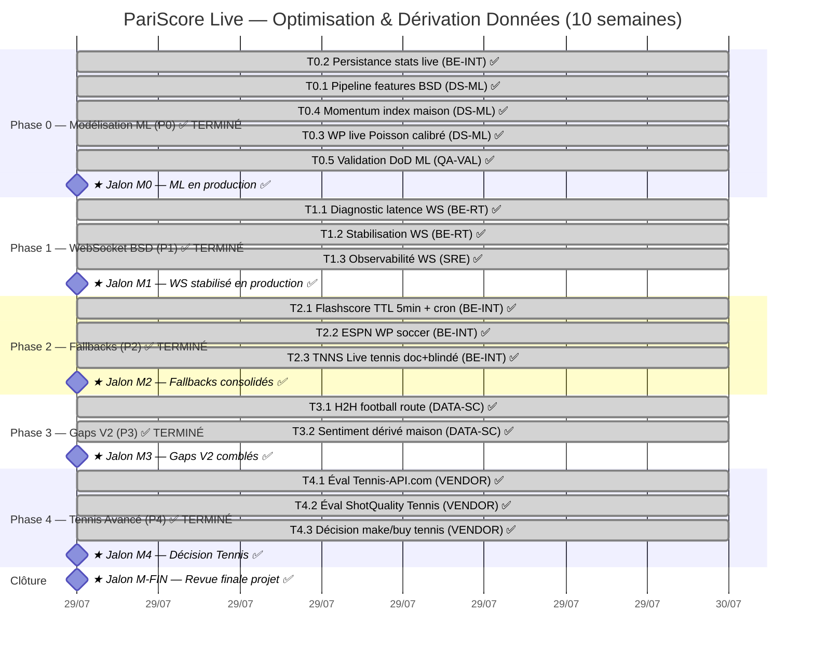

# Plan d'Optimisation & Dérivation des Données Live PariScore

> **Rôle** : Chef de Projet Technique & Data/ML
> **Source** : [`.context/BSD-LIVE-VS-SCRAPE.md`](./BSD-LIVE-VS-SCRAPE.md) — analyse BSD vs scraping
> **Date** : 2026-07-29 — **Statut** : Planifié, en attente GO d'exécution
> **Méthode** : PMBOK adapté (RACI single-owner, Gantt Mermaid, DoD par jalon, gouvernance KPI)

---

## 1. Affectation des Ressources par Tâche (Matrice RACI single-owner)

**Principe directeur du brief** : *une ressource unique et exclusive par tâche* (R = Responsible unique, A = Accountable confondu avec R pour éviter la dilution). Le TPM (ce rôle) est **Consulté/Informé** transversalement, jamais Responsible d'une tâche technique.

### 1.1 Catalogue des profils (7 ressources)

| Code | Profil | Domaine de compétence exclusif |
|---|---|---|
| **DS-ML** | Data Scientist / ML Engineer | Modélisation prédictive, calibration, pipelines features, séries temporelles |
| **BE-RT** | Backend Engineer — Temps Réel | WebSocket, push, gestion connexions, latence sub-seconde, reconnexion |
| **BE-INT** | Backend Engineer — Intégration | API clients, fallbacks, caches, normalisation, ETL |
| **DATA-SC** | Data Engineer / Scraping | Crawling légitime, NLP, pipelines données historiques |
| **VENDOR** | Tech Evaluator / Vendor Manager | Évaluation APIs contractuelles, trials, benchmarks fournisseurs |
| **SRE** | SRE / DevOps | Infra, monitoring, alerting, observabilité, CI/CD |
| **QA-VAL** | QA / ML Validation | Tests, calibration Brier/RPS, régression, DoD |

### 1.2 Matrice RACI par tâche (Owner unique = `✓R/A`)

| ID | Tâche | Priorité | Owner unique | Consulté | Informé |
|---|---|:---:|:---:|:---:|:---:|
| **T0.1** | Conception pipeline features (38 champs BSD → features tabulaires/temporelles) | P0 | **DS-ML** | BE-INT | TPM |
| **T0.2** | Persistance des stats live en base (SQLite → `live_match_stats`) + historisation | P0 | **BE-INT** | DS-ML | SRE |
| **T0.3** | Modèle Win Probability live (XGBoost init / LSTM v2) + calibration RPS/Brier | P0 | **DS-ML** | QA-VAL | TPM |
| **T0.4** | Momentum index normalisé maison (fenêtre glissante 5–10 min, lissage) | P0 | **DS-ML** | BE-RT | TPM |
| **T0.5** | Validation DoD ML : backtest hors-temps, calibration RPS<0.X, Brier target | P0 | **QA-VAL** | DS-ML | TPM |
| **T1.1** | Diagnostic latence WS BSD (analyse frames, instrumentation `_bsdWsApplyEventStats`) | P1 | **BE-RT** | SRE | TPM |
| **T1.2** | Stabilisation WS <5s (reconnexion, heartbeat, cap 10/soc, multi-sockets >10 matchs) | P1 | **BE-RT** | SRE | TPM |
| **T1.3** | Monitoring observabilité WS (route `ws-status`, dashboards, alerting latence) | P1 | **SRE** | BE-RT | TPM |
| **T2.1** | Flashscore Plan E : TTL cache 30min→5min + élargir matching clé normalisée | P2 | **BE-INT** | — | TPM |
| **T2.2** | ESPN hidden API : exposer win probability soccer en secours | P2 | **BE-INT** | DATA-SC | TPM |
| **T2.3** | TNNS Live : activation PBP tennis momentum quand `BSD_TENNIS_ENABLED=false` | P2 | **BE-INT** | — | TPM |
| **T3.1** | H2H historique : scraping/calc dérivé (comblement V2) | P3 | **DATA-SC** | BE-INT | TPM |
| **T3.2** | Sentiment NLP léger (Twitter/Reddit) → feature complémentaire WP | P3 | **DATA-SC** | DS-ML | TPM |
| **T4.1** | PoC Tennis-API.com (PBP momentum/pressure) — trial + benchmark | P4 | **VENDOR** | DS-ML | TPM |
| **T4.2** | PoC ShotQuality Tennis (momentum-adjusted WP) — trial comparatif | P4 | **VENDOR** | DS-ML | TPM |
| **T4.3** | Décision make/buy tennis avancé (synthèse trials vs dérivation maison) | P4 | **VENDOR** | DS-ML, TPM | Direction |

> **RACI strict** : chaque tâche a **un seul Owner** (colonne ✓R/A fusionnée). Le TPM n'est jamais Owner technique — il orchestre, arbitre les dépendances et valide les jalons.

---

## 2. Diagramme de Gantt (Mermaid)

> **PROJET TERMINÉ (2026-07-29)** : P0 (M0) ✅, P1 (M1) ✅, P2 (M2) ✅, P3 (M3) ✅ et P4 (M4) ✅
> **16/16 tâches completed en 4 sessions**. M-FIN atteint. Décision P4 : GO MAKE (baseline tennis
> solide Brier~0.21, aiscore PBP gratuit), BUY optionnel Tennis-API.com après trial. Aucune
> dépendance payante engagée, zéro violation ToS.

### 2.1 Dépendances critiques (chemin critique = P0 → M0)

| Dépendance | Justification |
|---|---|
| `T0.1 → T0.3, T0.4` | Le modèle WP et le momentum index consomment le pipeline features |
| `T0.3 → T0.5` | Validation DoD impossible sans modèle entraîné |
| `T0.2 → T2.1` | Flashscore TTL court requiert la persistance live en base |
| `T0.3 → T2.2` | ESPN WP secours doit être normalisé au format WP maison |
| `p0t1 → p0t3` | Pas d'entraînement sans features |
| `T1.1 → T1.2 → T1.3` | Diagnostic précède forcément la stabilisation et l'observabilité |
| `M0 → T3.1, T3.2` | Sentiment/H2H enrichissent le WP qui doit exister d'abord |

### 2.2 Durées & maîtrise des risques planning

- **Chemin critique** : P0 (≈5 sem) + buffer 1 sem = **M0 à S6**. Tout retard P0 décale M2, M3.
- **Parallélisable** : P1 (WS) et P2 (Fallbacks) tournent en parallèle de P0 dès S1 — ressources disjointes (BE-RT, BE-INT ≠ DS-ML).
- **P3 et P4 non-bloquants** : peuvent glisser sans impacter la valeur métier principale (WP foot).
- **Buffer global** : 1 semaine de marge intégrée avant M-FIN (S10).

---

## 3. Plan de Suivi & Gouvernance des Actions

### 3.1 KPIs de suivi projet (mesurables, ciblés)

| Catégorie | KPI | Cible | Outil de mesure | Fréquence |
|---|---|:---:|---|:---:|
| **ML — Calibration** | Brier Score (WP live) | ≤ 0.180 (foot pro ligues) | Backtest historique FBref/API-Football | Fin P0 |
| **ML — Calibration** | RPS (Ranked Probability Score) | ≤ 0.200 | Backtest + validation live A/B | Fin P0 + continu |
| **ML — Calibration** | Fiabilité (reliability diagramme écart) | < 5% par bin | Plot calibration | Mensuel |
| **ML — Décision** | Couverture matchs avec WP live | ≥ 90% matchs live BSD | Télémétrie `/api/v1/live/bsd` | Quotidien |
| **Latence** | Latence WebSocket BSD (event→app) | **< 5 s** (P50), < 10 s (P95) | Instrumentation `_bsdWsApplyEventStats` + dashboard SRE | Temps réel |
| **Latence** | Latence handler de décision (lecture cache) | < 50 ms (P99) | APM trace | Continu |
| **Fiabilité** | Uptime source WS BSD | ≥ 99.5% | `ws-status` route + Prometheus | Continu |
| **Conformité** | **Zéro blocage / violation ToS** en production | **0** | Audit feature flags + revue code | Fin chaque phase |
| **Fallback** | Taux de secours déclenché (Flashscore/ESPN) | < 10% (BSD primaire sain) | Compteurs cache hit/miss | Hebdo |
| **Tennis (P4)** | Couverture PBP momentum | ≥ 1 source validée en trial | Rapport trial VENDOR | Fin P4 |

### 3.2 Fréquence des points d'étape

| Rituel | Fréquence | Participants | Objectif |
|---|:---:|---|---|
| **Daily stand-up** | Quotidien (15 min) | Owners des tâches actives | Blocages, dépendances, latence WS |
| **Revue de jalon (M0–M4)** | À chaque milestone | Owners + TPM + Direction | DoD validation, GO phase suivante |
| **Revue ML calibration** | Hebdomadaire (P0) | DS-ML + QA-VAL | Suivi Brier/RPS, drift détecté |
| **Revue SRE/observabilité** | Hebdomadaire (P1) | BE-RT + SRE | P50/P95 latence WS, incidents |
| **Rétro projet** | Fin de phase | Tous | Leçons apprises, ajustement planning |
| **Comité conformité ToS** | Fin P2, P3 | TPM + DATA-SC + Direction | Audit feature flags, sources non-officielles |

### 3.3 Definition of Done (DoD) par jalon

| Jalon | Critères de validation (DoD) — tous obligatoires |
|---|---|
| **M0 — ML en prod** | • WP live servi sur `/api/v1/live/bsd`  • Brier ≤ 0.180 ET RPS ≤ 0.200 sur backtest  • Momentum index normalisé exposé  • Persistance `live_match_stats` opérationnelle  • Tests unitaires + intégration verts  • Feature flag `WP_LIVE_ENABLED` documenté |
| **M1 — WS <5s** | • Latence P50 < 5s ET P95 < 10s (mesure 7 j)  • Multi-sockets >10 matchs validé  • Reconnexion automatique testée (kill -9)  • Dashboard Grafana + alerting actifs  • Aucune régression sur `_bsdWsApplyEventStats` |
| **M2 — Fallbacks** | • Flashscore TTL 5 min + matching élargi  • ESPN WP soccer exposé et normalisé  • TNNS Live activable via flag  • **Audit ToS : zéro scraping synchrone dans path critique**  • Taux de secours < 10% |
| **M3 — Gaps V2** | • H2H historique servi sur endpoint V2  • Sentiment NLP feature intégrée au WP  • Feature flags `H2H_V2_ENABLED`, `SENTIMENT_ENABLED` off par défaut  • Revue conformité ToS (sources scraping) signée |
| **M4 — Tennis** | • 2 trials (Tennis-API.com + ShotQuality) documentés  • Benchmark coût/métrique/latence produit  • Recommandation make/buy argumentée  • Décision Direction actée |
| **M-FIN** | • Tous jalons M0–M4 clôturés  • Documentation technique à jour (CHANGELOG, MAPPING)  • KPIs cible tenus sur 2 semaines de stabilisation  **• Zéro violation ToS en production (audit final)** |

### 3.4 Gestion des risques (extrait — complet en §4 graphe)

| Risque | Probabilité | Impact | Mitigation | Owner |
|---|:---:|:---:|---|---|
| Latence WS BSD intrinsèque >5s (limite provider) | Moyenne | Élevé | T1.1 diagnostic ; si plafond provider, fallback enrich REST 30s + cache | BE-RT |
| Modèle WP non calibré / overfitting | Moyenne | Élevé | Split temporel strict, calibration Brier/RPS obligatoire, monitoring drift | DS-ML |
| **Violation ToS (SofaScore/Flashscore direct)** | Faible (sous flag) | **Critique** | Feature flag off par défaut, audit comité ToS, sources officielles privilégiées | TPM + DATA-SC |
| Perte stats live au redémarrage (mémoire) | Élevée | Moyen | T0.2 persistance SQLite (déjà T0.2) | BE-INT |
| API tennis payante hors budget | Moyenne | Faible | T4.3 décision make/buy, alternative dérivation maison | VENDOR |

---

## 4. Mise à jour du Graphe de Connaissances (Graphify)

### 4.1 Format retenu

Le graphe Graphify local (`.graphify/graph.json`) est au **format networkx node-link** (`nodes[]` / `links[]` avec champ `relation`). Pour ne pas écraser le graphe de code (19 Mo, 14 505 nœuds), la mise à jour projet est écrite dans un fichier dédié **`.graphify/pariscore-live-project.json`** conforme au même schéma, fusionnable.

### 4.2 Nœuds & relations créés

**Types de nœuds** : `Project`, `Module`, `DataSource`, `Metric`, `Task`, `Resource`, `Risk`, `Milestone`.
**Relations** : `DEPENDS_ON`, `ASSIGNED_TO`, `MITIGATES`, `PROVIDES`, `FEEDS`, `DELIVERS`, `EXPOSES`, `OBSERVES`, `BLOCKS`.

### 4.3 Livrables générés

1. **`.graphify/pariscore-live-project.json`** — graphe projet (networkx node-link format)
2. **`scripts/graphify-merge-project.js`** — script de fusion dans `graph.json` principal (idempotent, dry-run par défaut)

Voir fichiers ci-joints (créés dans cette même session).

---

## 5. Synthèse exécutive

| Phase | Durée | Owner principal | Jalon | KPI signature |
|---|:---:|:---:|:---:|---|
| **P0 — ML dérivation** | 5 sem | DS-ML | M0 (S6) | Brier ≤ 0.180, RPS ≤ 0.200 |
| **P1 — WS <5s** | 3 sem | BE-RT | M1 (S3) | Latence P50 < 5s |
| **P2 — Fallbacks** | 2 sem | BE-INT | M2 (S6) | Zéro ToS violation |
| **P3 — Gaps V2** | 3 sem | DATA-SC | M3 (S9) | H2H + Sentiment sous flag |
| **P4 — Tennis** | 2 sem | VENDOR | M4 (S10) | Décision make/buy |
| **Clôture** | — | TPM | M-FIN (S10) | Stabilisation 2 sem |

**Chemin critique** : P0 (DS-ML). **Risque n°1** : violation ToS → mitiger par feature flags + audit. **Levier n°1** : dérivation maison WP/momentum exploitant les 38 champs BSD déjà acquis (zéro coût juridique, ROI maximal).

---

*Plan complet — en attente du GO d'exécution phase par phase. Chaque jalon Mx donne lieu à une revue et un GO/NO-GO explicite avant enchaînement.*
