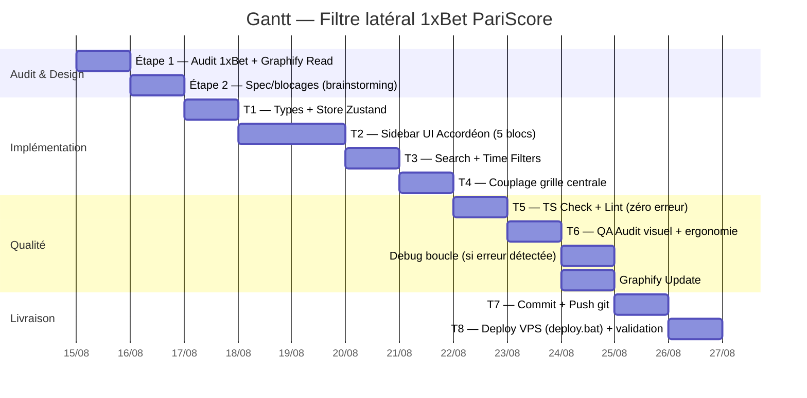

# PROMPT — Filtre latéral multi‑sports (1xBet) sur PariScore

| | |
|---|---|
| **Rôle traité** | Lead Frontend Engineer (Next.js 16, React 19, Tailwind CSS v4, shadcn/ui, Zustand) |
| **Repo** | `C:\Users\David\ZCodeProject\pariscore` |
| **Statut** | À lancer |
| **Déploiement** | `deploy.bat "msg"` (VPS) |

---

## 0. OBLIGATION DE PROCESS — SUPERMANPOWERS (PRÉALABLE À TOUT)

1. **Invoke le skill `using-superpowers` AVANT la moindre action** — avant toute lecture de code, question de cadrage ou exploration. Annonce « Using superpowers to … » puis suis-le.
2. Le skill te routera en priorité vers `brainstorming` (demande « let's build X ») : **commence PAR `superpowers:brainstorming`** et passe les gates de conception avant toute implémentation. Puis `writing-plans` pour découper le travail si la scope le justifie.
3. Applique ensuite les skills d'implémentation concernés (`frontend-design`, `testing`, `verification-before-completion`, `systematic-debugging`, etc.).

---

## 1. ÉTAPE 1 — AUDIT RÉEL DU FILTRE 1XBET (SOURCE D'INSPIRATION)

**Ouvre et analyse PRODUIT `https://1xbet.rs/en/line`** (ou `1xbet.com` selon accès) avant d'écrire la moindre ligne de code :

1. **Inspecte visuellement et structurellement** le panneau latéral gauche :
   - Barre de recherche d'équipe/championnat.
   - Filtres temporels (plages horaires : 1h, 2h, 12h, « aujourd'hui », etc.).
   - Bloc favoris / championnats populaires épinglés.
   - Arborescence multi-niveaux : **Sport → Championnat → Match** (drapeaux de pays quand présents).
   - Toggle **Live vs Avant-match (Line)**.
   - Badges de comptage de matchs, icônes de sport, densité, comportements hover/active.
2. **Documente les patterns observés** (markdown court dans `.context/` ou note de session) :
   - structure de l'arbre, comportement de repli/dépli, comportement de sélection, interactions recherche+heure, responsif mobile (drawer latéral ?).
3. **Relie au codebase PariScore via Graphify** la question suivante :
   `graphify query "filtre navigation sports latéral sidebar"` — repère les composants layout existants (`src/components/layout/Sidebar.tsx`, toute navigation sport existante), le store Zustand global, et la source de données des matchs (API routes / hook SWR/React Query) pour identifier ce qui existe déjà et ce qui est à créer. **Ne réinvente pas un composant qui existe** (consulter `COMPONENTS.md`).

---

## 2. ÉTAPE 2 — SPEC D'IMPLÉMENTATION

### 2.1 Structure et hiérarchie des données (Tree View 1xBet)

Le filtre latéral se divise en 5 blocs verticaux superposés :

1. **Barre de Recherche Rapide (Search Bar)** :
   - Champ de saisie instantané : *"Rechercher une équipe ou un championnat..."* avec bouton effacer (`✕`).
   - Filtrage dynamique en temps réel de toute l'arborescence dès la 2ème lettre tapée.

2. **Filtre Temporel (Time Range Bar)** :
   - Pills / Onglets horizontaux pour filtrer par plage d'heure de démarrage :
     `[ Tout ] [ 1h ] [ 2h ] [ 4h ] [ 6h ] [ 12h ] [ 24h ] [ Aujourd'hui ]`

3. **Section "Favoris & Top Championnats" (Pinned / Starred)** :
   - Bloc fixe en haut du filtre récapitulant les ligues majeures épinglées par l'utilisateur ou par défaut :
     - ⚽ UEFA Champions League
     - ⚽ Premier League
     - ⚽ Ligue 1
     - 🎾 Grand Slam / ATP
     - 🏀 NBA
   - Possibilité de cliquer sur l'étoile `⭐` à côté de n'importe quelle ligue pour l'ajouter/retirer des favoris.

4. **Arborescence en Accordéon Multi-Niveaux (Sports Tree)** :
   - **Niveau 1 (Sport)** : Icone du sport + Nom du sport + Badge de décompte total des matchs disponibles (ex: `Football (248)`). Flèche de déroulement (`Chevron`).
   - **Niveau 2 (Pays / Région)** : Drapeau du pays + Nom (ex: `🇫🇷 France`, `🇬🇧 Angleterre`, `🌐 International`).
   - **Niveau 3 (Championnat / Ligue)** : Nom de la compétition (ex: `Ligue 1`, `Ligue 2`, `Coupe de France`) + Badge du nombre de matchs + Étoile favori.
   - **Niveau 4 (Matchs - Optionnel sur clic)** : Liste directe des rencontres (`Équipe A vs Équipe B` + Heure du coup d'envoi).

5. **Toggle Mode Live vs Pre-Match (Line)** :
   - Commutateur en haut de barre : `[ 🔴 Live ] [ 📅 Avant-Match / Line ]`.

### 2.2 Spécifications UI / Design System (Tailwind CSS)

- **Palette de couleurs 1XBet / PariScore Dark** :
  - Background Sidebar : `bg-[#0F172A]` ou `bg-slate-900` avec bordure droite `border-r border-slate-800`.
  - Item survolé (Hover) : `hover:bg-slate-800/80` avec transition douce.
  - Item sélectionné (Active) : `bg-blue-600/20 text-blue-400 border-l-2 border-blue-500 font-semibold`.
  - Badges de décompte (Count Badge) : `bg-slate-800 text-slate-400 text-xs px-1.5 py-0.5 rounded-full font-mono`.
  - Filtre temporel actif : `bg-blue-600 text-white rounded-md text-xs font-medium`.

- **Typographie & Densité** :
  - Style compact à haute densité d'information (padding vertical réduit `py-1.5 px-2.5`).
  - Textes d'items en `text-xs font-medium text-slate-300`.

### 2.3 Modèle de données TypeScript (`src/types/sports-sidebar.ts`)

```typescript
export interface LeagueNode {
  id: string;
  name: string;
  matchCount: number;
  isFavorite?: boolean;
}

export interface CountryNode {
  id: string;
  name: string;
  countryCode: string; // Pour afficher le drapeau
  leagues: LeagueNode[];
}

export interface SportNode {
  id: string;
  name: string;
  icon: string; // Nom de l'icône Lucide (ex: 'Trophy', 'Activity', 'CircleDot')
  totalMatches: number;
  countries: CountryNode[];
}

export type TimeFilterHours = 'all' | '1h' | '2h' | '4h' | '6h' | '12h' | '24h' | 'today';
```

### 2.4 State Management (Zustand Store) — `src/stores/use-sports-sidebar-store.ts`

```typescript
interface SportsSidebarState {
  searchQuery: string;
  selectedTimeFilter: TimeFilterHours;
  expandedSports: Record<string, boolean>;
  expandedCountries: Record<string, boolean>;
  favoriteLeagueIds: string[];
  selectedLeagueId: string | null;
  selectedSportId: string | null;

  // Actions
  setSearchQuery: (query: string) => void;
  setTimeFilter: (filter: TimeFilterHours) => void;
  toggleSport: (sportId: string) => void;
  toggleCountry: (countryId: string) => void;
  toggleFavoriteLeague: (leagueId: string) => void;
  selectLeague: (leagueId: string | null) => void;
  selectSport: (sportId: string | null) => void;
}
```

**Couplage grille centrale** : connecter le store à l'URL (query params) pour que le clic sur une ligue ou un filtre temporel **mette à jour en temps réel** la grille de matchs affichée au centre de la page (réutiliser la source de données matchs existante).

---

## 3. GRAPHIFY — AVANT CHAQUE TÂCHE

**Règle : avant de commencer chaque tâche (`graphify read` d'abord, puis `graphify update` à la fin).**

- **Avant la tâche** : lire le graphe pour comprendre la zone concernée
  ```bash
  graphify query "<question architecture / composant>"
  graphify path "<A>" "<B>"     # relations entre fichiers
  graphify explain "<concept>"  # concept ciblé
  ```
- **Zone Graphify à interroger** : composants de layout, navigation sportive, stores Zustand, hooks matchs (SWR/React Query), routes API matchs.
- **À la fin de chaque tâche** : `graphify update .` si le code de la tâche a été modifié/AST modifié (gratuit, aucune API).

---

## 4. ENGINEERING LOOP (BOUCLE D'INGÉNIERIE)

Boucle itérative jusqu'à déploiement complet, ré-exécutée à chaque correction :

```
[0. Graphify Read] ➔ [1. Types & Zustand Store] ➔ [2. Sidebar UI Accordéon]
   ➔ [3. Search & Time Filters Logic] ➔ [4. Couplage grille centrale]
   ➔ [5. TypeScript Check] ➔ [6. QA Audit] ➔ [7. Graphify Update]
   ➔ [8. Commit & Push] ➔ [9. Déploiement VPS]
```

| Étape | Action | Gate de passage |
|-------|--------|-----------------|
| 0 | Graphify Read (zone concernée) | Compréhension suffisante de la zone |
| 1 | Créer `src/types/sports-sidebar.ts` + store Zustand | Compile |
| 2 | UI accordéon 5 blocs (search, time pills, favoris, tree, toggle) | Rendu fidèle 1xBet |
| 3 | Recherche (2e lettre) + filtre temporel réactifs | Filtrage reflété dans le store |
| 4 | Couplage store → grille centrale (URL sync) | La grille se met à jour sans refresh |
| 5 | `npx tsc --noEmit` + `bun run lint` | **Zéro erreur** |
| 6 | QA visuelle/ergonomique (voir §5) | Tous les checks passent (sinon → debugging) |
| 7 | `graphify update .` | Graphe à jour |
| 8 | `git add .` + commit + `git push origin main` | Push réussi |
| 9 | `deploy.bat "msg"` (VPS) | Déploiement validé (health check `/api/v1/status`) |

---

## 5. GANTT CHART

### Mermaid



### Layout temporel simplifié

| Phase | J1 | J2 | J3 | J4 | J5 | J6 | J7 | J8 | J9 |
|---|---|---|---|---|---|---|---|---|---|
| Audit 1xBet + Graphify Read | █ | | | | | | | | |
| Spec / brainstorming | | █ | | | | | | | |
| Types + Store Zustand | | █ | | | | | | | |
| Sidebar UI Accordéon | | | █ | █ | | | | | |
| Search + Time Filters | | | | | █ | | | | |
| Couplage grille centrale | | | | | █ | | | | |
| TS Check + Lint | | | | | | █ | | | |
| QA + Debug (si erreur) | | | | | | █ | █ | | |
| Graphify Update | | | | | | | █ | | |
| Commit + Push | | | | | | | | █ | |
| Deploy VPS + validation | | | | | | | | | █ |

(Échéancier indicatif ±2j — peut être réalloué selon réalités d'exécution.)

---

## 6. QA TESTING & DEBUGGING

### 6.1 Lancement QA

À l'issue de l'implémentation (étape T5 passée), **lancer le QA testing** :

```bash
bun run lint
bun run typecheck        # si configuré (sinon npx tsc --noEmit)
bun run test             # tests unitaires/integration si existants
bun playwright test      # E2E si pertinent (playwright.config.ts)
```

### 6.2 Checks QA visuel / ergonomie

- Repliement/dépliement fluide des accordéons **sans saut de layout**.
- Clic sur un championnat ou un filtre temporel → **mise à jour instantanée** de la grille de matchs centrale.
- Responsive : sidebar rétractable / **Drawer latéral en version mobile**.
- Focus/accessibilité, hover/active conformes au design system.

### 6.3 Debugging si erreur détectée

**Si une anomalie est détectée, exécuter la boucle de debugging avant tout passage à la suite :**

1. Reproduire et isoler le bug.
2. Invoker le skill `systematic-debugging` (superpowers) si non déjà fait.
3. Corriger → relancer `npx tsc --noEmit` + lint + QA checks.
4. **La tâche précédente ne passe au statut "done" qu'à 100% passant** (skill `verification-before-completion` : preuve > assertion).
5. Re-boucler la section Engineering Loop à partir de l'étape concernée.

---

## 7. GRAPHIFY UPDATE (FIN DE PROMPT — 100% COMPLET)

**Une fois le prompt entièrement terminé (mise en production OK), mettre à jour le knowledge graph :**

```bash
graphify update .
```

- Le graphe écrit dans `.graphify/` (canon actuel).
- Valider que les nouveaux fichiers (`src/types/sports-sidebar.ts`, `src/stores/use-sports-sidebar-store.ts`, composants sidebar) apparaissent dans le graphe.
- Conserver `graphify-out/` comme archive (ne pas le mettre à jour).
- En cas de zone manquante, lancer `graphify explain "<composant>"` et vérifier les relations.

---

## 7bis. SÉQUENCE DE FIN DE PROMPT — "100% TERMINÉ"

Quand toutes les tâches du prompt sont implémentées et les critères de clôture atteints, exécuter **dans cet ordre** :

1. **Mise à jour du graphe Graphify** (avant toute fin de session) :
   ```bash
   graphify update .
   ```
2. **Lancement complet du QA testing** :
   ```bash
   bun run lint
   bun run typecheck        # si configuré (sinon npx tsc --noEmit)
   bun run test
   bun playwright test
   ```
   - **Si une erreur est détectée** : lancer directement la boucle de debugging (§6.3) — `systematic-debugging`, corriger, relancer les checks jusqu'à 100% passant. **Ne jamais déployer avec une erreur connue.**
3. **Déploiement de production** :
   ```bat
   deploy.bat "feat(sidebar): filtre latéral 1xbet multi-sports avec recherche et filtres temporels"
   ```
   - Valider ensuite le health check : `GET /api/v1/status` (VPS).
4. Rapport de fin de session en `.context/` (files modifiés, validation, statut).

---

## 8. CRITÈRES DE CLÔTURE

- ✅ Fidélité visuelle et UX au filtre 1xBet analysé à l'Étape 1.
- ✅ Arborescence Sport → Pays → Championnat (→ Match) fonctionnelle avec badges de comptage.
- ✅ Filtres horaires (1h, 2h, 4h, 6h, 12h, 24h, Aujourd'hui) + recherche textuelle réactifs.
- ✅ Couplage grille centrale en temps réel (store Zustand ↔ URL).
- ✅ **Zéro erreur TypeScript**, lint OK.
- ✅ QA testing passé (sinon boucle de debugging résolue).
- ✅ `graphify update .` effectué.
- ✅ Commit + push + **déploiement VPS validé** (`deploy.bat`).