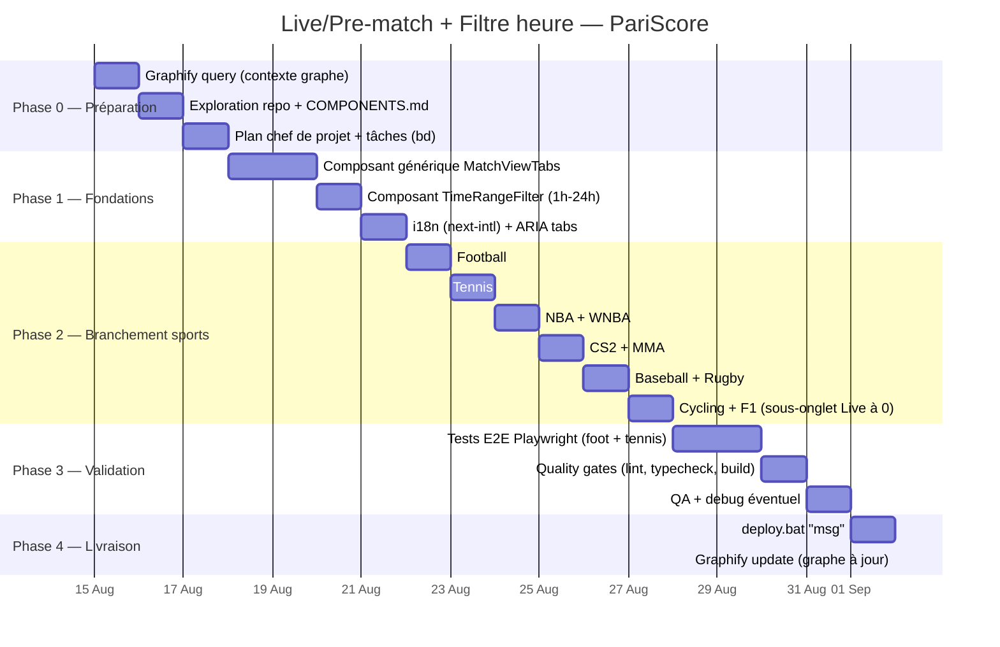

# Prompt — Séparation Live/Pre-match + Filtre par heure de début (tous sports)

> Date : 2026-08-15 · Repo : `C:\Users\David\ZCodeProject\pariscore`
> Statut : **à émettre à l'agent chef de projet** — planification puis implémentation via boucle d'ingénierie, QA, puis deploy.

---

## 1. Prompt à émettre (bloc autonome)

```text
# RÔLE
Tu es agent chef de projet senior sur le dépôt C:\Users\David\ZCodeProject\pariscore.
Tu ne codes PAS toi-même : tu planifies et orchestres l'implémentation d'une
fonctionnalité. Ton livrable est un plan détaillé + liste de tâches répartissables.

# CONTEXTE PRODUIT (PariScore)
Application web de paris sportifs : Next.js 16 + React 19 + Tailwind v4 + shadcn/ui +
TypeScript strict + App Router + hooks SWR/React Query, i18n next-intl (FR par défaut).
Design system dark navy / néon vert (#00e676). Chaque sport a un onglet global dans
src/components/layout/sport-tabs.tsx (tennis, football, cs2, mma, nba, wnba, cycling,
f1, baseball, rugby) et un composant de contenu dédié :
- src/components/football/football-tab-content.tsx
- src/components/football/tennis-tab-content.tsx (tennis vit dans src/components/football/)
- src/components/nba/nba-tab-content.tsx, src/components/wnba/wnba-tab-content.tsx
- src/components/cs2/cs2-tab-content.tsx, src/components/mma/mma-tab-content.tsx
- src/components/baseball/baseball-tab-content.tsx, src/components/rugby/rugby-tab-content.tsx
- src/components/cycling/cycling-tab-content.tsx, src/components/f1/f1-tab-content.tsx

État actuel : dans chaque onglet sport, les matchs live et prematch sont mélangés dans
une même liste (ex. football : cards FIFA-style + football-live-card.tsx dans le même
flux, avec un filtre texte "⚡ Live" dans quick-value-filters.tsx côté dashboard).
L'utilisateur s'y perd.

# OBJECTIF
Implémenter la séparation Live / Pre-match sur tous les onglets sport, à la manière de
1xbet.com, plus un filtre par heure de début sur le prematch. Plan uniquement, pas de code.

# BESOIN UTILISATEUR (à traiter tel quel)
"Entre les matchs en live ou en prematch, je m'y perds sur n'importe quels onglets sport
(foot, tennis, basket, etc...). Donc comme sur 1xbet.com, je veux faire le tri entre les
matchs en live et en prematch et ne pas avoir tout sur le même onglet. Ainsi que d'avoir
un filtre par heure de début 1h/2h/4h/6h/12h/24h..."

# EXIGENCES FONCTIONNELLES
1. Séparation Live / Pre-match sur TOUS les onglets sport (football, tennis, NBA, WNBA,
   CS2, MMA, baseball, rugby, cycling, F1 — et tout futur sport) : sous-onglets ou
   sélecteur "Live | Pre-match" (modèle 1xbet.com) dans chaque *-tab-content, avec
   compteur de matchs sur chaque sous-onglet (ex. "Live (12)").
2. Filtre par heure de début sur le prematch : 1h / 2h / 4h / 6h / 12h / 24h (fenêtre
   glissante à partir de maintenant — matchs commençant dans X heures, tolérance définie),
   implémenté en composant réutilisable.
3. Sous-onglets sport sans matchs live (ex. cycling, f1) : comportement défini — onglet
   Live grisé ou masqué avec compteur 0 (à trancher dans le plan).
4. Conservation des filtres existants (ligue, équipes, valeur, etc.) : la séparation
   Live/Pre-match et le filtre horaire s'ajoutent sans les casser.

# EXIGENCES TECHNIQUES
5. Composant réutilisable unique, pas de duplication par sport : architecture de type
   composant générique MatchViewTabs / TimeRangeFilter paramétré par sport + liste de
   matchs typée, branché dans chaque *-tab-content. Chaque sport = simple point
   d'adaptation (type de match, source de données).
6. Accessibilité : ARIA tabs (rôles tab/tablist/tabpanel, aria-selected, navigation
   clavier, focus visible).
7. i18n : libellés via next-intl, FR par défaut.
8. Responsive mobile : sélecteur utilisable sur petit écran.
9. Design system : ne pas casser l'existant (dark navy / #00e676, shadcn/ui).
10. État persistant : trancher et justifier — mémorisation du choix Live/Pre-match dans
    l'URL (query param) et/ou localStorage.
11. Tests : Playwright E2E au minimum pour football et tennis (le repo a tests/ avec
    tests/apk-webview.spec.ts comme exemple de structure).

# PÉRIMÈTRE HORS-SCOPE
- Pas de refonte du design system ni de la data-fetching (SWR/React Query) existante.
- Pas de changement du backend/API de données : consommer les flux déjà présents.
- Pas d'ajout de nouvelle source de données live.
- Pas de migration de composants legacy (pariscore.html, server.js).

# LIVRABLES ATTENDUS (de ta part)
1. Découpage en phases/étapes avec ordre d'implémentation justifié (composant générique
   d'abord, puis branchement sport par sport, puis filtre horaire, puis tests).
2. Fichiers touchés : création vs modification, chemins exacts dans le repo (vérifier les
   noms réels sur disque avant de les mentionner).
3. Décisions à trancher (chacune avec recommandation) : comportement onglet Live à 0
   match, persistance URL vs localStorage, tolérance de la fenêtre horaire, labels FR des
   sous-onglets.
4. Risques / pièges : impact sur les filtres existants, conflit avec le filtre "⚡ Live"
   de quick-value-filters.tsx, variabilité des types de matchs entre sports, accessibilité,
   perfs (listes longues), compatibilité design system.
5. Critères de validation par étape (qu'est-ce qui prouve que l'étape est finie).
6. Liste de tâches répartissables : intitulé, fichiers, dépendances, définition de done —
   prête à être assignée à des agents d'implémentation.

# CONTRAINTES DU REPO (à intégrer)
- RÈGLE #1 : ne jamais inventer de nom de composant. Consulter COMPONENTS.md (135
  composants listés) avant toute création/renommage ; si le composant n'existe pas, le
  créer explicitement et mettre à jour COMPONENTS.md dans la même change.
- TypeScript strict, commentaires en français, hooks préfixés use-, composants PascalCase.
- Qualité : bun run lint (ESLint 9), bun run typecheck, bun run build, E2E Playwright.
- Le plan doit être autonome : un agent d'implémentation qui reçoit une tâche ne doit pas
  avoir besoin de contexte supplémentaire.

# DÉROULÉ
1. Explore le repo (structure réelle des tab-content, données disponibles, COMPONENTS.md,
   conventions).
2. Rédige le plan découpé et la liste de tâches conformément aux livrables ci-dessus.
3. Vérifie que chaque fichier cité existe, que chaque tâche est assignable isolément, et
   que les critères de validation sont mesurables.
```

---

## 2. Gantt chart (planification indicatif)



---

## 3. Boucle d'ingénierie (loop-engineering)

Source : `.context/loop-engineering-procedure.md` (retenue 2026-08-04) — "Stop prompting. Design the loop. Get a score."

```
Schedule → Triage → Read/Write STATE → Worktree isolé → Implémenteur
→ Vérifieur (tests + gates) → MCP/Git/Tickets → {Human Gate}
   → safe/allowlist  → Commit/PR/Action
   → risqué/ambigu   → Escale humain avec contexte complet
Puis → loop. Toujours état mis à jour (STATE).
```

Application au projet :

| Élément | Mapping PariScore |
|---|---|
| **Scheduling** | CRON/exécution manuelle de `opencode run` ; cadence par phase du Gantt |
| **Triage** | `bd ready` — issues du plan créées dans beads avant toute implémentation |
| **État (STATE)** | **bd (beads) = spine d'état persistant** (issues Dolt DB) — pas de TODO markdown |
| **Worktree** | 1 worktree isolé par tentative d'implémentation/fix (`loop-worktree`) |
| **Implémenteur** | Sub-agent `implementer` — modifications minimales, jamais de review de soi-même |
| **Vérifieur** | Sub-agent `verifier` — APPROVE/REJECT seulement, voit le diff, n'édite pas |
| **Gates** | `bun run lint` + `bun run typecheck` + `bun run build` + E2E Playwright avant merge |
| **Circuit breaker** | Max itérations par tâche ; erreur répétée N× → escale humain avec contexte complet |
| **Budget** | `loop-budget.md` si la boucle tourne en continu ; semaine 1 = report-only |

Règles d'or : la vérification reste la responsabilité du développeur (lire les diffs, pas juste "presser go") ; jamais de push sans PR/review sur les chemins sensibles ; pause = désactiver le timer.

---

## 4. Graphify — avant ET après

### Avant de commencer les tâches (obligatoire)

Le graphe de connaissances est la canon vivante (`.graphify/`). Avant toute exploration ou implémentation :

```bash
graphify query "onglets sport live prematch filtres heure"   # charge le sous-graphe des tab-content concernés
graphify path "football-tab-content" "sport-tabs"            # relations entre composants
graphify explain "tab-content"                               # concept ciblé si besoin
```

Si `.graphify/wiki/index.md` existe : l'utiliser pour la navigation large avant le raw source browsing. Ne lire `.graphify/GRAPH_REPORT.md` que si query/path/explain ne suffisent pas.

### À 100% de finition du prompt (obligatoire)

Une fois le prompt exécuté en totalité (implémentation + tests + QA + deploy) :

```bash
graphify update .      # AST-only, sans coût API — écrit dans .graphify/
```

Cela reflète les nouveaux composants (MatchViewTabs, TimeRangeFilter) et le branchement des tab-content dans le graphe. Les fichiers `.graphify/` "dirty" après hooks/updates sont normaux — pas un motif pour sauter l'étape.

---

## 5. QA testing + debugging

1. **Tests E2E** : `npx playwright test` — au minimum les specs football + tennis couvrant Live/Pre-match et le filtre horaire (nouveaux specs à créer dans `tests/`, sur le modèle de `tests/apk-webview.spec.ts`).
2. **Quality gates** : `bun run lint` → `bun run typecheck` → `bun run build` (toutes doivent passer).
3. **Lancement du QA** : dès la fin des phases 2–3, lancer le QA complet (tests + gates).
4. **Debugging si erreur détectée** :
   - Boucle de diagnostic : reproduire → isoler la cause racine (skill `systematic-debugging`) → corriger en worktree isolé → re-tester.
   - Le vérifieur APPROVE/REJECT chaque fix ; aucune correction ne repart sans preuve (test qui passe ou gate vert).
   - Circuit breaker : max N itérations par bug ; si non résolu → escale humain avec contexte complet (rapport bug dans `.context/` si besoin).
5. **Sortie du QA** : 0 échec requis avant passage au deploy.

---

## 6. Deploy

Une fois le QA 100% vert :

```cmd
deploy.bat "Live/Pre-match tabs + filtre heure 1h-24h sur tous sports"
```

- Point d'entrée unique : `deploy.bat "msg"` (racine, alias de `scripts/deploy.bat`).
- Le runner est smart : build complet car `src/` est touché (composants + hooks) — ~3 min attendu.
- QA post-deploy optionnelle : `bash scripts/post-deploy-qa.sh`.

---

## 7. Ordre d'exécution global (séquenceur)

```
1. Émettre le prompt (section 1) → l'agent chef de projet rend plan + tâches
2. `graphify query` (section 4) avant de toucher au code
3. Créer les tâches dans bd → implémenter via la boucle d'ingénierie (section 3)
4. QA testing + debug si erreur (section 5) — 0 échec requis
5. `deploy.bat "msg"` (section 6)
6. `graphify update .` à 100% (section 4)
```