# Session — Page d'accueil par défaut (remplace l'onglet Tennis)

**Date** : 2026-08-24 · **Skill design** : ui-ux-pro-max · **Statut global** : ✅ TERMINÉ

## Demande

« Mets une home page au lieu de commencer sur l'onglet tennis » — traçabilité complète +
boucle ingénierie (audit → design → implémentation → QA visuelle → code review → déploiement).

## Audit préalable (fichiers réels vérifiés)

| Fichier | Constat |
|---|---|
| `src/app/page.tsx` | `useState<SportTab>("tennis")` ligne 124 — la landing affiche la grille tennis |
| `src/components/layout/mobile-bottom-nav.tsx` | ⚠️ **Bug latent** : onglet `id:"accueil"` appelle `onTabChange("accueil")` jamais géré → contenu vide |
| `src/components/layout/sport-tabs.tsx` | 10 TABS typés `SportId`, bannière floutée via `getSportBg(activeSport)` |
| `src/components/layout/sport-swipe-header.tsx` | `TAB_ORDER` sans "home", wrap-around, seuil 50px |
| `src/lib/sport-images.ts` | `Record<SportId,…>` exhaustifs ; pattern anti-guess-URL documenté (baseball→hero football) |
| `src/stores/use-sports-sidebar-store.ts` | `syncSportFromTab` écrit `selectedSportId` (+ URL `?sport=`) → ne PAS y écrire "home" |
| `sports-sidebar.tsx` | props `activeSport: string` ✓ compatible ; widgets conditionnés à `"football"` |

## Décisions design & ingénierie

1. **Vue "home" distincte des sports** — pas dans `SportTabId` (arborescence sidebar) pour ne pas
   polluer le store ni l'URL ; union locale `SportTab` de page.tsx étendue.
2. **Store préservé** : aller À l'accueil ne synchronise PAS `selectedSportId` (l'arbre sidebar
   garde le dernier sport consulté, widgets Top5 masqués car `activeSport!=="football"`).
   Le deep-link `?sport=…` reste prioritaire sur le défaut (effet store→tab inchangé).
3. **Navigation retour** : logo header cliquable → accueil ; onglet « Accueil » en tête de
   SportTabs (icône lucide `Home`, accent charte `bg-emerald-600`) ; bottom-nav mobile corrigée
   (`accueil` → `home` — fix du bug latent).
4. **HomeDashboard** (nouveau composant `src/components/dashboard/home-dashboard.tsx`) :
   panneau bienvenue + 3 étapes d'onboarding (icônes décoratives `aria-hidden`, cibles ≥44px,
   contrastes zinc/emerald conformes dark navy) + tuiles features (Bet Manager, Championnats,
   Paper Trading, Docs API) + CTA primaire unique (règle primary-action) vers Football et
   secondaire ancre `#section-upcoming`. Français codé en dur comme le hero voisin (« Bonjour ») ;
   i18n noté en follow-up.
5. **Icônes SVG uniquement** (règle no-emoji-icons) — zéro emoji dans la home.
6. Sections globales (Best matches / Prochains matchs / Gemini AI) inchangées sous la vue.

## Gantt

```mermaid
gantt
    dateFormat HH:mm
    axisFormat %H:%M
    section Boucle ingénierie
    Audit navigation + types + store      :done, a1, 00:00, 25m
    Design tokens + structure dashboard    :done, a2, after a1, 15m
    Doc tracabilite initiale               :done, a3, after a2, 10m
    Implémentation (5 fichiers)            :active, b1, after a3, 40m
    Typecheck + lint + build               :b2, after b1, 20m
    QA visuelle prod (probe Playwright)    :b3, after b2, 15m
    Code review + correctifs               :b4, after b3, 25m
    Deploy + re-verif finale               :b5, after b4, 15m
```

## Journal d'avancement

| # | Étape | Statut |
|---|---|---|
| 1 | Skill ui-ux-pro-max chargé, règles appliquées | ✅ |
| 2 | Audit 7 fichiers navigation/types/store | ✅ |
| 3 | Bug latent bottom-nav identifié | ✅ |
| 4 | Doc tracabilité créée | ✅ |
| 5 | Implémentation | ✅ |
| 6 | Vérifications statiques | ✅ |
| 7 | QA visuelle + code review | ✅ |
| 8 | Déploiement | ⏳ |

## Vérifications

| Commande | Résultat |
|---|---|
| `tsc --noEmit` (6 fichiers touchés) | ✅ 0 erreur (erreurs préexistantes bankroll/skyvern non liées) |
| `eslint` fichiers touchés | ✅ 0 erreur / 0 warning (`globals.css` ignoré par config — attendu) |
| `bun run build` | ✅ Compiled successfully, 70/70 pages statiques |

## Implémentation livrée

| Fichier | Changement |
|---|---|
| `src/components/dashboard/home-dashboard.tsx` | **NOUVEAU** — panneau bienvenue + CTA primaire unique « Explorer le football » + secondaire ancre `#section-upcoming` ; onboarding 3 étapes (`<ol>`, icônes aria-hidden) ; 4 tuiles features (Link `/bankroll`, `/ligues`, dialogs Paper Trading & Docs API) ; cibles ≥44px, focus rings, reduced-motion respecté |
| `src/app/page.tsx` | `SportTab` += `"home"` (défaut) ; guard `SPORT_IDS` dans `handleTabChange` (ids nav mobile non-sport ignorés — fix pollution store/URL) ; pas de sync store pour home ; rendu conditionnel HomeDashboard ; logo header → bouton retour accueil ≥44px ; commentaire deps effect |
| `src/components/layout/sport-tabs.tsx` | Onglet « Accueil » en tête (lucide `Home`, accent `bg-emerald-600`) |
| `src/components/layout/sport-swipe-header.tsx` | `"home"` en tête de TAB_ORDER (swipe cohérent) |
| `src/components/layout/mobile-bottom-nav.tsx` | Fix bug latent : id `accueil` → `home` (géré par page.tsx désormais) |
| `src/lib/sport-images.ts` | `SportId` += `"home"` + entrées Records (pattern anti-guess URL : hero football réutilisé, commenté) |
| `src/app/globals.css` | `.sport-ambient[data-sport="home"]` → ambiance neutre accent charte (évite fallback vert tennis) |

## Code review (sous-agent — REQUEST CHANGES → corrigé)

| # | Gravité | Finding | Correctif |
|---|---|---|---|
| R1 | MAJEUR | Logo bouton <44px cible tactile | ✅ `-my-2 px-1 py-2` + aria-label retiré (texte visible = nom accessible) |
| R2 | MAJEUR | Ids bottom-nav `live/value/favoris/profil` morts : contenu vide + `syncSportFromTab("live")` publie `?sport=live` invalide | ✅ Guard `SPORT_IDS` dans handleTabChange (ignore non-sport sauf home) |
| R3 | Mineur | Deps `[storeSportId]` sans explication | ✅ Commentaire intentionnel |
| R4 | Mineur | `LiveLineToggle sportId="home"` écrirait `modes["home"]` en localStorage | ✅ Gate sidebar → fallback football |
| R5 | Mineur | CTA `bg-emerald-600` contraste 3.77:1 < AA | ✅ `bg-emerald-700 hover:bg-emerald-600` (≥4.5:1) |
| R6 | Mineur | Ambiance `data-sport="home"` retombait sur vert tennis | ✅ Règle CSS neutre accent charte |
| R7 | NIT | Class surgery runtime sur accents tuiles | ✅ Champs explicites `tile`/`chip` |
| R8 | NIT | scrollIntoView ignore reduced-motion | ✅ `useReducedMotion()` |

**Validés sans correctif** : flux deep-link `?sport=` (aucune boucle), swipe wrap-around, tests
existants non cassés (sélecteurs par nom), sécurité (aucune entrée utilisateur).

## Follow-ups (hors périmètre)

- i18n des chaînes FR de la HomeDashboard (next-intl) — accepté en dette, contexte chaud.
- Router les ids mobile `live/value/favoris/profil` vers de vraies vues (actuellement inertes).
- Roving focus arrow-keys sur `role="tablist"` SportTabs (pré-existant, couvre 11 items).
- Spec E2E stale `tests/smoke.spec.ts:86` attend un h1 "Tennis" — à mettre à jour séparément.
