# Session — Vues nav réelles + Sidebar élargie + Top5 interactif + Classements complets

**Date** : 2026-08-24 · **Skills** : ui-ux-pro-max · **Statut** : ✅ TERMINÉ

> **Déploiements** : `ff1bbcc0` (features) puis `a20418de` (correctifs review) — build_ran:1,
> health OK. **QA prod finale : QA_FEATURES_PASS** (incluant test anti-régression C1).

## Round review (REQUEST CHANGES → corrigé, commit a20418de)

| # | Gravité | Finding | Correctif |
|---|---|---|---|
| R1 | **CRITIQUE** | Cards de sélection : `selDef` résolue depuis la stratégie ACTIVE alors que `entry.value` avait été capturé sous une autre → métriques fabriquées (« BTTS · 3 % ») ; re-clic sous autre stratégie supprimait au lieu de corriger | ✅ Capture figée `{entry, strategy}` par matchId ; card rend la définition capturée ; re-clic sous une autre stratégie = re-capture |
| R2 | MAJEUR | ValueNavView heuristique `<=1` : impliedProb est 0-100 chez TOUS les producteurs → l'heuristique détruisait les edges sur longshots (implied arrondi à 1) | ✅ Soustraction directe (comme le reste du codebase) |
| R3 | MAJEUR | Classements : tri sur la métrique active mais colonne surlignée fixe (BTTS) → 7 marchés/8 triés sur colonne invisible | ✅ Colonne dynamique `{def.short}` = valeur de tri (`def.fmt(row.value)`) ; dup xG supprimée |
| R4 | Mineur | Chips marché sans aria-pressed / X cards 20px <24px / message « pas de données » trompeur pour xG / SPORT_TABS local mort / key index / useMemo inutiles | ✅ tous |
| R5 | NIT | Probe : `waituntil` typo + gap structurel (jamais de bascule post-sélection) | ✅ cas cross-stratégie ajouté et PASS en prod |

**Validé sans correctif** : boundary vue/store exemplaire ; mergeMarkets sans risque de drift
de noms (source unique teams map ; xG lit rawRows directement) ; perf OK (scroll cap, ≤24 rows).

## Résultats QA prod finaux

```json
sidebarWidthClass: w-64 xl:w-72 ✅
probLineCount: 5 ✅   selectionBlock(2 clicks): 1 ✅
cardKeepsCapturedStrategy: true ✅ (anti-C1)
rankTableRows: 18 (>12 ancien top) ✅   colonne PPM ✅
mobileViews Live/Value/Favoris/Profil: 4/4 ✅
Verdict: QA_FEATURES_PASS
```

Screenshots : `.context/qa-top5-interactive.png`, `.context/qa-rankings-prod.png`.

## Demandes (5)

| # | Demande | Réponse design |
|---|---|---|
| T1 | Lancer les vraies vues sur les ids nav morts (`live/value/favoris/profil` — ex-B2) | 4 vues dédiées dans page.tsx, guard SPORT_IDS étendu (ids vues ≠ ids sport, pas de sync store) |
| T2 | Agrandir la sidebar en largeur | Aside `w-60 xl:w-64` → `w-64 xl:w-72` |
| T3 | Top5 : sélectionner 1..n matchs → cards affichées à gauche | Rows cliquables (toggle, aria-pressed) ; bloc « Sélection » en tête du widget sidebar avec cards compactes + suppression unitaire |
| T4 | Top5 : probabilité de réussite par match | Chip « Réussite estimée : X% » quand la stratégie est probabiliste (6/9) ; « — » sinon (PPG/buts/encaissés ne sont pas des probas — pas d'invention) |
| T5 | Classements : stats à côté des équipes + toutes les équipes | Fini le top 12 : fusion client-side de TOUS les marchés par équipe (1 seul appel API, payload contient tout) → tableau complet scrollable |

## Audit réalisé

| Fichier | Constat |
|---|---|
| `use-football-rankings.ts` | Payload contient **tous les marchés** d'un coup (`data.markets: Record<market, FdRankRow[]>`, `FdRankRow={team,value,gp}` + variante xG) → merge possible sans nouvel appel |
| `football-league-rankings-widget.tsx` | `rawRows.slice(0, 12)` ligne ~150 = limite artificielle ; 1 seule stat affichée par ligne |
| `football-strategy-top5-widget.tsx` | Rows non cliquables ; `entry.value` = proba % pour 6 stratégies sur 9 (bestTeam=PPG, bestAttack=buts, bestDefense=encaissés → non probabilistes) |
| `sports-sidebar.tsx:908` | Aside `w-60 … xl:w-64` |
| `use-sports-sidebar-store.ts` | `favoriteLeagueIds: string[]` (ids seuls), `selectedMatchIds: string[]`, `drawerOpen` — shapes pour FavorisView |
| `lib/tennis-data.ts` / `football-data.ts` | Pas de flag isLive exploitable côté dashboard → LiveView = vue passerelle vers filtres Live par sport (honnête, tracé) |

## Tâches

### Fait
- [x] Audit 7 fichiers + types
- [x] Décisions design ci-dessus
- [x] Présente doc de traçabilité
- [x] T2 — sidebar `w-64 xl:w-72` (était `w-60 xl:w-64`)
- [x] T3+T4 — Top5 : rows cliquables (checkbox, aria-pressed), bloc « Sélection (n) » en tête avec cards (heure, affiche, stratégie, valeur, P %, suppression, tout effacer) ; chip « Réussite estimée : X% » sur les 6 stratégies probabilistes
- [x] T5 — Classements : fusion client-side des marchés → tableau COMPLET trié par marché actif, colonnes #/Équipe/J/PPM/B-m/O1.5/BTTS (+ xG/xGA sur marchés xG), scroll max-h-72
- [x] T1 — nav-extra-views.tsx : 4 vues + wiring page.tsx (union SportTab étendue, VIEW_TABS, guard, rendu conditionnel)
- [x] Vérifs : eslint 0/0 sur 5 fichiers · tsc 0 erreur · build 70/70

### À faire
- [ ] QA visuelle prod (probe étendue)
- [ ] Code review sous-agent
- [ ] Déploiement + re-vérif
- [ ] Déploiement + re-vérif

## Gantt

```mermaid
gantt
    dateFormat HH:mm
    axisFormat %H:%M
    section Boucle ingénierie
    Audit fichiers et types            :done, a1, 00:00, 25m
    Doc tracabilite                    :done, a2, after a1, 10m
    T2 sidebar width                   :b1, after a2, 5m
    T3 T4 top5 select cards proba      :b2, after b1, 40m
    T5 classements complet             :b3, after b2, 35m
    T1 vues nav                        :b4, after b3, 45m
    Verifs statiques + build           :c1, after b4, 15m
    QA prod + review                   :c2, after c1, 30m
    Deploy + re-verif                  :c3, after c2, 15m
```



## Journal

| # | Horodatage | Tâche | Statut |
|---|---|---|---|
| 1 | 2026-08-24 | Audit + décisions | ✅ |
| 2 | 2026-08-24 | Implémentation T1→T5 | ⏳ |
| 3 | 2026-08-24 | Vérifications + QA + review + deploy | ⏳ |
