# Session — Vues nav réelles + Sidebar élargie + Top5 interactif + Classements complets

**Date** : 2026-08-24 · **Skills** : ui-ux-pro-max · **Statut** : ✅ TERMINÉ

> **Déploiements** : `ff1bbcc0` (features) puis `a20418de` (correctifs review) — build_ran:1,
> health OK. **QA prod finale : QA_FEATURES_PASS** (incluant test anti-régression C1).

## Round review (REQUEST CHANGES → corrigé, commit a20418de)

| # | Gravité | Finding | Correctif |
|---|---|---|---|
| R1 | **CRITIQUE** | Cards de sélection : `selDef` résolue depuis la stratégie ACTIVE alors que `entry.value` avait été capturé sous une autre → métriques fabriquées (« BTTS · 3 % ») ; re-clic sous autre stratégie supprimait au lieu de corriger | ✅ Capture figée `{entry, strategy}` par matchId ; card rend la définition capturée ; re-clic sous une autre stratégie = re-capture |
| R2 | MAJEUR | ValueNavView heuristique `<=1` : impliedProb est 0-100 chez TOUS les producteurs → l'heuristique détruisait les edges sur longshots (implied arrondi à 1) | ✅ Soustraction directe (comme le reste du codebase) |
| R3 | MAJEUR | Classements : tri sur la métrique active mais colonne surlignée fixe (BTTS) → 7 marchés/8 triés sur colonne invisible | ✅ Colonne dynamique `{def.short}` = valeur de tri (`def.fmt(row.value)`) ; dup xG supprimée |
| R4 | Mineur | Chips marché sans aria-pressed / X cards 20px <24px / message « pas de données » trompeur pour xG / SPORT_TABS local mort / key index / useMemo inutiles | ✅ tous |
| R5 | NIT | Probe : `waituntil` typo + gap structurel (jamais de bascule post-sélection) | ✅ cas cross-stratégie ajouté et PASS en prod |

**Validé sans correctif** : boundary vue/store exemplaire ; mergeMarkets sans risque de drift
de noms (source unique teams map ; xG lit rawRows directement) ; perf OK (scroll cap, ≤24 rows).

## Résultats QA prod finaux

```json
sidebarWidthClass: w-64 xl:w-72 ✅
probLineCount: 5 ✅   selectionBlock(2 clicks): 1 ✅
cardKeepsCapturedStrategy: true ✅ (anti-C1)
rankTableRows: 18 (>12 ancien top) ✅   colonne PPM ✅
mobileViews Live/Value/Favoris/Profil: 4/4 ✅
Verdict: QA_FEATURES_PASS
```

Screenshots : `.context/qa-top5-interactive.png`, `.context/qa-rankings-prod.png`.

---

# Itération 2 — 2026-08-24 : Classements L5/L10 inter-saisons + filtre saison

**Demande** : (1) confirmer Global/Dom/Ext ✓ (déjà présent) ; (2) ajouter un filtre
**L5/L10/Saison** où la fenêtre N chevauche les saisons — ex. L5 avec 1 match joué en
2026/27 = 4 derniers de 2025/26 + ce match ; (3) ajouter un **filtre saison segmenté**
(25/26, 26/27…) en plus des L5/L10.

## Design & implémentation

| Élément | Choix |
|---|---|
| Toggle fenêtre | Groupe `[L5] [L10] [Saison]` à côté du contexte Dom/Ext (défaut Saison = comportement historique) |
| Blend inter-saisons | `blendFd` / `blendXg` : poids réels par matchs joués — `w_cur=min(gp_cur,N)`, `w_prev=min(gp_prev,N−w_cur)` ; moyenne pondérée exacte sur agrégats de saison |
| Saisons | Tri desc sur année ; `effectiveSeason` = la plus récente dispo par défaut ; `prevSeason` = suivante dans la liste (générique au-delà des 2 citées) |
| Filtre saison | Dropdown remplacé par groupe segmenté `25/26 · 26/27…` (`slice(2)`), aria-pressed, ligne dédiée sous contexte/fenêtre |
| Tri blended | Respecte `higherBetter[market]` renvoyé par l'API (xGA ascendant inclus) |
| Transparence | Footer dynamique : « 5 derniers matchs · 26/27 + complément 25/26 · trié par X » |

Fichiers : `football-league-rankings-widget.tsx` uniquement (+ hook inchangé, 2e appel SWR
pour la saison précédente, dédupliqué 1 h).

## Vérifications itération 2

| Check | Résultat |
|---|---|
| eslint / tsc ciblés | ✅ 0/0 |
| Build | ✅ 70/70 |
| QA prod | ✅ via itération 3 |

---

# Itération 3 — 2026-08-24 : marché statistique en liste déroulante

**Demande** : « sélectionner ma stratégie par une liste déroulante et non des boutons »
dans les Classements (= sélecteur de marché Buts/m / PPM / O1.5 / … qui débordait,
même problème que les pills Top5 corrigées précédemment).

**Correctif** (`football-league-rankings-widget.tsx`) :
- Rangée de pills `overflow-x-auto scrollbar-none` → **Shadcn Select** (`size="sm"`,
  h-8 w-full, thème sombre, focus ring émeraude) — même pattern que le Top5.
- Items libellés avec le titre descriptif complet ; ligne sous le trigger :
  « Trié par : {def.short} » (vert émeraude, truncate + title).
- `aria-label="Marché statistique"` ; duplication du titre supprimée au-dessus du tableau.

## Vérifications itération 3

| Check | Résultat |
|---|---|
| eslint / tsc ciblés | ✅ 0/0 |
| Build + deploy + QA prod | ✅ `cdfd7ee8` (déployé via 410c29d9) |

---

# Itérations 4-5 — 2026-08-24 : plancher cotes + buteurs/passeurs + drapeaux

## Itération 4 — plancher de cotes 1.15 (Top5)

- Filtrage post-scoring unique dans la lib : exclusion si proba ≥ 1/1.15 ≈ 86,96 %
  (7 stratégies probabilistes ; bestAttack/bestDefense = λ moyens → hors périmètre).
- Déployé `410c29d9` · QA prod : Over 1.5 affiche 86/86/85/84/83 % → aucun ≥ 87 ✅.

## Itération 5 — Buteurs & Passeurs par championnat (+ drapeaux)

**Demandes** : meilleurs buteurs & passeurs décisifs par championnat avec stats
moyennes /match selon saison et contexte ; drapeaux pays dans le dropdown championnats.

| Élément | Implémentation |
|---|---|
| Route `GET /api/football/players` | **Nouveau** — scrape serveur Understat `/league/{slug}/{year}` (blob `playersData`, décodage `\xXX`), top 10 buteurs + passeurs avec `games/total/perMatch` ; cache Map 6 h multi-clés + fallback stale ; ligues couvertes : epl, laliga, bundesliga, seriea, ligue1, russian_premier (404 documenté sinon) |
| Hook `use-football-players.ts` | **Nouveau** SWR dédup 1 h |
| Widget classements | Vue segmentée header **[Équipes/Buteurs/Passeurs]** ; panel joueurs (rang, nom+équipe, J, moy/m vert, total chip) ; scope Dom/Ext masqué en vue joueurs avec note explicite (Understat ne fournit pas le split venue sur playersData — follow-up crawl pages joueurs si requis) |
| Drapeaux | Select championnats custom (Radix) : PNG flagcdn 18×13 + label, codes ISO ajoutés aux 16 ligues (GB-ENG/Gb-SCT inclus) |
| Lisibilité tableau | Fin du stretch `w-full` → colonnes compactées à gauche, nom tronqué à 104 px, stats collées à « J » |

## Vérifications itérations 4-5

| Check | Résultat |
|---|---|
| eslint / tsc ciblés | ✅ 0/0 |
| Build | ✅ 70/70 |
| **QA prod finale** (`scripts/qa-players-probe.js`) | **QA_PLAYERS_PASS** |

### Résultats QA prod détaillés

| Check | Valeur |
|---|---|
| Panel Buteurs : lignes top 10 nom+équipe+J+moyenne+total | ✅ 10 |
| Footer « source Understat » | ✅ |
| Drapeaux dans Select championnats | ✅ 16/16 |
| Colonne équipe compacte (`w-[104px]`, stats collées à J) | ✅ |
| Régression : Select marché (10 options) / L5 / saisons | ✅ |
| Plancher cotes Top5 (< 87 %) | ✅ (validé itération 4 sur Over 1.5 : 86/86/85/84/83) |

### Débug notable (itération 5)

Premier déploiement → `UNDERSTAT_PARSE_EMPTY` : la page `/league/{slug}` servie au
serveur est une coquille JS sans données. **Fix** : endpoint XHR du front
`GET /getLeagueData/{slug}/{year}` avec headers `X-Requested-With: XMLHttpRequest`
(sans lui → 404), payload contient directement `players[]` (553 joueurs ligue 1).
Vérifié accessible depuis le VPS (200, 0.49 s).

### Déploiements du lot

| Commit | Contenu |
|---|---|
| `51b20d9c` | Pictos sports + classements L5/L10/saisons |
| `cdfd7ee8` | Marché statistique en Select |
| `410c29d9` | Plancher cotes 1.15 |
| `fd673373` | Buteurs/Passeurs + drapeaux + table compacte |
| `bb91e623` | Fix endpoint XHR players |

Health OK · Discord OK à chaque déploiement.

### Follow-ups

- Split Dom/Ext pour les joueurs (crawl pages joueur Understat — lourd, à arbitrer).
- ~~Flux live multi-sports agrégé~~ → **Itération 6 ci-dessous.**
- Router les ids mobile `live/value/favoris/profil` vers des vues enrichies.
- i18n des nouvelles chaînes FR (home-dashboard, classements, panel joueurs).

---

# Itération 6 — 2026-08-24 : LiveNavView réelle (flux agrégé 30 s)

**Suivi du follow-up « flux live »** : la vue Live passe de passerelle à **vrai flux
agrégé** — SWR sur `/api/football/live` (BSD) et `/api/tennis/live`, refresh 30 s,
revalidate au focus.

| Sport | Rendu |
|---|---|
| Football | badge minute / MT, affiche tronquée, score émeraude (12 max + « +N autres ») |
| Tennis | joueurs avec pastille service ●, sets 1–0, tournoi + set courant & jeux |
| Vide | état dédié (« apparaissent dès le coup d'envoi ») |
| Pied | boutons secondaires → analyse complète par sport |

Fichier : `nav-extra-views.tsx` uniquement (shapes défensifs optionnels).

## Vérifications itération 6

| Check | Résultat |
|---|---|
| eslint / tsc | ✅ 0/0 |
| Build | ✅ |
| **Deploy + QA prod** (`scripts/qa-live-probe.js`) | ✅ **QA_LIVE_PASS** — sections Football (3 matchs : 89' 1–1, 62' 0–0, 46') + Tennis rendues, boutons analyse ×2, **0 erreur JS** |

Déployé : `ee1ebb41` · build_ran:1 · health OK. Screenshot `.context/qa-live-view.png`.

---

# Itération 7 — 2026-08-24 : AUDIT filtres sidebar (matchs qui ne s'affichent pas)

**Repro utilisateur** : « Bundesliga 2 pour demain → aucun match dans la partie ».

## Phase A — Audit statique de la chaîne

Pipeline vérifié : arbre (`use-sports-tree` ← `/api/football/matches`) → clic ligue
(`selectLeague("football:{id}")`) → grille (`FootballTabContent`, source identique
`use-football-matches`) → filtres league/mode/time/sélection.

| # | Cause racine | Gravité |
|---|---|---|
| RC1 | `modes.football` **persisté à "live"** : cliquer une ligue prematch-only garde l'onglet Live actif → 0 carte (le Pre-match en contient N, visible seulement si on devine le switch) | 🔴 principale |
| RC2 | Aucun filtre « Demain » nulle part (union `TimeFilterKey`, lib, pills grid **et** sidebar) ; un `selectedTimeFilter` persisté (ex 24h) masque demain même en Pre-match | 🟠 |
| RC3 | BSD prematch `limit=100` tronque les petites ligues (arbre ET grille cohérents mais tronqués) — hors repro B2 (couvert par OpenLigaDB) | ⚪ noté |

## Phase B — Correctifs (commit dédié)

| Fix | Contenu |
|---|---|
| F1 (RC1+) | **Auto-bascule Live→Pre-match gated par intention** (`lastIntentRef` sur `leagueId\|timeKey`) : joue au montage + au changement de filtre uniquement — plus de trappe « retour manuel Live impossible », plus de yank quand un match se termine |
| F2a | `match-view.ts` : `TimeFilterKey += "tomorrow"`, `parseTimeFilter` → `{tomorrow}`, nouveau `filterByTomorrow()` (jour calendaire now+1) |
| F2b | `sports-tree.ts` : `matchInTimeWindow` branche tomorrow (compteurs arbre cohérents) |
| F2c | `time-range-filter.tsx` + sidebar : pill **« Demain »** (i18n fr/en ×2 namespaces) |
| F2d | `football-tab-content.tsx` : prematch honore tomorrow ; tennis `scopeByTime` aussi (`tennis-tab-content.tsx`) ; store `TIME_PARAM_KEYS += "tomorrow"` (URL round-trip réparé) |
| Tests | Assertions parseTimeFilter mises à jour + 2 cas filterByTomorrow (minuit / sans date) |

## Phase C — Review (REQUEST CHANGES → tout corrigé)

R1 effet continu = piège a11y/UX → remplacé par gating intention ✓ · R2 pills sidebar
sans Demain (clé morte) → ajoutées ✓ · R3 URL `?time=tomorrow` rejetée au hydrate →
TIME_PARAM_KEYS ✓ · R4 tennis ignorait Demain → scopeByTime ✓ · R5 live memo foot
sémantique → choix produit : **Demain ne filtre pas le Live** (documenté) · R6 leakage
autres sports (nba/mma… lisent hours/today only) → follow-up tracé.

## Vérifications itération 7

| Check | Résultat |
|---|---|
| eslint 6 fichiers / tsc ciblé | ✅ 0/0 |
| `bun test sports-tree.test.ts` | ✅ **37 pass / 0 fail** |
| Build | ✅ |
| **QA prod scénario B2/Demain** (`scripts/qa-b2-demain-probe.js`) | ✅ **PASS** — verdict : B2 a 9 matchs à venir mais **0 le 25/08** (prochain ven. 28/08 18:30) → l'état vide post-fix est **légitime et explicite** ; pill Demain active grid+sidebar, auto-bascule Pre-match ✓, 41 cartes autres ligues |

### Amélioration UX finale (hint prochain match)

Quand une ligue filtrée est vide dans la fenêtre, l'état vide affiche désormais :
« Prochain {ligue} : ven. 28 août à 18:30 — {home} vs {away} » (source liste non
filtrée) — transforme le ressenti « bug » en information actionnable.

Déploiements : `b7d1c471` (fix filtres) + hint (commit suivant).

---

# Itération 4 — 2026-08-24 : plancher de cotes 1.15 dans le Top5

**Demande** : « ne pas voir de matchs avec des cotes ≤ 1.15 sur les stratégies ».

## Implémentation (`src/lib/football-strategy-top5.ts`)

- Filtrage **post-scoring, point unique** (couvre les 3 chemins : cotes dévigées,
  forme soccerstats, Poisson BSD) : exclusion si `value ≥ 1/1.15 ≈ 86.96 %`.
- Périmètre : les 7 stratégies probabilistes (`bestTeam`, `bestTeam1x2`,
  `doubleChance`, `over15`, `under35`, `bttsYes`, `over65Corners`).
  `bestAttack`/`bestDefense` = λ moyens (buts/encaissés), pas des probabilités → hors périmètre.
- `bestTeam` : la forme renvoie du PPG (≤3, jamais filtré à tort) ; le chemin cotes
  renvoie un % — filtré correctement.
- Effet attendu : listes Top5 plus courtes (< 5), état « Pas de match qualifié » possible
  quand tout est écrêté — copie existante réutilisée.

## Vérifications itération 4

| Check | Résultat |
|---|---|
| eslint / tsc lib | ✅ 0/0 |
| Build + deploy + QA prod (assert proba < 87 %) | ⏳ |

## Demandes (5)

| # | Demande | Réponse design |
|---|---|---|
| T1 | Lancer les vraies vues sur les ids nav morts (`live/value/favoris/profil` — ex-B2) | 4 vues dédiées dans page.tsx, guard SPORT_IDS étendu (ids vues ≠ ids sport, pas de sync store) |
| T2 | Agrandir la sidebar en largeur | Aside `w-60 xl:w-64` → `w-64 xl:w-72` |
| T3 | Top5 : sélectionner 1..n matchs → cards affichées à gauche | Rows cliquables (toggle, aria-pressed) ; bloc « Sélection » en tête du widget sidebar avec cards compactes + suppression unitaire |
| T4 | Top5 : probabilité de réussite par match | Chip « Réussite estimée : X% » quand la stratégie est probabiliste (6/9) ; « — » sinon (PPG/buts/encaissés ne sont pas des probas — pas d'invention) |
| T5 | Classements : stats à côté des équipes + toutes les équipes | Fini le top 12 : fusion client-side de TOUS les marchés par équipe (1 seul appel API, payload contient tout) → tableau complet scrollable |

## Audit réalisé

| Fichier | Constat |
|---|---|
| `use-football-rankings.ts` | Payload contient **tous les marchés** d'un coup (`data.markets: Record<market, FdRankRow[]>`, `FdRankRow={team,value,gp}` + variante xG) → merge possible sans nouvel appel |
| `football-league-rankings-widget.tsx` | `rawRows.slice(0, 12)` ligne ~150 = limite artificielle ; 1 seule stat affichée par ligne |
| `football-strategy-top5-widget.tsx` | Rows non cliquables ; `entry.value` = proba % pour 6 stratégies sur 9 (bestTeam=PPG, bestAttack=buts, bestDefense=encaissés → non probabilistes) |
| `sports-sidebar.tsx:908` | Aside `w-60 … xl:w-64` |
| `use-sports-sidebar-store.ts` | `favoriteLeagueIds: string[]` (ids seuls), `selectedMatchIds: string[]`, `drawerOpen` — shapes pour FavorisView |
| `lib/tennis-data.ts` / `football-data.ts` | Pas de flag isLive exploitable côté dashboard → LiveView = vue passerelle vers filtres Live par sport (honnête, tracé) |

## Tâches

### Fait
- [x] Audit 7 fichiers + types
- [x] Décisions design ci-dessus
- [x] Présente doc de traçabilité
- [x] T2 — sidebar `w-64 xl:w-72` (était `w-60 xl:w-64`)
- [x] T3+T4 — Top5 : rows cliquables (checkbox, aria-pressed), bloc « Sélection (n) » en tête avec cards (heure, affiche, stratégie, valeur, P %, suppression, tout effacer) ; chip « Réussite estimée : X% » sur les 6 stratégies probabilistes
- [x] T5 — Classements : fusion client-side des marchés → tableau COMPLET trié par marché actif, colonnes #/Équipe/J/PPM/B-m/O1.5/BTTS (+ xG/xGA sur marchés xG), scroll max-h-72
- [x] T1 — nav-extra-views.tsx : 4 vues + wiring page.tsx (union SportTab étendue, VIEW_TABS, guard, rendu conditionnel)
- [x] Vérifs : eslint 0/0 sur 5 fichiers · tsc 0 erreur · build 70/70

### À faire
- [ ] QA visuelle prod (probe étendue)
- [ ] Code review sous-agent
- [ ] Déploiement + re-vérif
- [ ] Déploiement + re-vérif

## Gantt

```mermaid
gantt
    dateFormat HH:mm
    axisFormat %H:%M
    section Boucle ingénierie
    Audit fichiers et types            :done, a1, 00:00, 25m
    Doc tracabilite                    :done, a2, after a1, 10m
    T2 sidebar width                   :b1, after a2, 5m
    T3 T4 top5 select cards proba      :b2, after b1, 40m
    T5 classements complet             :b3, after b2, 35m
    T1 vues nav                        :b4, after b3, 45m
    Verifs statiques + build           :c1, after b4, 15m
    QA prod + review                   :c2, after c1, 30m
    Deploy + re-verif                  :c3, after c2, 15m
```



## Journal

| # | Horodatage | Tâche | Statut |
|---|---|---|---|
| 1 | 2026-08-24 | Audit + décisions | ✅ |
| 2 | 2026-08-24 | Implémentation T1→T5 | ⏳ |
| 3 | 2026-08-24 | Vérifications + QA + review + deploy | ⏳ |
