# Session — Pictogrammes sports style Winamax → PariScore

**Date** : 2026-08-24 · **Skills** : ui-ux-pro-max · **Statut** : 🔄 EN COURS

## Demande

« Lis et analyse la sidebar Winamax, prends les logos de sport et intègre-les à PariScore » —
URL analysée : `https://www.winamax.fr/paris-sportifs/sports/5/3/176509`

## Audit Winamax (rendu Playwright réel — scripts/winamax-sidebar-probe.js)

| Aspect | Constat |
|---|---|
| Rendu | SPA Angular (#app vide en statique) ; sidebar client-side |
| Sports listés | Football, Tennis, Basketball, Baseball, Boxe, Cyclisme, Football américain, NFL (logo PNG dédié s.winamax.fr), Football australien, Golf, Handball, Hockey sur glace, MMA, Rugby à XV, Rugby à XIII, Snooker |
| Style icônes | **Pictogrammes monochromes pleins** dans conteneur arrondi uniforme, rendus via CSS styled-components (classes hashées sc-gmPhUn*) mappant un sprite propriétaire ; exceptions PNG CDN |
| Structure | Arborescence sport → pays → ligue avec compteurs, hiérarchie dense |

## Décision design & IP

⚠️ Les icônes Winamax sont des **assets propriétaires** (sprite CSS privé + PNG CDN).
Les recopier tels quels = infraction + incohérence charte. Décision :

1. **Créer une bibliothèque de pictogrammes SVG ORIGINAUX** (`sport-pictograms.tsx`),
   style plein/monochrome équivalent (lisibilité 16px, viewBox 24, `currentColor`),
   dessinés maison — pas de copie de sprite.
2. Un picto par sport PariScore (+ home) : tennis(raquette+balle), football(ballon),
   cs2(viseur), mma(gant), nba+wnba(ballon basket), cyclisme(vélo), f1(casque),
   baseball(coutures), rugby(ballon ovale), home(maison).
3. Intégration aux **3 points d'usage** réels :
   - `sport-tabs.tsx` (TABS, barre onglets)
   - `page.tsx` SPORT_CARDS (home dashboard)
   - `sports-sidebar.tsx` SPORT_ICONS (arbre, mapping id payload → picto ; type élargi
     `LucideIcon` → `ComponentType<{className?: string}>`)
4. Cohérence visuelle : remplace les métaphores faibles actuelles (Footprints→football,
   Gauge→F1, Target→NBA, Volleyball→tennis).

## Tâches

### Fait
- [x] Rendu + extraction DOM Winamax
- [x] Décision IP/design ci-dessus
- [x] `src/components/ui/sport-pictograms.tsx` — 10 pictos line-art originaux (home, tennis, football, cs2, mma, basket×NBA/WNBA, cyclisme, F1 casque, baseball, rugby) · stroke currentColor 1.8 round
- [x] Intégration `sport-tabs.tsx` (11 TABS)
- [x] Intégration `page.tsx` SPORT_CARDS (5 cartes home)
- [x] Intégration sidebar arbre : mapping payload `SPORT_META.icon` → pictos (Trophy→football, Activity→tennis, Volleyball→baseball…), type élargi, fallback Lucide Trophy conservé
- [x] eslint 0/0 · tsc 0 erreur fichiers touchés

### À faire
- [ ] Build + QA prod (screenshot barre onglets) + deploy

## Gantt

```mermaid
gantt
    dateFormat HH:mm
    axisFormat %H:%M
    section Boucle ingénierie
    Analyse Winamax (Playwright DOM)   :done, a1, 00:00, 20m
    Decision design IP                 :done, a2, after a1, 10m
    Doc tracabilite                    :done, a3, after a2, 5m
    Pictogrammes SVG originaux         :b1, after a3, 40m
    Integration 3 surfaces             :b2, after b1, 20m
    Verifs + build                     :c1, after b2, 15m
    QA prod + deploy                   :c2, after c1, 20m
```

## Journal

| # | Étape | Statut |
|---|---|---|
| 1 | Analyse Winamax | ✅ |
| 2 | Pictogrammes + intégrations | ⏳ |
| 3 | Vérifs + QA + deploy | ⏳ |
