# Session — Top 5 Matchs : boutons → Select Shadcn

**Date** : 2026-08-23 · **Bead** : (adhoc, hors bd) · **Statut global** : ✅ TERMINÉ

## Objectif

Remplacer la rangée de boutons-pills débordante (`Équipe`, `1X2`, `Att`, `Déf`, `2Ch.`…) du bloc
**TOP 5 MATCHS** de la sidebar football par un **Select Shadcn** compact intégré au thème sombre,
en conservant le wiring state → liste des 5 matchs + description verte.

## Fichiers identifiés (audit)

| Fichier | Rôle |
|---|---|
| `src/components/football/football-strategy-top5-widget.tsx` | **Cible** — widget sidebar Top 5 (COMPONENTS.md ✓) |
| `src/lib/football-strategy-top5.ts` | Source de vérité type `StrategyTop5Key` (9 clés) |
| `src/hooks/use-football-top5.ts` | Hook data `matchesFor(strategy)` |
| `src/components/ui/select.tsx` | Shadcn Select (Radix) déjà installé ✓ |

## Décisions d'ingénierie

1. **Clés réelles conservées** : le spec exemple listait `team/1x2/attack/…/over_25` (illustratif).
   La source de vérité est `StrategyTop5Key` = `bestTeam, bestTeam1x2, bestAttack, bestDefense,
   doubleChance, over15, over35, bttsYes, over65Corners`. Utiliser d'autres valeurs casserait
   `matchesFor()`. → Les 9 stratégies réelles deviennent les `SelectItem`.
2. **State inchangé** : `useState<StrategyTop5Key>("bestTeam")` local suffit (aucun store global
   pour ce widget) ; `onValueChange` caste vers `StrategyTop5Key` (TS strict).
3. **Description verte** : `def.label` affiché en permanence sous le Select (vert émeraude) ;
   le suffixe technique xG/buts reste dans le bloc données (pas de duplication).
4. **Header L5/L10 conservé** : la bascule fenêtre de forme reste à droite du titre.
5. **Emojis** : demandés explicitement dans le spec → ajoutés par stratégie.

## Gantt

```mermaid
gantt
    dateFormat HH:mm
    axisFormat %H:%M
    section Boucle ingénierie
    Audit composant + lib + Select     :done, a1, 00:00, 20m
    Doc traçabilité initiale (.md)     :done, a2, after a1, 10m
    Implémentation Select              :done, b1, after a2, 25m
    Typecheck + lint                   :done, b2, after b1, 15m
    Mise à jour doc + bilan            :done, b3, after b2, 10m
```

## Journal d'avancement

| # | Horodatage | Étape | Statut |
|---|---|---|---|
| 1 | 2026-08-23 | Localisation via COMPONENTS.md → `football-strategy-top5-widget.tsx` | ✅ |
| 2 | 2026-08-23 | Audit : 9 pills `overflow-x-auto scrollbar-none` (cause troncature) | ✅ |
| 3 | 2026-08-23 | Audit lib : `StrategyTop5Key` 9 clés, pas de `over25` (→ `over35` réel) | ✅ |
| 4 | 2026-08-23 | Audit UI : shadcn Select présent (Radix, taille `sm` dispo) | ✅ |
| 5 | 2026-08-23 | Création présente doc traçabilité | ✅ |
| 6 | 2026-08-23 | Remplacement pills → Select + description verte (4 éditions) | ✅ |
| 7 | 2026-08-23 | Vérification typecheck/lint — voir ci-dessous | ✅ |

## Vérifications

| Commande | Résultat |
|---|---|
| `bun run typecheck` | ✅ **0 erreur** sur le widget (erreurs préexistantes ailleurs : bankroll/, live-card, scripts/, tools/ — non liées) |
| `bunx eslint src/components/football/football-strategy-top5-widget.tsx` | ✅ 0 warning / 0 erreur |

## Modifications livrées

**Fichier unique** : `src/components/football/football-strategy-top5-widget.tsx`

1. Import `Select/SelectContent/SelectItem/SelectTrigger/SelectValue` depuis `@/components/ui/select`.
2. `StrategyDef.short` → remplacé par `emoji` ; les 9 stratégies réelles conservent leurs clés
   (`StrategyTop5Key`) pour que `matchesFor()` continue de fonctionner sans changement.
3. Rangée de pills (`flex gap-1 overflow-x-auto … scrollbar-none` — cause du débordement)
   remplacée par un `SelectTrigger size="sm" h-8 w-full` thème sombre (`bg-slate-900/90`,
   `border-slate-700/80`, focus ring émeraude).
4. Description dynamique verte (`text-emerald-400`, `aria-live="polite"`) affichée en permanence
   sous le Select ; la ligne technique xG/buts dans le bloc données passe en slate neutre
   (suppression de la duplication du label).

## Hors périmètre (noté pour suite)

- QA visuel navigateur (Playwright) non lancé — à faire sur dev server si souhaité.

## Itération 2 — 2026-08-23 : `over35` → `under35` (demande David)

**Demande** : vouloir **Under 3,5 buts** et **Over 1,5 buts** dans le sélecteur.

| Fichier | Changement |
|---|---|
| `src/lib/football-strategy-top5.ts` | Clé `over35` → `under35` dans `StrategyTop5Key`, doc comment, `HIGHER_BETTER` ; cotes : `impliedProb(odds_under_35, odds_over_35)` ; forme Poisson : `(1 - P(≥4)) × 100` = P(≤3) |
| `src/components/football/football-strategy-top5-widget.tsx` | Item Select `Over 3,5 buts 🔥` → `Under 3,5 buts ❄️` |

`over15` (⚽ Over 1,5) déjà présent — inchangé.

**Vérifications itération 2** :

| Commande | Résultat |
|---|---|
| `tsc --noEmit` (grep fichiers touchés) | ✅ 0 erreur |
| `eslint` lib + widget | ✅ 0 erreur |
| `findstr over35` sur les 3 fichiers | ✅ 0 occurrence résiduelle |

**Déploiement** : commit + push + `deploy.bat` (build complet déclenché car `src/` modifié).

## Itération 3 — 2026-08-23 : Audit visuel QA + code review (boucle ingénierie)

**Constat utilisateur** : « aucune modification visible en frontend ».

### Phase A — Diagnostic

| Étape | Résultat |
|---|---|
| Montage composant | ✅ `sports-sidebar.tsx:866` — rendu si `activeSport === "football"` uniquement |
| État VPS (`ssh`) | ✅ commit `d9e78d7a` déployé ; « Choisir une strat… » dans chunk SSR ; « Under 3,5 buts » dans chunk client |
| Sonde Playwright v1 | ❌ FAIL — **faux négatif** : `.first()` cliquait l'item d'arborescence sidebar au lieu de la carte sport |
| Sonde diagnostique v2 | ✅ clic ciblé `button span.text-sm.font-semibold` = "Football" → section présente |

### Phase B — QA visuelle prod (`scripts/qa-top5-probe.js`)

| Check | Résultat |
|---|---|
| URL après clic Football | `?sport=football` ✅ |
| Section Top 5 dans le DOM | ✅ |
| Select Shadcn (`data-slot=select-trigger`) | ✅ 1 |
| Description verte initiale | ✅ « Meilleure équipe (forme) » |
| Options du select | ✅ 9 items dont **❄️ Under 3,5 buts** |
| Wiring : sélection Under 3,5 → description | ✅ « Under 3,5 buts » |
| Bascule L5/L10 | ✅ 2 boutons |
| Erreurs JS console/pageerror | ✅ 0 |
| **Verdict** | **QA_TOP5_PASS** |

Screenshots : `.context/qa-top5-home.png`, `.context/qa-top5-section.png`.

**Cause racine du constat utilisateur** : home charge l'onglet Tennis par défaut (carte
Football à cliquer) et/ou service worker servant des chunks en cache → hard-refresh.

### Phase C — Code reviewer (sous-agent, verdict APPROVE)

| # | Gravité | Finding | Correctif appliqué |
|---|---|---|---|
| R1 | Mineur | `qa-top5-diag.js:26` TDZ crash si échec clic (`diag` déclaré après try/catch) | ✅ hoist `diag` avant le bloc try |
| R2 | Mineur | `api/football/top5/route.ts:14` JSDoc obsolète « Over 3.5 » | ✅ → « Under 3.5 » |
| R3 | Mineur | `impliedProb(odds_under_35, …)` params nommés inversés (résultat correct) | ✅ commentaire clarificateur |
| S1 | Suggestion | description tronquée sans recovery | ✅ `title={def.label}` hover |
| S2 | Suggestion | sonde n'assertait pas `afterSelectDesc` | ✅ assert `includes("Under 3,5")` |

Points validés sans correctif : math P(X≤3)=1−P(X≥4) exacte ; devig symétrique ; zéro leftover
`over35` ; pas de persistance localStorage de la clé (useState local, `partialize` store limité
aux favoris/modes) ; contraste emerald-400/slate-900 ≈ 9.3:1 AAA ; nav clavier Radix OK.

### Phase D — Vérifications post-correctifs

| Commande | Résultat |
|---|---|
| `tsc --noEmit` (fichiers touchés) | ✅ 0 erreur |
| `eslint` 5 fichiers | ✅ 0 erreur |

**Déploiement itération 3** : commit + push + deploy.bat.
