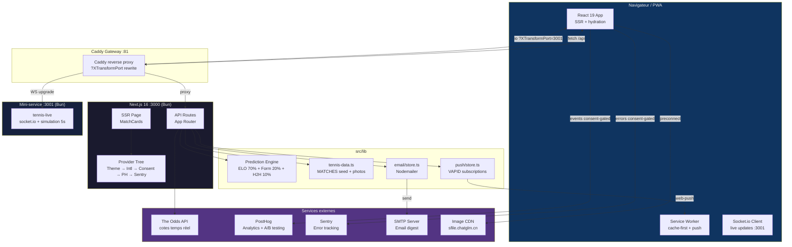
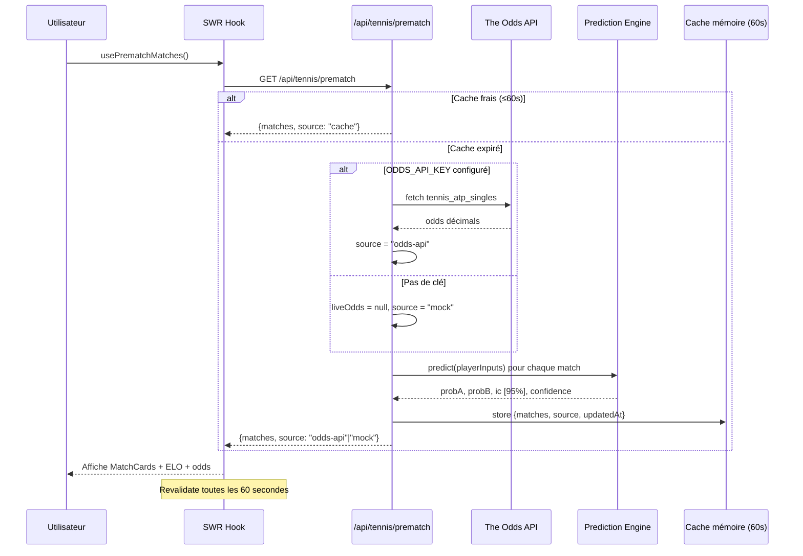
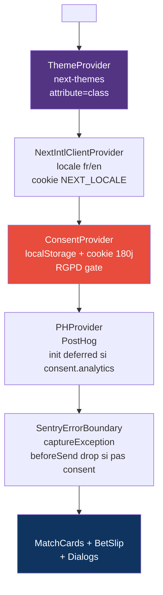
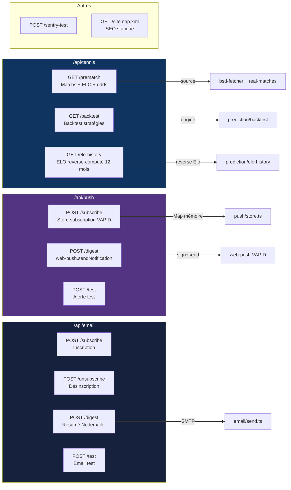
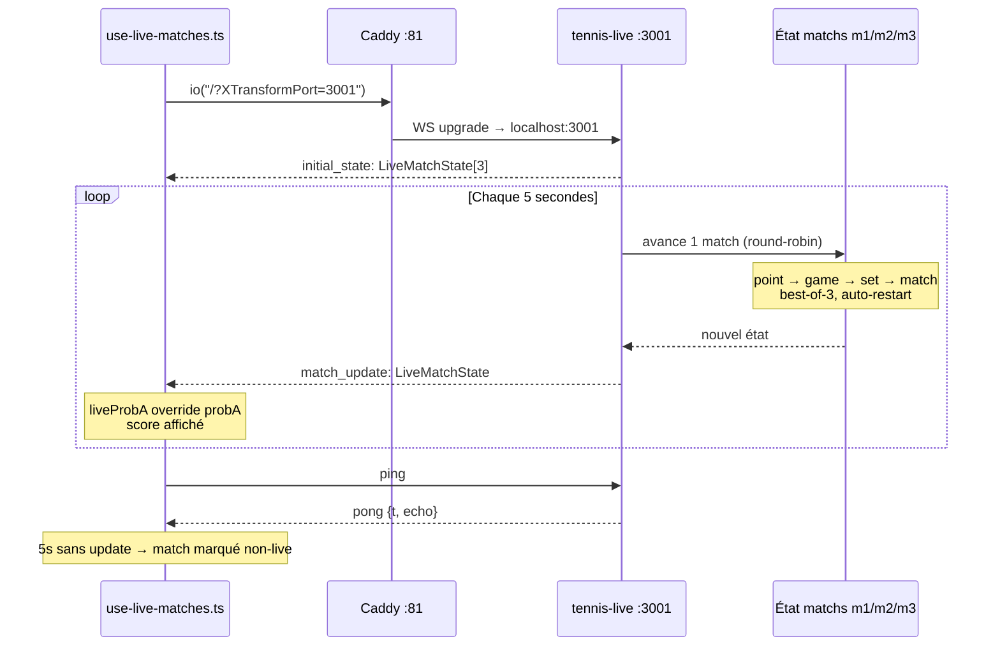
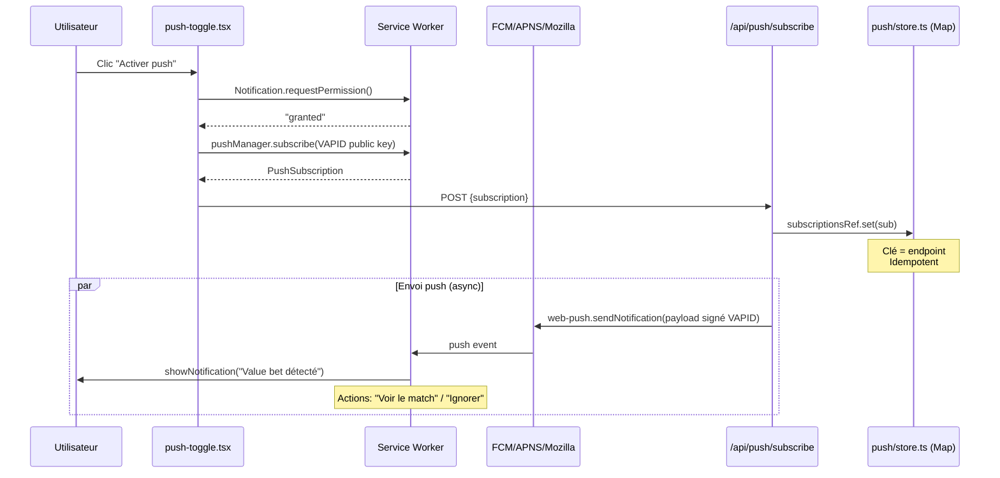
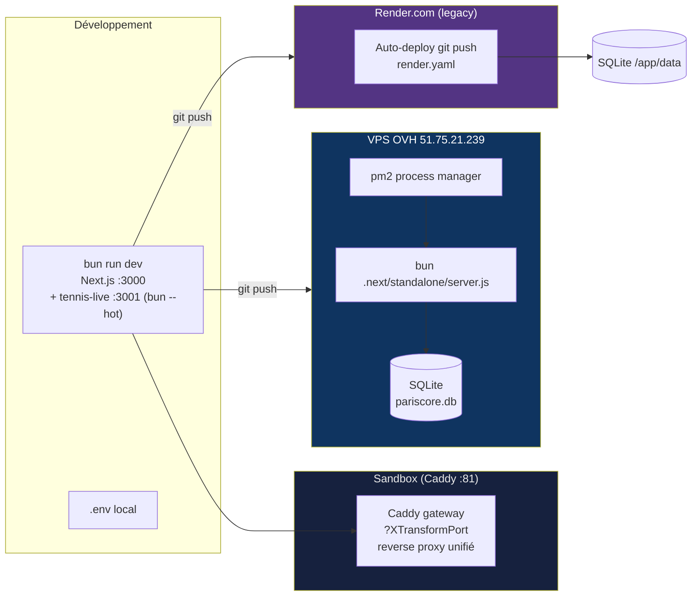
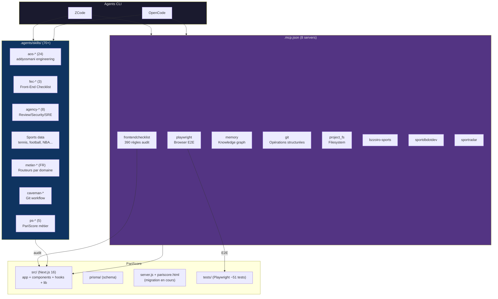

# PariScore (SetPoint) — Diagrammes Mermaid

> **Complément visuel de [`ARCHITECTURE.md`](./ARCHITECTURE.md).**
> Les diagrammes ci-dessous sont rendus nativement par GitHub, GitLab, VS Code (extension Markdown Preview Mermaid), ZCode et OpenCode.
> Dernière mise à jour : 12 juillet 2026

---

## 1. Vue d'ensemble du système



---

## 2. Flux de données — Prematch API



---

## 3. Moteur de prédiction (ELO + Forme + H2H)

```mermaid
graph LR
    subgraph Inputs["Entrées joueur"]
        ELO[Elo global]
        SE[Elo surface<br/>dur/terre/gazon]
        FORM[Forme<br/>6 derniers matchs]
        H2H[Confrontations<br/>directes]
    end

    subgraph Blend["Fusion pondérée → P(A gagne)"]
        ELO_BL[**Elo blend 70%**<br/>blendedElo = 0.55×surface + 0.45×global<br/>P = 1/(1+10^((eloB-eloA)/400))]
        FORM_BL[**Forme 20%**<br/>decay 0.85^i sur 6 matchs<br/>pForm = logistic(formA-formB, ×4)]
        H2H_BL[**H2H 10%**<br/>winRate direct<br/>pH2H = h2hScore]
    end

    subgraph Output["PredictionResult"]
        PROB[probA: 0-100<br/>probB = 100 - probA]
        IC[ic: [low, high]<br/>95% CI bootstrap 1000 tirages]
        CONF[confidence: 0-1<br/>clamp(1 - icWidth/40)]
        ELOGAP[eloGap: blendedEloA - blendedEloB]
    end

    ELO --> ELO_BL
    SE --> ELO_BL
    FORM --> FORM_BL
    H2H --> H2H_BL
    ELO_BL -->|0.70| PROB
    FORM_BL -->|0.20| PROB
    H2H_BL -->|0.10| PROB
    PROB --> IC
    IC --> CONF
    ELO_BL --> ELOGAP

    style Blend fill:#0f3460,color:#eee
    style Output fill:#16213e,color:#eaeaea
```

---

## 4. Provider Tree (layout.tsx)



---

## 5. API Routes — carte complète



---

## 6. RGPD Consent Flow

```mermaid
state diagram-v2
    [*] --> Pending: Page chargée
    Pending --> Pending: Pas de telemetry<br/>(principe de précaution)

    Pending --> All: Accepter tout
    Pending --> AnalyticsOnly: Analytics uniquement
    Pending --> Rejected: Tout refuser

    All --> AnalyticsEnabled: PostHog init + Sentry beforeSend OK
    AnalyticsOnly --> AnalyticsEnabled: PostHog init + Sentry beforeSend OK
    Rejected --> AnalyticsDisabled: PostHog opt_out + Sentry drop

    AnalyticsEnabled --> Pending: Changement d'avis
    AnalyticsDisabled --> Pending: Changement d'avis

    note right of Pending: Stocké dans localStorage<br/>+ cookie 180 jours<br/>SameSite=Lax
```

---

## 7. Service Worker — stratégies de cache

```mermaid
graph TD
    REQ[Requête entrante] --> CHECK{Type?}

    CHECK||Static asset| CF[Cache-first<br/>setpoint-static-v4]
    CHECK||/api/* GET| NF[Network-first<br/>setpoint-api-v4]
    CHECK||Navigation offline| FALLBACK[Fallback cache /]
    CHECK||Cross-origin| BYPASS[Bypass<br/>pas de cache]

    CF --> C1{En cache?}
    C1||Oui| SERVE1[Servir cache]
    C1||Non| FETCH1[Fetch réseau → cache]

    NF --> C2{Réseau OK?}
    C2||Oui| SERVE2[Servir + cache]
    C2||Non| SERVE3[Servir cache]

    style CF fill:#0f3460,color:#fff
    style NF fill:#533483,color:#fff
    style FALLBACK fill:#e74c3c,color:#fff
```

---

## 8. WebSocket Live — mini-service tennis-live



---

## 9. Push Notifications (VAPID)



---

## 10. Déploiement



---

## 11. Couche Agent IA (ZCode + OpenCode + MCP + Skills)



---

## Légende des couleurs

| Couleur | Couche |
|---------|--------|
| 🟦 Bleu foncé (`#0f3460`) | Serveur / API / Core |
| 🟣 Violet (`#533483`) | Services externes / Cloud |
| ⬛ Noir-bleu (`#1a1a2e`) | Framework / Runtime |
| 🔴 Rouge (`#e74c3c`) | Sécurité / RGPD / Alertes |
| 🗒️ Gris-bleu (`#16213e`) | Données / Infrastructure |
