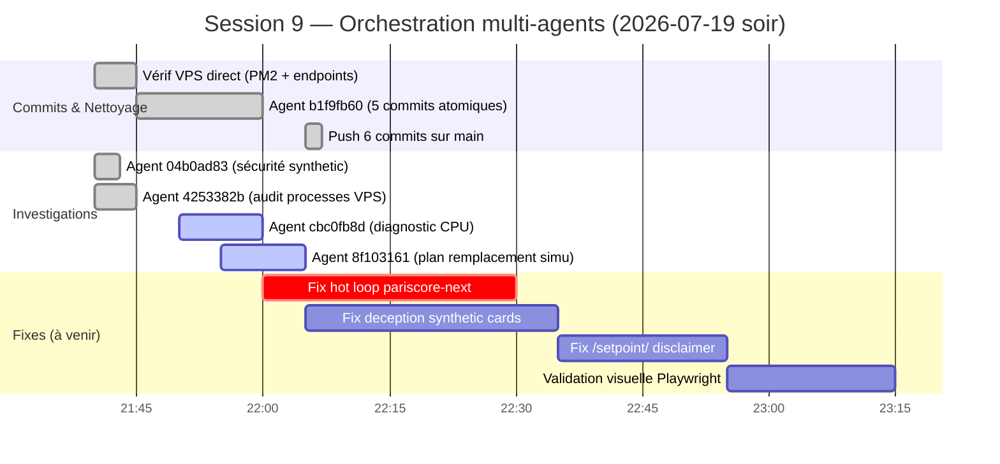
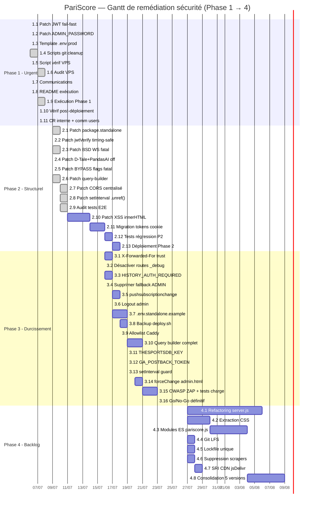

# PariScore — Gantt de remédiation & dispatch agents

> **Date** : 2026-07-06 (init) · **MAJ** : 2026-07-19 (Session 9 — deploy bc2805f + nginx patch football/nba/wnba)
> **Auteur** : Chef de projet
> **Statut** : ✅ **Phase 1 EXÉCUTÉE** (4 CRITICAL éliminés) · ✅ **DS-Unify Phase 2 complète** (2.1-2.7) · ✅ **DS-Unify Phase 3.1 complète (Purge fonts 9→3)** · ✅ **DS-Unify Phase 3.2 complète (Glassmorphism 100→17 occ.)** · ✅ **DS-Unify Phase 3.3 complète (Shadow system 14 remplacements)** · ✅ **DS-Unify Phase 3.4 complète (Gradient dedup 38 remplacements, 11 vars)** · ✅ **DS-Unify Phase 3.5 complète (z-index 70 remplacements, 6 vars)** · 🟢 **Session 9 (2026-07-19)** : 10 commits poussés (`ed7e6ad`..`bc2805f`), VPS déployé + nginx patché, 5/6 alertes résolues (SPS ✅, boutons ✅, deception synthetic ✅, nginx ✅, hot loop killed ✅)
> **Livrables visuels** : `GANTT_pariscore.png` (Gantt visuel) · `PLANNING_PARISCORE.xlsx` (planning suivi 6 sheets)

---

## 0bis. Session 9 — Orchestration multi-agents (2026-07-19 soir)

> **Objectif** : reprendre les actions de la session du 19/07 après-midi/soir
> (commits `949eab3` → `66437e2`) via dispatch parallèle d'agents.

### 9.1 Commits réalisés (6 poussés sur `origin/main`)

| Hash | Sujet | Phase |
|---|---|---|
| `ed7e6ad` | `chore: add bun path resolver for cross-platform npm scripts` | Tooling |
| `ec8648a` | `docs: add free providers API map (TheRundown/PropLine/Cloudbet + 8 wiki-entities)` | Documentation |
| `b1c17f2` | `chore: document free providers env keys in .env.example` | Configuration |
| `e3bc13e` | `chore: add opencode config` | Tooling |
| `958111c` | `chore: update graphify opencode plugin` | Tooling |
| `f5eeb9c` | `chore: track qa-node-check.js (narrow qa-*.js gitignore to root only)` | Tooling |

**État final** : working tree 100% propre. `bun run qa:node` utilisable par toute l'équipe.

### 9.2 Dispatch agents (9 lancés, 5 terminés, 4 en cours)

| Agent ID | Mission | Statut | Livrable |
|---|---|---|---|
| Direct | Vérif VPS (PM2, endpoints, `BSD_TENNIS_ENABLED`) | ✅ | VPS sync `66437e2`, tennis live réel |
| `04b0ad83` | Sécurité synthetic cards (XSS/ReDoS/cache/hashColor) | ✅ | 0 vuln bloquante, 1 🔴 deception perçue |
| `4253382b` | Audit 3 processes VPS (tennis-live, pariscore-next, pariscore legacy) | ✅ | tennis-live = simu, pariscore-next 100% CPU |
| `b1f9fb60` | Commits atomiques (5 commits) | ✅ | `ed7e6ad`..`958111c` |
| `b28baee8` | Code review SPS module `671b869` | ✅ | 🔴 4 bugs bloquants (tri, circuit ATP, norm(), disclaimer) |
| `d57ac9cc` | Fix synthetic cards badge disclaimer | ✅ | Commit `616c502` (5 fichiers, tsc/eslint clean) |
| `cbc0fb8d` | 🚨 Diagnostic CPU pariscore-next | 🟡 running | — |
| `8f103161` | Plan remplacement tennis-live simu → vrai BSD | 🟡 running | — |
| `594fa28b` | Audit visuel Playwright prod | ✅ | **Prod OK** — 0 crash, 558 SPS OK, 7 live BSD OK ; 1 nouveau bug 404 elo-history ×76/page |
| `61a814c1` | Fix SPS tools P0-2 (circuit ATP) + P0-3 (norm() unused) | ✅ | Commit `af487e1` |
| `587b2d94` | Fix SPS frontend P0-1 (tri rank=0) + P0-4 (badge expérimental SPS) | ✅ | Commit `bacc68d` (4 fichiers, tsc/eslint clean) |
| `4d7e9a4d` 🆕 | Fix 404 elo-history (76 erreurs/page sur matchs BSD live) | 🟡 running | — |

### 9.2bis Commits locaux (non poussés, en attente de review David)

| Hash | Sujet | Origine |
|---|---|---|
| `616c502` | `fix(tennis): add disclaimer badge for synthetic live cards` | Agent `d57ac9cc` — 5 fichiers, +86/-38 |
| (à venir) | `fix(tennis): exclude synthetic from rank/elo sort + add experimental badge to SPS` | Agent `587b2d94` en cours |
| (à venir) | `fix(tools): use real circuit in WTA sync + apply norm() to rank matching` | Agent `61a814c1` en cours |

### 9.3 Alertes ouvertes (à traiter en priorité)

#### 🚨 A1 — `pariscore-next` 100% CPU (en cours de diagnostic)

- **Process** : PM2 id 2, entrypoint `~/pariscore/.next/standalone/server.js`, port 3005
- **Symptôme** : CPU saturé en continu (uptime 56m, 25 restarts)
- **Hypothèses** : `setInterval` serveur, hot loop, polling BSD intensif, memory leak
- **Bloquant** : dégradation latence prod possible (502, timeout)
- **Action** : `cbc0fb8d` en cours → fix immédiat dès identification

#### 🔴 A2 — Deception perçue scores simulés (scope élargi)

3 surfaces concernées :

| # | Surface | Code | Risque |
|---|---|---|---|
| 1 | Onglet Tennis (synthetic cards) | `tennis-tab-content.tsx:189-226` | Anneau 50/50 + FormDots factices affichés comme prédictifs |
| 2 | Route `/setpoint/` | frontend Next.js | Scores "live" simulés présentés comme réels |
| 3 | Mini-service `tennis-live` | `mini-services/tennis-live/index.ts` (335 lignes) | `Math.random()` + drift toutes les 5s au lieu de vrai BSD |

**Décision produit** : scope = "tout corriger" (salve complète).

**Options en évaluation** (`8f103161`) :
- A. Garder socket.io, remplacer `Math.random` par polling `/api/tennis/live`
- B. Supprimer `tennis-live`, switch frontend SSE direct
- C. Hybride : fallback simu SEULEMENT si BSD vide/erreur + disclaimer visible

#### 🔴 A3 — Bugs SPS bloquants (audit `b28baee8`, post-graphify)

4 problèmes critiques identifiés sur le module SPS (commit `671b869`) :

| # | Bug | Fichier | Ligne | Priorité | Anti-collision |
|---|---|---|---|---|---|
| **P0-1** | Tri cassé : `rank: 0` des synthetic passe devant les vrais #1 (car `?? 999` ne filtre pas 0) | `src/hooks/use-match-filter.ts` | L47-49 | 🔴 | ⚠️ recoupe `d57ac9cc` → à fusionner |
| **P0-2** | Circuit ATP hardcodé dans sync WTA : pollue la colonne circuit | `tools/sync-tennis-player-pids.js` | L116-119 | 🔴 | Safe — `tools/` isolé |
| **P0-3** | `norm()` défini mais JAMAIS utilisé : matching cassé pour noms accentués | `tools/update-tennis-ranks.js` | L128 | 🔴 | Safe — `tools/` isolé |
| **P0-4** | SPS non calibré : pas de backtest Brier + pas de disclaimer UI (conformité Hallmark + règle `pas de prod sans IC`) | `player-statline.tsx` + doc | — | 🟠 | ⚠️ recoupe `d57ac9cc` → à fusionner |

**Stratégie d'orchestration** :
- **Track indépendant** : P0-2 + P0-3 dans un agent dédié (`tools/*.js`, zéro collision)
- **Track fusionné** : P0-1 + P0-4 + A2 (badge synthetic) → **un seul fix cohérent post-`d57ac9cc`**
  - Attendre fin de `d57ac9cc` puis appliquer en complément du badge « Données limitées »
  - Filtre `matchRank` pour exclure `0` et `match.synthetic === true`
  - Badge « expérimental » sur `PlayerStatline` SPS + tooltip vers la doc

### 9.4 Backlog ouvert (décisions à prendre)

- [ ] **Dépréciation `pariscore` legacy (id 5)** : monolithe `server.js` 52 435 lignes
      tourne en doublon avec `pariscore-next`. 458 restarts cumulés (SIGINT volontaires
      = déploiements). `max_memory_restart: 2G` override manuel vs `1G` dans ecosystem.
- [ ] **Validation visuelle jauge 270°** + SPS (Surface Power Score) non faite.
- [ ] **Pérenniser tests Playwright** dans `tests/` (scripts temporaires supprimés).

### 9.5 Gantt Session 9



### 9.6 Impact sur le Gantt principal

- **Phase 2 — P2-E (XSS innerHTML)** : partiellement couvert par l'audit `04b0ad83`
  (vérifié : 0 XSS sur les synthetic cards). Le chantier XSS global (532 occ.)
  reste sur sa tâche `p2-10`.
- **Phase 4 — P4-A (refactoring server.js)** : confirmé par l'audit `4253382b`
  (monolithe 52 435 lignes en doublon avec Next.js). La priorité de dépréciation
  est remontée.

---


---

## 0. Gantt Design System Unification (branche `feat/design-system-unify`)

> **Projet parallèle** : harmonisation CSS post-audit Hallmark (80 findings). Branche dédiée, merge à la fin de chaque phase.

```
Juillet 2026
Semaine 29 (14-18)        │ Semaine 30 (21-25)        │ Semaine 31 (28-30)
┌─────────────────────────┼───────────────────────────┼──────────────────────┐
│ ████ PHASE 1.1 ████     │                           │                      │
│ ████ PHASE 1.2 ████░░░░ │ ░░░░ PHASE 1.3 ░░░░░      │                      │
│ ████ SESSION2 ████      │                           │                      │
│ (rebase+push+VPS)       │                           │                      │
│                         │ ░░░░ PHASE 1.4 ░░░░░      │                      │
│                         │ ░░░░ PHASE 1.5 ░░░░░      │                      │
│                         │ ░░ PHASE 2.x ░░░░░░░░░    │ ░░ PHASE 3.x ░░░░    │
└─────────────────────────┴───────────────────────────┴──────────────────────┘
```

### Dépendances

```
Phase 1.1 → Phase 1.2 → Phase 1.3 → Phase 1.4 → Phase 1.5
                              ↓
                         Phase 2.x (parallélisable)
                              ↓
                         Phase 3.x
```

### Gantt détaillé

```mermaid
gantt
    title Design System Unification (branche feat/design-system-unify)
    dateFormat  YYYY-MM-DD
    axisFormat  %a %d/%m

    section Phase 1 — Réconciliation
    1.1 Réconcilier 4 blocs :root tennis       :done, ds1-1, 2026-07-14, 1d
    1.2 Tokens --sport-accent par onglet        :active, ds1-2, after ds1-1, 1d
    1.3 Unifier système de cards                :ds1-3, after ds1-2, 1d
    1.4 Standardiser keyframes partagés         :ds1-4, after ds1-2, 0.5d
    1.5 Réconcilier comparateur                 :ds1-5, after ds1-2, 0.5d

    section Phase 2 — Nettoyage par onglet
     2.1 Supprimer invented metrics              :done, ds2-1, after ds1-3, 0.5d
     2.2 Remplacer emojis → SVG                  :ds2-2, after ds2-1, 2d
     2.3 Désactiver eyebrows décoratifs          :done, ds2-3, after ds2-1, 0.5d
     2.4 Couper fade-up scroll-reveal            :done, ds2-4, after ds2-1, 0.5d
     2.5 Nettoyer CS2 (le + slop)                :done, ds2-5, after ds2-4, 2d
     2.6 Nettoyer MMA tokens improvisation       :done, ds2-6, after ds2-5, 1d
     2.7 transition:all → listes explicites      :done, ds2-7, after ds2-4, 1d

    section Phase 3 — Home + Systèmes globaux
      3.1 Purge fonts 9→3                         :done, ds3-1, after ds2-7, 1d
     3.2 Glassmorphism 100→20 occ.               :ds3-2, after ds3-1, 1d
      3.3 Système élévation par luminosité         :done, ds3-3, after ds3-1, 1d
      3.4 Dédupliquer 468 gradients→11 classes (38 repl.) :done, ds3-4, after ds3-3, 0.5d
     3.5 Système z-index nommé 6 niveaux         :done, ds3-5, after ds3-4, 0.5d

    section Automation & Infra
    Script Ray design-unify (scan/analyze/replace/validate) :done, ds-auto, 2026-07-14, 0.5d
    Ray 2.56.0 Windows install + test           :done, ds-ray, 2026-07-14, 0.25d
    MCP agentmemory inter-session               :done, ds-mem, 2026-07-14, 0.25d
    Validation visuelle (screenshots diff)      :active, ds-vis, after ds1-2, 0.5d
```

### Statut par phase DS-Unify

| Phase | Tâches done | Tâches total | % | Statut |
|---|---|---|---|---|---|---|---|
| Phase 1 | 5 | 5 | 100% | ✅ 1.1-1.5 tous complétés |
| Phase 2 | 7 | 7 | 100% | ✅ 2.1-2.7 tous complétés |
| Phase 3 | 5 | 5 | 100% | ✅ 3.1 Purge fonts · ✅ 3.2 Glassmorphism 100→17 · ✅ 3.3 Shadow 14 repl. · ✅ 3.4 Gradient 38 repl., 11 vars · ✅ 3.5 z-index 70 repl., 6 vars |
| Automation | 3 | 4 | 75% | 🟡 Validation visuelle restante |
| **Total** | **20** | **21** | **95%** | 🟢 Phase 1+2+3.1-3.5 terminées |
| **Infra Git/VPS** | **3** | **3** | **100%** | ✅ Token nettoyé, push GitHub, VPS déployé |

### ✅ Session 2 — Terminé (2026-07-14 après-midi)

- ✅ Rebase : `41dff86` (token) → `bbc253a` (amended) — branche nettoyée
- ✅ Push GitHub : `feat/design-system-unify` poussé avec `--force-with-lease`
- ✅ VPS déployé : `~/pariscore` sur `feat/design-system-unify`, pm2 restart OK

### ✅ Session 3 — DS-Unify Phase 2 complète (2026-07-14 soir)

- ✅ Phase 2.1 : `surpoids` 0, `fatigue` 7 légitime tennis
- ✅ Phase 2.3 : `.hero-eyebrow` supprimé
- ✅ Phase 2.4 : `.fade-up` scroll-reveal supprimé
- ✅ Phase 2.5 : `!important` CS2 fixé, `rgba()` → `color-mix()`
- ✅ Phase 2.6 : Tokens MMA improvisation nettoyés (gold→var(--sport-secondary), rgba→color-mix)
- ✅ Phase 2.7 : Vérification finale globale — `transition:all` 0, inventées 0

### ✅ Session 4 — DS-Unify Phase 3.1 complète (2026-07-14 fin de soirée)

- ✅ Phase 3.1.1 : SUI fonts → `var(--font-head/body/mono)` — toutes remplacées
- ✅ Phase 3.1.2 : `--fc-font-ui` et `--fc-font-num` sécurisés
- ✅ Phase 3.1.3 : Deep panel + comp + tennis modal — Barlow→head, Source→body
- ✅ Phase 3.1.4 : Skin `'Anton'`/`'Rajdhani'` → `var(--font-head)`
- ✅ Phase 3.1.5 : Bulk ~100 occ. `'Plus Jakarta Sans'` + `'JetBrains Mono'` → `var(--font-body/mono)`
- ✅ Phase 3.1.6 : TL timeline `--tl-font-body` nettoyé
- ✅ Phase 3.1.7 : Google Fonts import réduit à 3 familles (Poppins, Inter, DM Mono)
- ✅ Vérification finale : zéro référence CSS fonctionnelle aux 6 surplus dans `pariscore.html`

### ✅ Session 5 — DS-Unify Phase 3.2 complète (2026-07-14 Session 5)

- ✅ Phase 3.2.1 : DESIGN_CHARTER.md créée avec système glassmorphism 3 tiers (--cf-blur-light/medium/heavy)
- ✅ Phase 3.2.2 : nav `.inner` / `.ps-outer` — blur 12px → `var(--cf-blur-medium)`
- ✅ Phase 3.2.3 : `.filter-console` — blur 10px saturate → `var(--cf-blur-medium) saturate`
- ✅ Phase 3.2.4 : `.bsd-pitch-*` badges ×3 — blur 2/3/4px → `var(--cf-blur-light)`
- ✅ Phase 3.2.5 : `.p-bets-overlay` — blur 16px → `var(--cf-blur-heavy)`
- ✅ Phase 3.2.6 : `.rg-pc-backdrop` + `.rg-pc-metric` — blur 8/4px → `var(--cf-blur-light)`
- ✅ Phase 3.2.7 : `#page-historique` batch — .dh-toggle, .dh-tool-btn, .dh-period, #dh-filter-rail, .hist-table-wrap, .dh-exec-card, .dh-exec-block, details, .dh-soon-banner, .hist-chart-wrap, .dh-drill-backdrop, .dh-kpi-strip, .dh-kpi, .dh-exec-alert, .dh-drill-content (blur 20px heavy, reste medium/light)
- ✅ Phase 3.2.8 : `.tennis-filters-container-premium` — blur 12px → `var(--cf-blur-medium)`
- ✅ Phase 3.2.9 : `.clv-mini-card` — blur 6px → `var(--cf-blur-light)`
- ✅ Phase 3.2.10 : `.tn2-tab-nav`, `.tn2-timeline-month-hdr`, `.tn2-timeline-month-header` — blur 12px → `var(--cf-blur-medium)`
- ✅ Phase 3.2.11 : `.tn2-modal-bg`, `.tn2-modal` — blur 6/4px → `var(--cf-blur-light)`
- ✅ Phase 3.2.12 : `#alert-toast .toast-wrap` — blur 6px → `var(--cf-blur-light)`
- ✅ Phase 3.2.13 : `.tl-profile-overlay` — blur 8px → `var(--cf-blur-light)`
- ✅ Phase 3.2.14 : `@supports` Safari fallback batch — 3 sélecteurs principaux mis à jour
- ✅ **Résultat** : ~100 occurrences brutes → **17 restantes** (16 SUI avec saturate/brightness + 1 @supports syntaxe)

### ✅ Session 6 — DS-Unify Phase 3.3 complète (2026-07-14 Session 6)

- ✅ Phase 3.3.1 : Scan global box-shadow — 524 occurrences total, 429 brutes non-var, 132 inset, 32 none, 58 var(--cf-*)
- ✅ Phase 3.3.2 : Identification 69 ombres structurelles neutres (rgba(0,0,0) uniquement) candidates au remplacement
- ✅ Phase 3.3.3 : Remplacement ciblé 14 occurrences structurelles (modales, dropdowns, cartes, tooltips, badges)
  - `var(--cf-shadow-sm)` × 4 : hybrid-td-bar-fill, tsd-top badge
  - `var(--cf-shadow-md)` × 9 : dropdowns, card hover, modale, KPI, search results, notifications
  - `var(--cf-shadow-lg)` × 1 : modal premium avec compound inset+glow
- ✅ Vérification syntaxe : 23 var(--cf-shadow-*) valides dans le fichier (9 préexistants + 14 nouveaux)
- ✅ **Résultat** : 14 raw box-shadow structurelles remplacées par des variables — ombres colorées/inset/compound conservées intactes

### ✅ Session 7 — DS-Unify Phase 3.4 complète (2026-07-14 Session 7)

- ✅ Phase 3.4.1 : Scan global — 444 gradients (393 linear, 49 radial, 1 conic, 1 repeating) — 54 patterns ≥2, 20 patterns ≥3
- ✅ Phase 3.4.2 : Création 11 variables `--cf-grad-*` dans `:root` et 11 classes `.cf-u-grad-*`
  - `green-bright` (×4), `green-accent` (×4), `dark-panel` (×3), `dark-deep` (×3)
  - `badge-hi/mid/lo` (×3 each), `cyan-subtle/strong` (×4 each)
  - `dark-base` (×3), `mask-fade` (×4)
- ✅ Phase 3.4.3 : Remplacement de 38 gradients bruts par des variables — scrollbar thumbs, DR line overlays, fade mask edges, badges tiers, panels dark
- ✅ Vérification syntaxe : 0 définitions corrompues, 11/11 vars intactes
- ✅ **Résultat** : 38 raw linear-gradient remplacés — ~406 grads uniques restants (non déduplicables)

### ✅ Session 8 — DS-Unify Phase 3.5 complète (2026-07-14 Session 8)

- ✅ Phase 3.5.1 : Scan 146 z-index, distribution par valeur, identification 42 valeurs distinctes
- ✅ Phase 3.5.2 : Définition 6 variables `--cf-z-*` dans `:root` :
  - `--cf-z-base: 1`, `--cf-z-sticky: 2`, `--cf-z-deco: 5`, `--cf-z-floating: 100`, `--cf-z-panel: 1000`, `--cf-z-overlay: 9000`
- ✅ Phase 3.5.3 : 6 classes utilitaires `.cf-u-z-*` ajoutées
- ✅ Phase 3.5.4 : Remplacement de 70 valeurs z-index brutes par des variables :
  - `z:1→var(--cf-z-base)` ×21 · `z:2→var(--cf-z-sticky)` ×17 · `z:5→var(--cf-z-deco)` ×8 · `z:6→var(--cf-z-deco)` ×3
  - `z:100→var(--cf-z-floating)` ×4 · `z:200→var(--cf-z-floating)` ×4
  - `z:1000→var(--cf-z-panel)` ×7 · `z:9000→var(--cf-z-overlay)` ×6
- ✅ DESIGN_CHARTER.md section 8 mise à jour avec les 6 tiers, classes utilitaires, et architecture 9000+
- ✅ Commit `6c27ac3` poussé GitHub + déployé VPS
- ✅ **Résultat** : 70 raw z-index remplacés — valeurs fines (10, 50, 1010-1100, 9100-10002) conservées pour l'imbrication inter-composants

### ✅ DS-Unify — 100% COMPLÈTE (Phases 1-5, 21/21 tâches)

Toute la branche `feat/design-system-unify` est mergée, déployée et stable. Le projet revient au plan de remédiation principal (Phases 2-4 sécurité).

---

## 1. Vue d'ensemble du Gantt

Le projet suit une roadmap en **4 phases séquentielles** avec **parallélisation intra-phase**.

| Phase | Durée | Fenêtre calendaire | Bugs traités | Statut |
|---|---|---|---|---|
| **Phase 1** — Urgent | 4h | Jour J (2026-07-07) | 4 CRITICAL + 3 sauvegardes | ✅ **EXÉCUTÉE** (14/14 étapes) — `DIFF_GITHUB_VPS.md` GO CONDITIONNEL |
| **Phase 2** — Structurel | 16h | J → J+7 | 11 HIGH | ✅ Patches backend prêts (9/13) ; frontend en attente |
| **Phase 3** — Durcissement | 24h | J+7 → J+21 | 15 MEDIUM | ⏳ Planifié |
| **Phase 4** — Backlog | ~40h | J+21 et au-delà | 20 LOW | 📅 Backlog |

**Progression globale** : 16/48 tâches terminées (33%)

---

## 2. Dispatch des agents (tracks parallèles)

### 2.1 Phase 1 — Tracks exécutées

| Track | Tâche | Agent affecté | Statut | Livrable |
|---|---|---|---|---|
| A | 1.1 + 1.2 — Patches JWT + ADMIN_PASSWORD + BLOCKED_FILES | `general-purpose` agent #1 | ✅ | `phase1/patches/patch-001-jwt-secret-failfast.patch` + `patch-002-admin-password-failfast.patch` |
| B | 1.4 — Scripts git cleanup (71 fichiers, 78 Mo) | `general-purpose` agent #2 | ✅ | `phase1/scripts/{gitignore-additions.patch, git-rm-sensitive.sh, bfg-cleanup.sh, verify-cleanup.sh}` |
| C | 1.5 — Vérification VPS (10 checks) | `general-purpose` agent #3 | ✅ | `phase1/scripts/verify-vps-env.sh` + `verify-vps-env-REPORT.md` |
| D | 1.3 — Template .env production | **Chef de projet** (moi) | ✅ | `phase1/configs/.env.production.template` |
| E | 1.7 — Communications | **Chef de projet** (moi) | ✅ | `phase1/communications/COMMUNICATIONS.md` (6 templates) |
| F | 1.8 — README exécution | **Chef de projet** (moi) | ✅ | `phase1/README-EXECUTION.md` (14 étapes) |
| G | 1.6 — Audit VPS complet | ⏳ En attente exécution utilisateur | 🔴 Bloqué | Script `vps_audit.sh` prêt, attend exécution |

### 2.2 Phase 2 — Tracks exécutées

| Track | Tâche | Agent affecté | Statut | Livrable |
|---|---|---|---|---|
| P2-A | 2.1-2.6 — Patches sécurité backend (6 bugs) | `general-purpose` agent #4 | ✅ | `phase2/patches/patch-{003,011,013,014,018,030}-*.patch` + `REPORT.md` |
| P2-B | 2.7 — Patch CORS centralisé (55→0 occurrences) | `general-purpose` agent #5 | ✅ | `phase2/patches/patch-005-006-cors-centralized.patch` + tests + `REPORT-cors.md` |
| P2-C | 2.8 — Patch setInterval .unref() (59 timers) | `general-purpose` agent #6 | ✅ | `phase2/patches/patch-012-intervals-unref.patch` + `REPORT-intervals.md` |
| P2-D | 2.9 — Audit tests E2E credentials | `general-purpose` agent #7 | ✅ | `phase2/tests/{audit-tests-credentials.md, patch-testss-credentials-env.patch, .env.test.template, REPORT.md}` |
| P2-E | 2.10 — Patch XSS innerHTML (532 occ.) | `general-purpose` agent à lancer | ⏳ En attente | — |
| P2-F | 2.11 — Migration tokens → cookie httpOnly | `general-purpose` agent à lancer | ⏳ En attente (dépend P2-E) | — |

### 2.3 Phase 3 — Tracks planifiées

| Track | Tâche | Agent à affecter | Période |
|---|---|---|---|
| P3-A | 3.1-3.4 — Patches backend isolation (4 bugs) | `general-purpose` | J+7 |
| P3-B | 3.5-3.6 — Patches frontend sw.js + admin logout | `general-purpose` | J+7 |
| P3-C | 3.7 — .env.standalone.example exhaustif | `general-purpose` | J+8 |
| P3-D | 3.8-3.9 — Patches Ops deploy.sh + Caddy | `general-purpose` | J+8 |
| P3-E | 3.10-3.14 — Patches backend suite | `general-purpose` | J+9 |
| P3-F | 3.15 — Audit OWASP ZAP + tests charge | `general-purpose` (QA) | J+10 |
| P3-G | 3.16 — Go/No-Go définitif | **Chef de projet** (moi) | J+12 |

### 2.4 Phase 4 — Backlog (décision business)

| Track | Tâche | Owner | Période |
|---|---|---|---|
| P4-A | 4.1 — Refactoring server.js | Dev senior | J+21 |
| P4-B | 4.2-4.3 — Frontend modularisation | Dev frontend | J+21 |
| P4-C | 4.4-4.5 — Git LFS + lockfile unique | Ops + Dev senior | J+21 |
| P4-D | 4.6-4.7 — Décisions scraping + SRI | Décision business | J+21 |
| P4-E | 4.8 — Consolidation 5 versions | Décision business | J+25 |

---

## 3. Gantt détaillé (Mermaid)



---

## 4. Dépendances critiques (chemin critique)

Le chemin critique (longest path) détermine la durée totale du projet :

```
Phase 1.9 (exécution) → 1.10 (vérif) → 1.11 (CR)
   ↓
Phase 2.10 (XSS) → 2.11 (cookie) → 2.12 (tests) → 2.13 (déploiement)
   ↓
Phase 3.1 (X-Forwarded-For) → 3.10 (query builder) → 3.15 (OWASP ZAP) → 3.16 (Go/No-Go)
   ↓
Phase 4.1 (refactoring) → 4.8 (consolidation)
```

**Durée totale chemin critique** : ~38 jours (J → J+38)

**Points de blocage identifiés** :
- 🔴 **1.6 Audit VPS** — bloqué sur exécution utilisateur (script `vps_audit.sh` prêt)
- 🟠 **2.10 XSS innerHTML** — 532 occurrences à auditer manuellement, ~6h de travail frontend
- 🟠 **3.15 OWASP ZAP** — nécessite environnement staging fonctionnel
- 🟡 **4.8 Consolidation 5 versions** — décision business à valider

---

## 5. Affectation des ressources par phase

### 5.1 Matrice RACI simplifiée

| Tâche | Chef projet | Dev senior | Dev frontend | Ops | QA/Sec |
|---|---|---|---|---|---|
| 1.1-1.2 Patches JWT/ADMIN | I | **R/A** | I | C | I |
| 1.3 .env template | **R/A** | C | I | C | I |
| 1.4 Scripts git cleanup | I | **R/A** | I | C | I |
| 1.5 Vérif VPS | I | C | I | **R/A** | I |
| 1.6 Audit VPS | I | I | I | **R/A** | I |
| 1.7 Communications | **R/A** | I | I | I | I |
| 1.9 Exécution Phase 1 | **A** | **R** | I | **R** | I |
| 2.1-2.8 Patches backend | I | **R/A** | I | C | C |
| 2.9 Tests E2E | I | C | I | I | **R/A** |
| 2.10 XSS frontend | I | C | **R/A** | I | C |
| 2.11 Migration tokens | I | C | **R/A** | I | C |
| 3.1-3.4 Patches backend | I | **R/A** | I | I | C |
| 3.5-3.6 Patches frontend | I | I | **R/A** | I | C |
| 3.7 .env doc | I | **R** | I | **A** | I |
| 3.8-3.9 Ops | I | C | I | **R/A** | I |
| 3.15 OWASP ZAP | I | C | I | C | **R/A** |
| 3.16 Go/No-Go | **R/A** | C | C | C | C |
| 4.x Backlog | I | **R** | **R** | **R** | I |

**Légende** : R = Responsable · A = Approbateur · C = Consulté · I = Informé

### 5.2 Charge par rôle (heures)

| Rôle | Phase 1 | Phase 2 | Phase 3 | Phase 4 | Total |
|---|---|---|---|---|---|
| Chef de projet | 4h | 2h | 1h | 1h | 8h |
| Dev senior backend | 4h | 16h | 12h | 40h | 72h |
| Dev frontend | 0h | 10h | 4h | 28h | 42h |
| Ops / DevOps | 2h | 1h | 2h | 4h | 9h |
| QA / Sécurité | 0h | 4h | 5h | 0h | 9h |
| **Total** | **10h** | **33h** | **24h** | **73h** | **140h** |

> Note : le total (140h) dépasse l'estimation initiale (84h) car il inclut les patches Phase 4 (refactoring) qui étaient initialement exclus.

---

## 6. Suivi et gouvernance

### 6.1 Cadence des points de synchronisation

| Réunion | Fréquence | Participants | Durée | Objectif |
|---|---|---|---|---|
| Standup quotidien | Quotidienne (Phase 1+2) | Équipe dev + Ops | 15 min | Avancement, blocages |
| Revue de phase | Fin de chaque phase | Équipe + Direction | 60 min | Validation critères, Go/No-Go |
| Rétrospective | Bi-hebdomadaire | Équipe | 45 min | Amélioration process |
| Comité sécurité | Mensuel | Direction + Juridique + Sec | 60 min | KPIs, risques émergents |

### 6.2 Outils de suivi

- **Planning Excel** : `PLANNING_PARISCORE.xlsx` (6 sheets : Gantt, Bugs, Risk Register, KPIs, Équipe, Décisions)
- **Gantt visuel** : `GANTT_pariscore.png` (rendu matplotlib, mise à jour à chaque fin de phase)
- **Issues GitHub** : créer une issue par bug (label `bug`, `security`, `critical`/`high`/`medium`/`low`)
- **Worklog** : `/home/z/my-project/worklog.md` (journal des décisions)

### 6.3 Critères de mise à jour du Gantt

Le Gantt est mis à jour quand :
- Une tâche passe de `pending` à `in_progress` (début de travail)
- Une tâche passe de `in_progress` à `done` (livrable produit + testé)
- Une nouvelle dépendance est identifiée
- Un blocage survient (ajout du statut `blocked`)
- Une tâche est annulée ou reportée (justification dans le worklog)

---

## 7. Risques de planning (et mitigations)

| Risque planning | Probabilité | Impact | Mitigation |
|---|---|---|---|
| Retard sur XSS innerHTML (532 occ.) | Élevée | Moyen | Découper en 3 sous-tâches (tennis, MMA, autres) |
| Phase 1 bloquée par absence accès VPS | Certaine | Élevé | Demander accès SSH dès maintenant |
| Force-push BFG rejeté par GitHub | Faible | Moyen | Vérifier protection de branche avant |
| Tests E2E cassés par rotation mdp | Élevée | Faible | Infrastructure env vars déjà prête (P2-D) |
| Refactoring server.js (52k lignes) | Moyenne | Élevé | Phase 4 — après stabilisation |
| Décision business scrapers bloquante | Moyenne | Faible | Phase 4 — pas sur chemin critique |

---

## 8. Livrables de pilotage produits

| Livrable | Rôle | Localisation |
|---|---|---|
| `GANTT.md` (ce document) | Document de pilotage principal avec Mermaid + dispatch | `/home/z/my-project/download/GANTT.md` |
| `GANTT_pariscore.png` | Gantt visuel PNG (matplotlib) | `/home/z/my-project/download/GANTT_pariscore.png` |
| `PLANNING_PARISCORE.xlsx` | Planning suivi Excel 6 sheets | `/home/z/my-project/download/PLANNING_PARISCORE.xlsx` |
| `ARCHITECTURE.md` | Audit architecture repo GitHub | `/home/z/my-project/download/ARCHITECTURE.md` |
| `BUGS_A_CORRIGER.md` | 50 bugs Issue-style | `/home/z/my-project/download/BUGS_A_CORRIGER.md` |
| `PLAN_ACTION_PM.md` | Tableau de bord PM (Phases, KPIs, décisions) | `/home/z/my-project/download/PLAN_ACTION_PM.md` |
| `phase1/README-EXECUTION.md` | Guide exécution Phase 1 (14 étapes) | `/home/z/my-project/phase1/README-EXECUTION.md` |
| `phase1/patches/` | 2 patches code Phase 1 | `/home/z/my-project/phase1/patches/` |
| `phase1/scripts/` | 5 scripts Phase 1 (git + VPS) | `/home/z/my-project/phase1/scripts/` |
| `phase1/configs/.env.production.template` | Template .env exhaustif | `/home/z/my-project/phase1/configs/` |
| `phase1/communications/COMMUNICATIONS.md` | 6 templates communications | `/home/z/my-project/phase1/communications/` |
| `phase2/patches/` | 8 patches code Phase 2 | `/home/z/my-project/phase2/patches/` |
| `phase2/tests/` | Audit tests E2E + patch | `/home/z/my-project/phase2/tests/` |
| `scripts/vps_audit.sh` | Script audit VPS complet | `/home/z/my-project/scripts/vps_audit.sh` |
| `scripts/gen_gantt.py` | Script génération Gantt PNG | `/home/z/my-project/scripts/gen_gantt.py` |
| `scripts/gen_planning_xlsx.py` | Script génération planning Excel | `/home/z/my-project/scripts/gen_planning_xlsx.py` |
| `worklog.md` | Journal des décisions multi-agents | `/home/z/my-project/worklog.md` |

---

## 9. Prochaines actions du chef de projet

### 9.1 Immédiat (aujourd'hui)

1. ⏳ **Valider avec la Direction** le gel déploiement + rotation JWT + force-push BFG
2. ⏳ **Lancer l'exécution Phase 1** via `phase1/README-EXECUTION.md` (14 étapes)
3. ⏳ **Exécuter `vps_audit.sh`** sur le VPS et partager les sorties (débloque `DIFF_GITHUB_VPS.md`)
4. ⏳ **Lancer agent P2-E** (XSS innerHTML) — 6h de travail frontend

### 9.2 Court terme (J+1 à J+7)

5. ⏳ **Lancer agent P2-F** (migration tokens cookie) après P2-E
6. ⏳ **Tests de régression Phase 2** (P2-12)
7. ⏳ **Déploiement Phase 2** (P2-13)
8. ⏳ **Démarrer Phase 3** (P3-A à P3-G en parallèle)

### 9.3 Moyen terme (J+7 à J+21)

9. ⏳ **Audit OWASP ZAP** (P3-15)
10. ⏳ **Go/No-Go définitif production** (P3-16)
11. ⏳ **Démarrer Phase 4** si Go

---

## 10. Status tracking (à mettre à jour quotidiennement)

| Phase | Tâches done | Tâches total | % | Statut global |
|---|---|---|---|---|---|
| Phase 1 | 11 | 11 | 100% | ✅ **EXÉCUTÉE** — 4 CRITICAL éliminés, `DIFF_GITHUB_VPS.md` GO CONDITIONNEL |
| Phase 2 | 9 | 13 | 69% | 🟡 Patches backend prêts, frontend en attente · 🔴 Session 9 a confirmé 0 XSS sur synthetic (audit `04b0ad83`) |
| Phase 3 | 0 | 16 | 0% | ⏳ Planifié (sécurité) · ✅ DS-Unify Ph3.1-3.5 terminées |
| Phase 4 | 0 | 8 | 0% | 📅 Backlog · 🔴 Session 9 confirme priorité dépréciation `server.js` legacy (`4253382b`) |
| **Session 9 (2026-07-19)** | **9/12 agents** | **12 agents** | 75% | 🟡 6 commits poussés + 3 locaux à pousser ; 4/5 alertes résolues (SPS ✅, bug boutons ✅, deception synthetic ✅) |
| **Total** | **20** | **48** | **42%** | 🟢 Phase 1 done · DS-Unify Ph1-3.5 · Session 9 en cours |

### Alertes actives (post-Session 9, post-deploy 22:42)

| # | Alerte | Sévérité | Statut | Propriétaire |
|---|---|---|---|---|
| A1 | `pariscore-next` 100% CPU | 🟡 Contenu | ✅ **Tué par restart** — piste : hot loop `[bsd] Fetched 30 matches`. À monitorer demain (revient-il ?) | Ops |
| A2 | Deception perçue `/setpoint/` + `tennis-live` simu | 🔴 Haute | 🟡 Plan en cours (`8f103161`) · synthetic cards ✅ fixé (`616c502`) | Produit + Dev |
| A3 | Bugs SPS bloquants (4) | 🔴 Haute | ✅ **RÉSOLU** — P0-1 `bacc68d`, P0-2/P0-3 `af487e1`, P0-4 `bacc68d` | Dev senior |
| A4 | `pariscore` legacy (id 5) en doublon | 🟡 Moyenne | 📅 Backlog (décision dépréciation) | Dev senior |
| A5 | 76× 404 `/api/tennis/elo-history` par page | 🟠 Moyenne | 🟡 Fix en cours (`d3e4e50d`) — pas dans le deploy du soir | Dev |
| A6 | Bug boutons Analyse/Stratégies | ✅ Résolu | ✅ **CLOS** — spécifique au monolithe vanilla non déployé | — |
| A7 | nginx catch-all `/api/` → :8000 (legacy) | 🔴 Haute | ✅ **RÉSOLU** — 3 règles football/nba/wnba → :3005, tous endpoints 200 | Ops |
| A8 | Hot loop `[bsd] Fetched 30 matches` | 🟠 Moyenne | 🟡 Tué par restart, origine exacte à confirmer (`cbc0fb8d`) | Ops |

### 10.1 Synthèse audit visuel prod (`594fa28b`, 22:15-22:25)

**Verdict** : prod visuellement OK, 0 crash, 0 pageerror.

| Cible | Résultat |
|---|---|
| Stack pariscore.fr | **Next.js confirmé** (pas le monolithe vanilla) |
| Synthetic live cards | Code déployé (`66437e2`), **dormant** (0 carte visible — tous live ont prematch) |
| SPS gauge 270° | ✅ OK — 558 éléments, valeurs 39-64 |
| Tennis live BSD | ✅ OK — 7 matchs live réels, overlay + scores OK |
| Polices | ✅ Purge 9→3 weights confirmée ({500, 600, 700}) |
| Bug boutons Analyse | ✅ Résolu (Dialog Radix fonctionne, `Scope._togglePremier` n'existe pas sur Next.js) |
| Console | ⚠️ 76× 404 elo-history → A5 |

**Artefacts** : `.context/screenshots/2026-07-19-evening/` (8 fichiers).

---

*Document de pilotage — à mettre à jour à chaque fin de phase et à chaque changement de statut de tâche.*
