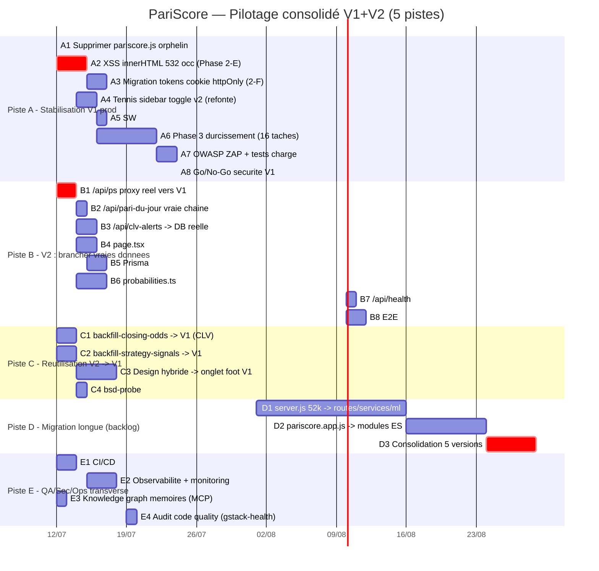

# PariScore — Pilotage consolidé V1 + V2

> **Chef de projet** : ZCode (GLM-5.2) · **Date** : 2026-07-11
> **Sources auditées** : répertoire local (V1 legacy en production) + `pariscore-v2-full-project.zip` (V2 Next.js)
> **Méthode** : 2 sous-agents `Explore` (audit V1 + audit V2) en parallèle, synthèse PM
> **Tracking** : `bd` (beads) — une issue par tâche avant lancement

---

## 0. Décision stratégique de pilotage

Le projet contient **deux codebases distinctes** qu'il faut piloter ensemble, pas fusionner aveuglément.

| Option | Description | Verdict PM |
|---|---|---|
| **A — V1 seule** | Ignorer V2, continuer le monolithe | ❌ Perd la maquette design validée par 1000 parieurs + les scripts backfill |
| **B — V2 seule** | Abandonner V1, migrer tout | ❌ Trop risqué : V2 est 100% mockée, pas de backend, pas de données |
| **C — Hybride (recommandé)** | V1 = production. V2 = (1) maquette design, (2) source de scripts réutilisables, (3) cible de migration long-terme branchée sur les vraies données V1 | ✅ |

**Recommandation PM : Option C.** Cinq pistes parallèles (A à E) ci-dessous.
**Décision business à valider** : confirmer l'option C, ou redéfinir le périmètre V2 (football-only comme le handover, ou multi-sports comme V1).

---

## 1. État de référence (audit factuel)

### 1.1 V1 Legacy — production

| Élément | État | Preuve |
|---|---|---|
| `server.js` (2.5Mo) | ✅ Compile (`node --check` = 0) | — |
| Frontend servi | `pariscore.app.js` + `pariscore.html` | `pariscore.html:25194` → `<script src="/pariscore.app.js?v=250711-04">` |
| `pariscore.js` (1.8Mo) | 🔴 **Orphelin / stale** | Non référencé ni par HTML ni par server.js |
| XSS `_jsStr()` | ✅ Appliqué (25 occ.) | `pariscore.app.js:5318,7594,13301…` |
| Toggle sidebar tennis | ✅ Rollbacké (corps vidé) | `pariscore.app.js:10645` (bd `ParisScorebis-rollback-20260711`) |
| Service Worker | ✅ Désactivé + auto-unregister | `pariscore.app.js:29320-29334` |
| Beads | 17 open · 16 in_progress · 300 closed | `.beads/issues.jsonl` (375 lignes) |
| GANTT sécurité | Phase 1 ✅ · Phase 2 69% · Phase 3 0% · Phase 4 0% | `GANTT.md` |

### 1.2 V2 Next.js — prototype (audit sous-agent)

| Élément | État réel | Contraste avec handover |
|---|---|---|
| `page.tsx` (2850 lignes) | UI riche mais **100% mockée** (`MOCK` hardcoded) | Handover dit "production-ready" |
| `/api/ps` (proxy) | **Fallback mock systématique** (25 endpoints mockés) | Handover dit "25 BSD intégrés" |
| `/api/clv-alerts` | Simulateur aléatoire (30% chance/poll) | Handover dit "CLV push temps réel" |
| `/api/pari-du-jour` | Logique de curation réelle → chaîne vers mock | — |
| `/api/health` | Métriques hardcodées `"true"` | Mensonger |
| Tests E2E (16) | Smoke tests sur mocks | "16/16 verts" crédible mais non significatif |
| `scripts/*.mjs` | **Complets et réels** (backfill CLV + stratégies, SQLite) | ✅ Partie la plus aboutie |
| `shared/probabilities.ts` | Plomberie (cascade/kelly/CLV), **pas de modèles ML** | CatBoost absent |
| Prisma (10 tables) | Schéma défini, **jamais écrit par l'app** | — |
| 50 composants shadcn/ui | **Inutilisés** par page.tsx (style inline) | — |

---

## 2. Gantt consolidé (5 pistes parallèles)

**Chemin critique** : `B1 → B4 → B8` (V2 démoquée) et `A2 → A3 → A6 → A8` (V1 durcie). Les deux chemins convergent vers la décision D3 (consolidation).

---

## 3. Affectation des ressources par piste

### 3.1 Inventaire des ressources disponibles

**Agents / sous-agents**
- `general-purpose` — implémentation multi-étapes, patchs, refactoring
- `Explore` — audit read-only, cartographie (fan-out large)

**Rôles métier (skills `agency-*` + `metier-*`)**
- **Backend Architect** (`agency-backend-architect`) — architecture server.js, routes API
- **Security Architect** (`agency-security-architect`) + `metier-securite-sre` + `aos-security-and-hardening` — XSS, OWASP, tokens, durcissement
- **Database Optimizer** (`agency-database-optimizer`) — Prisma, SQLite, backfill
- **API Tester** (`agency-api-tester`) — validation endpoints BSD/Pariscore
- **Code Reviewer** (`agency-code-reviewer`) + `aos-code-review-and-quality` — revue pre-merge
- **Incident Commander** (`agency-incident-commander`) — crises prod
- **SRE** (`agency-sre`) + `aos-ci-cd-and-automation` + `ps-deploy` — deploy, observabilité, CI/CD
- **Reality Checker** (`agency-reality-checker`) — confronter handover vs réalité

**Skills transverses `aos-*`**
- `aos-planning-and-task-breakdown` · `aos-spec-driven-development` · `aos-incremental-implementation` · `aos-frontend-ui-engineering` · `aos-test-driven-development` · `aos-debugging-and-error-recovery` · `aos-performance-optimization` · `aos-documentation-and-adrs`

**Skills métier Pariscore**
- `ps-audit` · `ps-test` · `ps-add-strategy` · `ps-changelog` · `ps-deploy`
- `betting` (domaine paris sportifs)

**MCP**
- `playwright` — QA E2E visuel, screenshots, scraping fallback
- `memory` — knowledge graph persistant (décisions, schémas API, bugs)
- `git` — opérations structurées (status/log/diff/commit)
- `project_fs` — lecture/écriture fichiers
- `bzzoiro-sports` · `sportdbdotdev` · `sportradar` — validation données sportives / endpoints BSD

**gstack (review/ship/deploy)**
- `/gstack-review` · `/gstack-qa` · `/gstack-ship` · `/gstack-investigate` · `/gstack-cso` (OWASP/STRIDE) · `/gstack-health`

**Tracking** : `bd` (beads) — toute tâche devient une issue avant exécution.

### 3.2 Matrice RACI par piste

**Légende** : R = Responsable · A = Approbateur · C = Consulté · I = Informé

| Tâche | PM (moi) | Backend Arch | Sec Arch | DB Optim | Frontend (aos) | SRE/Ops | API Tester | Code Reviewer | MCP |
|---|---|---|---|---|---|---|---|---|---|
| **A1** Suppr pariscore.js | A | **R** | C | I | I | C | I | C | git |
| **A2** XSS innerHTML | I | C | **R/A** | I | C | I | I | C | — |
| **A3** Tokens cookie | I | C | **R/A** | I | C | I | I | C | memory |
| **A4** Sidebar toggle v2 | A | I | I | I | **R/A** | I | I | C | playwright |
| **A5** SW reactivation | A | I | C | I | **R** | C | I | C | — |
| **A6** Phase 3 durcissement | A | **R** | **R** | I | C | C | I | C | — |
| **A7** OWASP ZAP | A | C | **R/A** | I | I | C | I | I | gstack-cso |
| **A8** Go/No-Go | **R/A** | C | C | I | C | C | I | I | — |
| **B1** /api/ps proxy réel | A | **R/A** | C | I | I | I | C | C | — |
| **B2** pari-du-jour | A | **R** | I | C | I | I | C | C | — |
| **B3** clv-alerts DB | A | **R** | I | **R** | I | I | C | C | memory |
| **B4** page.tsx câblage | A | I | C | I | **R/A** | I | I | C | playwright |
| **B5** Prisma consume | A | C | I | **R/A** | I | I | I | C | — |
| **B6** proba.ts modèles | A | **R** | I | C | I | I | I | C | — |
| **B7** health réel | A | **R** | I | I | I | C | I | C | — |
| **B8** E2E assertions | A | I | I | I | **R** | I | C | C | playwright |
| **C1** backfill CLV → V1 | A | C | I | **R/A** | I | I | C | C | — |
| **C2** backfill strat → V1 | A | C | I | **R/A** | I | I | C | C | — |
| **C3** design → foot V1 | A | I | I | I | **R/A** | I | I | C | playwright |
| **C4** bsd-probe | A | C | I | I | I | I | **R/A** | I | bzzoiro/sportradar |
| **D1** server.js modules | A | **R/A** | C | C | I | C | I | C | memory |
| **D2** app.js modules ES | A | C | I | I | **R/A** | I | I | C | — |
| **D3** consolidation | **R/A** | C | C | C | C | C | I | C | — |
| **E1** CI/CD | A | C | I | I | I | **R/A** | I | C | — |
| **E2** Observabilité | A | C | I | I | I | **R/A** | I | I | — |
| **E3** Memory MCP | **R/A** | I | I | I | I | I | I | I | memory |
| **E4** gstack-health | A | C | I | I | I | I | I | **R/A** | — |

### 3.3 Charge estimée par rôle (heures)

| Rôle | Piste A | Piste B | Piste C | Piste D | Piste E | Total |
|---|---|---|---|---|---|---|
| Chef de projet | 6h | 4h | 3h | 6h | 4h | 23h |
| Backend Architect | 14h | 18h | 4h | 90h | 2h | 128h |
| Security Architect | 16h | 2h | 0h | 4h | 1h | 23h |
| Database Optimizer | 0h | 12h | 12h | 8h | 0h | 32h |
| Frontend (aos) | 10h | 14h | 14h | 32h | 1h | 71h |
| SRE/Ops | 4h | 2h | 0h | 8h | 16h | 30h |
| API Tester | 0h | 4h | 6h | 0h | 0h | 10h |
| Code Reviewer | 4h | 4h | 2h | 4h | 2h | 16h |
| **Total** | **54h** | **60h** | **41h** | **152h** | **26h** | **333h** |

> Pistes A+B+C = priorité court-terme (~155h ≈ 4 semaines à 1 dev full-time équivalent).
> Piste D = dette long-terme, à lancer après stabilisation.

---

## 4. Détail des tâches prioritaires (Piste A + B + C, 2 premières semaines)

### Piste A — Stabilisation V1 (suite GANTT.md sécurité)

| # | Tâche | Skill / Agent | MCP | Livrable | Durée |
|---|---|---|---|---|---|
| **A1** | Supprimer `pariscore.js` (orphelin, stale) — risque de confusion/conflict | `general-purpose` + `aos-code-simplification` | git | PR suppression + vérif `node --check server.js` | 2h |
| **A2** | XSS innerHTML 532 occ. (Phase 2-E) — découper en 3 lots (tennis / MMA / autres) | `agency-security-architect` + `aos-security-and-hardening` | — | 3 patches + rapport | 24h |
| **A3** | Migration tokens → cookie httpOnly (Phase 2-F, dépend A2) | `agency-security-architect` | memory | Patch + tests régression | 16h |
| **A4** | Refonte propre tennis sidebar toggle (depuis `todo.md` : spec, maquette, implé, QA) | `aos-frontend-ui-engineering` + `aos-spec-driven-development` | playwright | Spec + impl + tests visuels | 16h |
| **A5** | Réactivation SW avec cache-busting (fichiers versionnés/hashés) | `aos-frontend-ui-engineering` + `SRE` | — | sw.js v2 + headers Cache-Control | 8h |
| **A6** | Phase 3 durcissement (16 tâches `GANTT.md` §3) | `agency-backend-architect` + `agency-security-architect` | gstack-cso | Patches + Go/No-Go | 48h |

### Piste B — V2 démoquée (brancher vraies données)

| # | Tâche | Skill / Agent | MCP | Livrable | Durée |
|---|---|---|---|---|---|
| **B1** | `/api/ps` proxy réel vers V1 local (`localhost:3000/api/v1/*`) — remplacer mocks `MOCK_BSD` | `agency-backend-architect` | — | route.ts refactor + tests | 16h |
| **B2** | `/api/pari-du-jour` vraie chaîne (dépend B1) | `agency-backend-architect` | — | route.ts + test curation | 8h |
| **B3** | `/api/clv-alerts` → lire `odds_snapshots` + `strategy_signals_history` (scripts backfill existent en C1/C2) | `agency-backend-architect` + `agency-database-optimizer` | memory | route.ts + DB seeding | 12h |
| **B4** | `page.tsx` : câbler boutons PARIER/Sauvegarder/Backtest, IDs BSD réels via `/api/v1/team?name=` | `aos-frontend-ui-engineering` | playwright | page.tsx + tests | 16h |
| **B5** | Consommer les 10 tables Prisma depuis les routes (dépend B2) | `agency-database-optimizer` | — | prisma client wiring | 16h |
| **B6** | `probabilities.ts` : importer Poisson/Dixon-Coles depuis legacy `server.js:20588` | `metier-ingenierie` + `agency-backend-architect` | memory | module ML + tests unitaires | 24h |
| **B7** | `/api/health` : métriques réelles (uptime, DB, endpoints BSD) | `agency-backend-architect` | — | route.ts + healthcheck | 4h |
| **B8** | E2E : assertions métier (EV/CLV calculés, données non-mock) — remplacer smoke tests | `metier-audit-qa` + `aos-test-driven-development` | playwright | specs + rapport | 16h |

### Piste C — Réutilisation V2 → V1 (valeur rapide)

| # | Tâche | Skill / Agent | MCP | Livrable | Durée |
|---|---|---|---|---|---|
| **C1** | Intégrer `backfill-closing-odds.mjs` dans V1 → CLV réel | `agency-database-optimizer` | — | Script + seeding 3 saisons | 12h |
| **C2** | Intégrer `backfill-strategy-signals.mjs` → backtest 16 stratégies V1 | `agency-database-optimizer` + `ps-add-strategy` | — | Script + rapport perf | 16h |
| **C3** | Refactor onglet football V1 avec design hybride validé (vote 1000) | `aos-frontend-ui-engineering` + `ps-audit` | playwright | Maquette + impl | 32h |
| **C4** | `bsd-probe.mjs` avec vraie `BSD_API_KEY` → valider 26 endpoints | `agency-api-tester` | bzzoiro-sports, sportradar | Rapport endpoints OK/KO | 8h |

### Piste E — Transverse (lancer en parallèle dès J)

| # | Tâche | Skill / Agent | MCP | Livrable | Durée |
|---|---|---|---|---|---|
| **E1** | CI/CD : tests automatisés (V1 n'en a aucun) | `SRE` + `aos-ci-cd-and-automation` | — | `.github/workflows` + `node --check` | 16h |
| **E2** | Observabilité : logs structurés, /health V1, alertes | `SRE` + `aos-observability-and-instrumentation` | — | Monitoring stack | 24h |
| **E3** | Memory MCP : capturer décisions, schémas API, bugs récurrents | PM (`aos-context-engineering`) | memory | Knowledge graph seedé | 8h |
| **E4** | Audit qualité global | `agency-code-reviewer` + `/gstack-health` | — | Dashboard qualité | 8h |

---

## 5. Séquencement d'exécution (dispatch agents)

### Sprint 1 — Semaine 1 (J → J+5) : fondations

Lancer en parallèle (agents indépendants) :

| Agent | Tâche | Skill de guidage |
|---|---|---|
| `general-purpose` #1 | **A1** Suppression pariscore.js | `aos-code-simplification` |
| `general-purpose` #2 (backend) | **B1** /api/ps proxy réel | `agency-backend-architect` |
| `general-purpose` #3 (data) | **C1** backfill CLV → V1 | `agency-database-optimizer` |
| `general-purpose` #4 (data) | **C2** backfill strat → V1 | `agency-database-optimizer` |
| `general-purpose` #5 (sec) | **A2-lot1** XSS tennis | `agency-security-architect` |
| `Explore` (read-only) | **C4** bsd-probe + **E4** audit qualité | `agency-api-tester` |
| PM (moi) | **E3** Memory MCP seed + création beads | `aos-context-engineering` |

**Point de synchronisation J+5** : validation A1, B1, C1, C2 → débloque B2/B3/B5.

### Sprint 2 — Semaine 2 (J+5 → J+10) : démoquage V1+V2

| Agent | Tâche | Dépend de |
|---|---|---|
| `general-purpose` #2 (backend) | **B2** + **B7** pari-du-jour + health | B1 |
| `general-purpose` #6 (frontend) | **A4** sidebar toggle + **A5** SW | — |
| `general-purpose` #3 (data) | **B5** Prisma consume | B2 |
| `general-purpose` #4 (data) | **B3** clv-alerts DB | B1, C1 |
| `general-purpose` #7 (ML) | **B6** proba.ts modèles réels | B1 |
| `general-purpose` #5 (sec) | **A2-lot2** XSS MMA + **A3** tokens cookie | A2-lot1 |
| `Explore` | **C3** design foot V1 (audit + maquette) | C1, C2 |
| `SRE` agent | **E1** CI/CD + **E2** observabilité | — |

**Point de synchronisation J+10** : V2 consomme données réelles, V1 durcie (XSS + tokens).

### Sprint 3 — Semaine 3 (J+10 → J+15) : validation

| Agent | Tâche |
|---|---|
| `agency-api-tester` | **B8** E2E assertions métier V2 |
| `metier-audit-qa` | **A7** OWASP ZAP staging |
| `agency-code-reviewer` | Revue pre-merge Piste A+B |
| PM | **A8** Go/No-Go sécurité V1 + **D3-décision** consolidation |

### Sprint 4+ — Piste D (backlog, post-stabilisation)

Lancée uniquement après Go/No-Go A8. `server.js` 52k lignes → `routes/` `services/` `ml/`. Estimation 150h (5-6 semaines).

---

## 6. Gouvernance et suivi

| Rituel | Fréquence | Outil |
|---|---|---|
| Standup | Quotidien (Sprint 1-2) | `bd ready` + `bd list` |
| Revue de piste | Fin de sprint | Ce document + `bd show` |
| Go/No-Go | Fin Piste A (A8), fin Piste B (B8) | PM + Security Architect |
| Mise à jour Gantt | À chaque changement de statut | `PILOTAGE_CONSOLIDE.md` |

### Critères de mise à jour
- Tâche `pending` → `in_progress` : début travail + `bd update <id> --claim`
- Tâche `in_progress` → `done` : livrable produit + testé + `bd close <id>`
- Nouvelle dépendance / blocage : ajout au §7 Risques + `bd` issue

---

## 7. Risques et mitigations

| Risque | P | Impact | Mitigation |
|---|---|---|---|
| A2 XSS (532 occ.) déborde | Élevée | Moyen | Découpe en 3 lots (A2-lot1/2/3) parallélisables |
| B1 proxy V1↑→V2 casse l'existant V1 | Moyenne | Élevé | Isoler V2 en port séparé ou sub-path ; ne pas muter les routes V1 |
| B6 modèles ML legacy non extractibles | Moyenne | Élevé | `Explore` d'abord sur `server.js:20588` avant implé |
| C3 design V2 → V1 casse le CSS tn2 | Moyenne | Moyen | Maquetter sur branche + `playwright` screenshots avant/après |
| D1 refacto server.js 52k introduit régressions | Élevée | Élevé | Seulement après A8 + CI/CD (E1) en place |
| Pas d'accès VPS | Certaine | Élevé | Demander accès SSH dès Sprint 1 |
| Décision business périmètre V2 non tranchée | Moyenne | Moyen | §0 — à valider avant Sprint 1 |

---

## 8. Décisions business en attente

À valider par la direction avant lancement des pistes :

1. **Option C (hybride) confirmée ?** (recommandation PM)
2. **Périmètre V2** : football-only (handover) ou multi-sports comme V1 ?
3. **Accès VPS SSH** pour audit + déploiement (bloque A6/A7)
4. **`BSD_API_KEY` production** pour C4 + B1 réels (bloque démoquage complet)
5. **CatBoost** : activer (`CATBOOST_ENABLED=true` + modèles `.cbm`) ? (bloque B6 ML réel)
6. **Stratégie consolid. 5 versions** (D3) : décision long-terme

---

## 9. Prochaines actions immédiates du chef de projet

1. ⏳ **Valider §0 + §8** avec la direction (option C, périmètre V2, accès VPS)
2. ⏳ **Créer les beads** pour A1, B1, C1, C2, A2-lot1, E3 (Sprint 1) via `bd`
3. ⏳ **Seeder le MCP memory** (E3) : entité `pariscore-architecture` + observations audit
4. ⏳ **Lancer Sprint 1** : 7 agents parallèles (dispatch §5)

---

*Document de pilotage — mettre à jour à chaque fin de sprint et changement de statut.*
*Cross-référence : `GANTT.md` (sécurité V1, Phase 1-4) · `todo.md` (sidebar tennis) · `backlog.md` (UI tennis + pipeline V3) · `HANDOVER.md` (zip V2).*

---

## 10. Journal d'exécution — Sprint 1 (2026-07-11/12)

### Exécuté

| Tâche | Statut | Livrable | Agent / Skill |
|---|---|---|---|
| **A1** — Archive `pariscore.js` orphelin | ✅ Fait | `.archive/pariscore.js.orphan-20260711` ; `node --check server.js` = OK | PM + `aos-code-simplification` |
| **A2-lot1** — XSS tennis | ✅ Fait | `SECURITY_XSS_TENNIS_AUDIT.md` + 12/12 CRITICAL patchés dans `pariscore.app.js` ; `node --check` = 0 | `agency-security-architect` |
| **B1 (prépa)** — Mapping BSD↔V1 | ✅ Fait | `MAPPING_BSD_V1_V2.md` : 25 routes BSD V1 réelles, 8 matchs directs, 15 partiels, 2 gaps | PM |
| **C1+C2** — Backfill CLV/stratégies → V1 | ✅ Fait (code) | `BACKFILL_GAP_ANALYSIS.md` + `scripts/migrate-add-bd-tables.mjs` + `scripts/backfill-closing-odds-v1.mjs` + `scripts/backfill-strategy-signals-v1.mjs` ; `node --check` OK × 3 ; verdict GO | `agency-database-optimizer` |
| **E3** — Knowledge graph MCP | ✅ Fait | `.context/memory.jsonl` (7 entités + 7 relations) + `MEMORY_FILE_PATH` dans `.mcp.json` + `scripts/seed-memory-graph.cjs` | PM + `aos-context-engineering` |

### Blocages découverts (à traiter)

| Blocage | Impact | Action requise |
|---|---|---|
| **`bd` (beads) cassé** — bd.exe disparaît après postinstall, Dolt embedded `winapi #5` | Suivi issues impossible via CLI | Réinstaller/pinner bd dans session dédiée ; suivi intermédiaire via `.beads/issues.jsonl` passif + `PILOTAGE_CONSOLIDE.md` |
| **`better-sqlite3` absent** du poste local | V1 ne démarre pas ; scripts backfill non testables sur vraie DB ; B1 (proxy réel) bloqué | `npm install better-sqlite3` (exception à la règle "no npm install" — c'est la seule dépendance native requise) **OU** copier `pariscore.db` depuis le VPS |
| **Pas de DB locale** (`*.db` absent) | Backfill + proxy réel impossibles à valider localement | Copier `pariscore.db` (snapshot) depuis le VPS de prod |

### Reste à faire Sprint 1

- **B1** — Implémenter proxy réel V2→V1 : **bloqué** par `better-sqlite3` + DB locale
- **C1+C2 validation réelle** — Exécuter migration + backfill sur vraie DB : **bloqué** par `better-sqlite3` + DB locale
- **C4** — `bsd-probe.mjs` avec vraie `BSD_API_KEY` : non démarré (agent non lancé)
- **E4** — Audit qualité `gstack-health` : non démarré

### Découvertes d'audit intégrées au MCP memory
- `pariscore-v1-legacy` : 8 observations (orphelin, XSS, rollback sidebar, SW désactivé…)
- `pariscore-v2-nextjs` : 13 observations (mock systématique, Prisma non écrit, etc.)
- `pariscore-bugs-recurrents` : 6 observations
- `pariscore-api-schemas` : 6 observations (351 routes V1, 25 BSD réelles)
