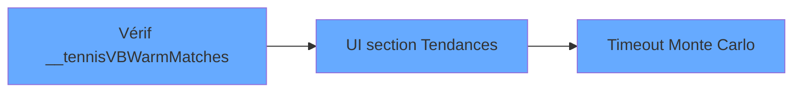

# Sprint Plan — Juillet 2026

> Généré le 2026-06-24 par l'agent CTO Pariscore
> Source : architecture_pariscore.md v12.85 + audit beads/todo.md/CHANGELOG/code

---

## Objectif

Stabiliser le socle (doc figée, priorisation claire) puis exposer les prévisions
TimesFM dans l'interface utilisateur.

---

## P0 — Planning & Architecture ✅ Terminé

| # | Action | Statut | Commit |
|---|--------|--------|--------|
| 1 | Commit architecture_pariscore.md v12.85 | ✅ | 371c4f9 |
| 2 | Nettoyer les probes .context/ (13 fichiers, -1825 lignes) | ✅ | 371c4f9 |
| 3 | Prioriser les 9 beads + sprint à venir | ✅ | Ce document |
| 4 | Créer PLAN_SPRINT.md | ✅ | Ce document |

---

## Décisions de priorisation

### Périmètre du sprint

| Priorité | Source | Sujet | Pilier | Effort |
|----------|--------|-------|--------|--------|
| P1 | beads fez0 | A2: Stale-while-revalidate (déjà implémenté) | B — Engineering | ✅ Fermer sans code |
| P1 | todo P0.4 | safeFixed() — déjà implémenté avec stack trace | B — Engineering | ✅ Fermer sans code |
| P1 | beads 28km | Vérifier peuplement __tennisVBWarmMatches | B — Engineering | ~10min (logs + curl) |
| P1 | beads x2ez | UI TimesFM — section Tendances du moment (JS manquant) | C — Design | ~30min |
| P1 | beads cslx | Timeout Monte Carlo RG >60s | B — Engineering | ~30min |
| P1 | beads bphz/q6jl/6hlh | A3/A4/A5 déjà fermés | — | ✅ Rien |
| P1 | commit 63c4e0f | P1.1 logger catch silencieux déjà commité | — | ✅ Rien |

### IN — Sprint en cours



### BACKLOG — Sprint suivant ou différé

| Source | Sujet | Raison |
|--------|-------|--------|
| beads uvy6 | Pro rework tennis top10 modal (3D + Chart.js) | P2, feature, pas régression |
| beads bwnk | Local WOM provider | P2, dépend décision architecture |
| todo P1.2 | Dashboard erreurs par onglet | P1 mais pas bloquant |
| todo P1.4 | SSE connection leak check | Audit seulement |
| beads vrbw | F1 images self-host | P3, cosmétique |
| beads das9 | FBref dépréciation | P3, FBref déjà mort |
| beads 49pe | OddAlerts API study | P3, étude budgétaire |
| beads m5rf | WOM value-bet gate | P3, backtest nécessaire |
| beads kxst | MMA nav icon | P3, cosmétique |
| beads eeyc | CS2 economy model | BLOQUÉ (pas de feed) |
| todo.md | Migration JWT → httpOnly cookie | Sécurité, à rediscuter |

---

## Cartographie UI TimesFM

### ✅ Déjà implémenté (commit eb56ab5)

| Composant | Fichier | Lignes |
|-----------|---------|--------|
| Cache lookup tennis/football | pariscore.js | 4291–4339 |
| _renderForecastBadge() | pariscore.js | 4341–4347 |
| _renderForecastSparkline() | pariscore.js | 4349–4352 |
| Badge + sparkline dans cartes Top10 | pariscore.js | 4581–4587 |
| Préchargement cache au démarrage | pariscore.js | 4777–4787 |
| Polling 5min | pariscore.js | 4811–4817 |
| CSS badges + sparkline + trending | pariscore.html | 19908–19923 |
| HTML section "Tendances du moment" | pariscore.html | 14952–14973 (statique) |

### 🔲 À implémenter

| Composant | Fichier | Estimation |
|-----------|---------|------------|
| JS pour peupler #trending-risers / #trending-decliners | pariscore.js | ~30 lignes, 30 min |

---

## ADR-001 : Priorisation Sprint Juillet 2026

### Contexte
Audit complet des sources : architecture_pariscore.md v12.85, todo.md, 9 beads,
CHANGELOG, code source.

### Constats

1. **A2 (stale-while-revalidate)** : déjà implémenté avec `getSackmannLastSync()`
   (server.js lignes 36438–36443). La beads utilisait `sps_last_run` par erreur —
   les deux pipelines (Sackmann CSV vs SPS Python) sont différents. Le guard
   actuel est correct.

2. **safeFixed() logging** : déjà implémenté avec stack trace complète
   (pariscore.js lignes 15193–15199). todo.md obsolète.

3. **UI TimesFM** : badge + sparkline déjà commités (eb56ab5). La section
   "Tendances du moment" a le HTML statique mais le JS manque pour la peupler.

### Décisions

- A2 : ✅ Fermé sans modification (code déjà correct)
- safeFixed : ✅ Fermé sans modification (code déjà correct)
- UI TimesFM badge/sparkline : ✅ Fermé
- UI TimesFM section tendances : 🔲 À implémenter (P1, ~30min)
- Vérif __tennisVBWarmMatches : 🔲 Investigation (P1, ~10min)
- Timeout Monte Carlo : 🔲 Si le temps le permet (P1)
- Pro rework tennis modal : ⏳ Repoussé P2
- Tout le reste : ⏳ Backlog P2-P3

---

## Procédure de vérification __tennisVBWarmMatches

```bash
# Après démarrage du serveur, attendre 10s
# 1. Vérifier le cache Top10
curl -s http://localhost:3000/api/v1/tennis/top10 | jq '.total_active'

# 2. Ajouter dans /api/v1/status un champ debug :
#    "tennisVBWarmMatches_count": (globalThis.__tennisVBWarmMatches || []).length

# 3. Vérifier les logs du warmup
grep -i "WarmTop10\|Top10Refresh\|tennisVBWarm\|SPS_CACHE" server.log
```

---

## ADR-002 : A2 déjà implémenté

### Contexte
La beads `fez0` demandait d'ajouter un guard stale-while-revalidate dans
`_refreshTop10Cache()` basé sur `sps_last_run`.

### Analyse
Le guard existe déjà aux lignes 36438–36443, mais utilise `getSackmannLastSync()`
(Sackmann CSV import time) plutôt que `sps_last_run` (SPS Python pipeline). Ces
deux pipelines sont indépendants :
- Sackmann : import CSV des matchs historiques (24h)
- SPS : calcul Surface Power Score (5min)

Le guard sur Sackmann est logiquement correct : le rebuild TOP10 dépend des
données Sackmann. Un guard SPS supplémentaire serait une optimisation distincte.

### Décision
Fermer la beads `fez0` sans modification du code.
