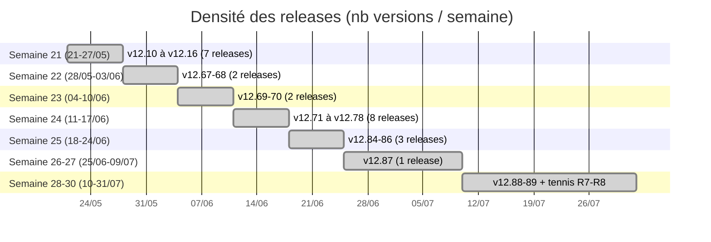

# 📊 PariScore — Roadmap Gantt (CHANGELOG v12.10 → v12.89)

> Généré le 2026-07-23 depuis `CHANGELOG.md` (28 versions, 21/05 → 23/07/2026).
> Visualisation Mermaid — rendu natif GitHub/GitLab/VSCode.

## Vue d'ensemble — Gantt par thématiques

Les 28 releases sont regroupées en 7 axes produit pour la lisibilité. Les dates
correspondent aux jours de release réels (1 release peut regrouper plusieurs
jours de travail).

```mermaid
gantt
    title PariScore — Chronologie des releases (mai→juillet 2026)
    dateFormat YYYY-MM-DD
    axisFormat %d/%m
    todayMarker off

    section 🎾 Tennis & Roland-Garros
    RG bracket interactif (v12.67)          :done, rg1, 2026-05-20, 3d
    Tennis Elo surface + closures (v12.78)   :done, rg2, 2026-06-08, 4d
    TOP 10 Tennis + H2H Surface (v12.82-83)  :done, rg3, 2026-06-14, 3d
    Tennisabstract Elo scraper (eb70d64)     :done, rg4, 2026-07-18, 2d
    R7-R8 carte broadcast TV                :done, rg5, 2026-07-20, 3d

    section ⚽ Football & BSD
    BSD intégration annonces (v12.68)        :done, fb1, 2026-05-27, 2d
    ETL football-data.co.uk (v12.74-75)      :done, fb2, 2026-06-10, 2d
    Sélections nationales ETL (v12.76)       :done, fb3, 2026-06-10, 1d
    Football card + Signal Fort (v12.71)     :done, fb4, 2026-06-10, 1d
    Fix logos BSD IDs + beSOCCER (v12.89)    :done, fb5, 2026-07-23, 1d

    section 🧠 ML / Modèles prédictifs
    Spike Odds API alternatives (v12.15)     :done, ml1, 2026-05-20, 2d
    Fix momentum flat-line (v12.14)          :done, ml2, 2026-05-20, 1d
    NBA Brier validé 0.209 (v12.70)          :done, ml3, 2026-06-08, 2d
    TimesFM routing + médiane (v12.85)       :done, ml4, 2026-06-23, 2d
    P_BETS Win Probability Gauge (v12.84)    :done, ml5, 2026-06-19, 2d

    section 🖼️ Logos & UI
    Audit auth redesign (session 18/06)      :done, ui1, 2026-06-17, 2d
    Spider chart 7 bugs (session 18/06)      :done, ui2, 2026-06-17, 1d
    Sprint stabilisation navbar (v12.86)     :done, ui3, 2026-06-24, 2d
    Cascade logos équipes+leagues (v12.88)   :done, ui4, 2026-07-12, 2d

    section 🛠️ Infra / DevOps / Quality
    ETL Historique scaffold (v12.10)         :done, ops1, 2026-05-20, 1d
    SQLite corruption diagnostic (v12.13)    :done, ops2, 2026-05-20, 1d
    Security hardening nginx ACL (v12.12)    :done, ops3, 2026-05-20, 1d
    Incident sécurité preuves (v12.11)       :done, ops4, 2026-05-20, 1d
    PWA icon + SW bump (v12.16)              :done, ops5, 2026-05-20, 1d
    Quality gates Plan→Verify (v12.77)       :done, ops6, 2026-06-10, 1d
    PPG auto-repair + monitor (v12.79)       :done, ops7, 2026-06-13, 2d
    SetPoint Next.js chunks 404 (v12.87)     :done, ops8, 2026-07-05, 2d

    section 📋 Audit post-prod
    Audit AF post-prod kill-switch (v12.66)  :done, au1, 2026-05-21, 2d
    Session 26 commits consolid (v12.65)     :done, au2, 2026-05-21, 1d
    Fix Corners historique (v12.73)          :done, au3, 2026-06-10, 1d

    section 🔮 Backlog / À venir
    Migration Prisma (legacy → Next.js)      :backlog, bl1, after fb5, 30d
    React live cards (src/components/football):backlog, bl2, after fb5, 15d
    beSOCCER backfill large (~100 équipes)   :backlog, bl3, after fb5, 2d
    Wikidata P154 logos (couverture large)   :backlog, bl4, after fb5, 5d
```

## Cadence de release



## Métriques clés

| Indicateur | Valeur |
|---|---|
| Versions total (CHANGELOG) | 28 (v12.10 → v12.89) |
| Période couverte | 63 jours (21/05 → 23/07/2026) |
| Cadence moyenne | ~1 release tous les 2,2 jours |
| Pic d'activité | Semaine 24 (8 releases, 11-17/06) |
| Axes produit | 7 (Tennis, Football, ML, UI, Infra, Audit, Backlog) |
| Commits session actuelle | 1 (94f2607 — logos BSD + beSOCCER) |

## Backlog prioritaire (post v12.89)

1. **Migration Prisma** (30j estimé) — legacy `server.js`/`pariscore.html` → Next.js API routes + Prisma.
   Le plus gros chantier, débloque React live cards.
2. **React live cards** (`src/components/football/`) — stack séparée actuelle (mock data `LIVE_MATCHES`),
   à reconnecter au pipeline `db.matches`/SSE réel.
3. **beSOCCER backfill large** — `python scripts/besoccer-backfill-ids.py --from-file teams.txt --limit 100`
   pour couvrir les top 100 équipes mondiales (~100 fetchs Camoufox, ~5h).
4. **Wikidata P154** — propriété "logo image" pour les équipes hors-BSD/beSOCCER (couverture mondiale).

---

*Source : `CHANGELOG.md` (28 versions) + `CLAUDE.md` (journal de sessions).*
