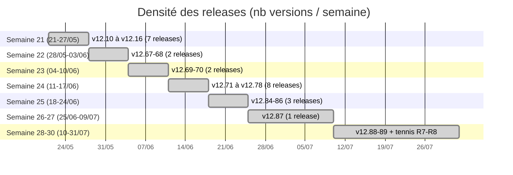
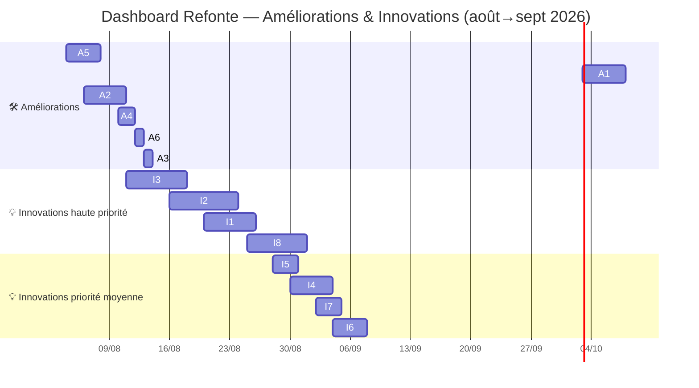
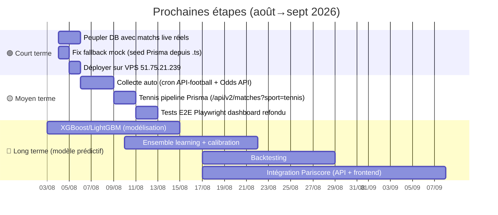
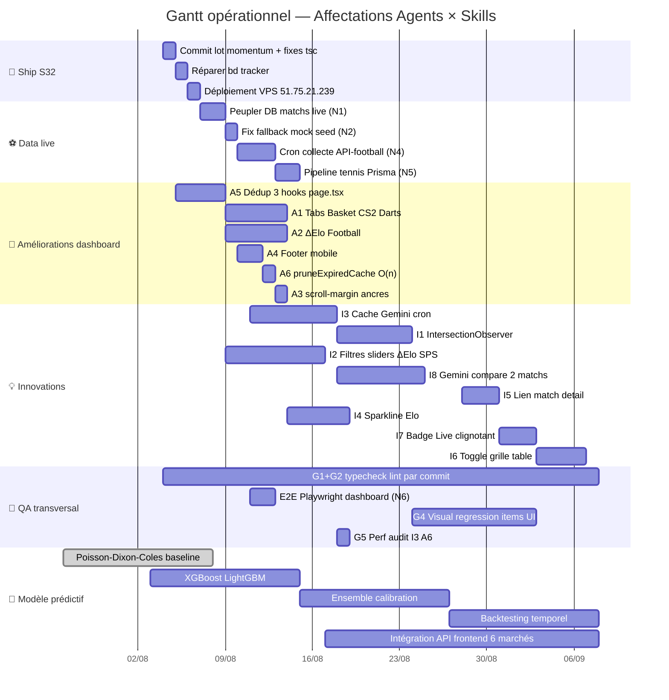

# 📊 PariScore — Roadmap Gantt (CHANGELOG v12.10 → v12.89)

> Généré le 2026-07-23 depuis `CHANGELOG.md` (28 versions, 21/05 → 23/07/2026).
> Visualisation Mermaid — rendu natif GitHub/GitLab/VSCode.

## Vue d'ensemble — Gantt par thématiques

Les 28 releases sont regroupées en 7 axes produit pour la lisibilité. Les dates
correspondent aux jours de release réels (1 release peut regrouper plusieurs
jours de travail).

```mermaid
gantt
    title PariScore — Chronologie des releases (mai→juillet 2026)
    dateFormat YYYY-MM-DD
    axisFormat %d/%m
    todayMarker off

    section 🎾 Tennis & Roland-Garros
    RG bracket interactif (v12.67)          :done, rg1, 2026-05-20, 3d
    Tennis Elo surface + closures (v12.78)   :done, rg2, 2026-06-08, 4d
    TOP 10 Tennis + H2H Surface (v12.82-83)  :done, rg3, 2026-06-14, 3d
    Tennisabstract Elo scraper (eb70d64)     :done, rg4, 2026-07-18, 2d
    R7-R8 carte broadcast TV                :done, rg5, 2026-07-20, 3d

    section ⚽ Football & BSD
    BSD intégration annonces (v12.68)        :done, fb1, 2026-05-27, 2d
    ETL football-data.co.uk (v12.74-75)      :done, fb2, 2026-06-10, 2d
    Sélections nationales ETL (v12.76)       :done, fb3, 2026-06-10, 1d
    Football card + Signal Fort (v12.71)     :done, fb4, 2026-06-10, 1d
    Fix logos BSD IDs + beSOCCER (v12.89)    :done, fb5, 2026-07-23, 1d

    section 🧠 ML / Modèles prédictifs
    Spike Odds API alternatives (v12.15)     :done, ml1, 2026-05-20, 2d
    Fix momentum flat-line (v12.14)          :done, ml2, 2026-05-20, 1d
    NBA Brier validé 0.209 (v12.70)          :done, ml3, 2026-06-08, 2d
    TimesFM routing + médiane (v12.85)       :done, ml4, 2026-06-23, 2d
    P_BETS Win Probability Gauge (v12.84)    :done, ml5, 2026-06-19, 2d

    section 🖼️ Logos & UI
    Audit auth redesign (session 18/06)      :done, ui1, 2026-06-17, 2d
    Spider chart 7 bugs (session 18/06)      :done, ui2, 2026-06-17, 1d
    Sprint stabilisation navbar (v12.86)     :done, ui3, 2026-06-24, 2d
    Cascade logos équipes+leagues (v12.88)   :done, ui4, 2026-07-12, 2d

    section 🛠️ Infra / DevOps / Quality
    ETL Historique scaffold (v12.10)         :done, ops1, 2026-05-20, 1d
    SQLite corruption diagnostic (v12.13)    :done, ops2, 2026-05-20, 1d
    Security hardening nginx ACL (v12.12)    :done, ops3, 2026-05-20, 1d
    Incident sécurité preuves (v12.11)       :done, ops4, 2026-05-20, 1d
    PWA icon + SW bump (v12.16)              :done, ops5, 2026-05-20, 1d
    Quality gates Plan→Verify (v12.77)       :done, ops6, 2026-06-10, 1d
    PPG auto-repair + monitor (v12.79)       :done, ops7, 2026-06-13, 2d
    SetPoint Next.js chunks 404 (v12.87)     :done, ops8, 2026-07-05, 2d

    section 📋 Audit post-prod
    Audit AF post-prod kill-switch (v12.66)  :done, au1, 2026-05-21, 2d
    Session 26 commits consolid (v12.65)     :done, au2, 2026-05-21, 1d
    Fix Corners historique (v12.73)          :done, au3, 2026-06-10, 1d

    section 🔮 Backlog / À venir
    Migration Prisma (legacy → Next.js)      :backlog, bl1, after fb5, 30d
    React live cards (src/components/football):backlog, bl2, after fb5, 15d
    beSOCCER backfill large (~100 équipes)   :backlog, bl3, after fb5, 2d
    Wikidata P154 logos (couverture large)   :backlog, bl4, after fb5, 5d
```

## Cadence de release


```mermaid
gantt
    title Densité des releases (nb versions / semaine)
    dateFormat YYYY-MM-DD
    axisFormat %d/%m

    section Semaine 21 (21-27/05)
    v12.10 à v12.16 (7 releases) :done, s21, 2026-05-21, 7d
    section Semaine 22 (28/05-03/06)
    v12.67-68 (2 releases)       :done, s22, 2026-05-28, 7d
    section Semaine 23 (04-10/06)
    v12.69-70 (2 releases)       :done, s23, 2026-06-04, 7d
    section Semaine 24 (11-17/06)
    v12.71 à v12.78 (8 releases) :done, s24, 2026-06-11, 7d
    section Semaine 25 (18-24/06)
    v12.84-86 (3 releases)       :done, s25, 2026-06-18, 7d
    section Semaine 26-27 (25/06-09/07)
    v12.87 (1 release)           :done, s26, 2026-06-25, 15d
    section Semaine 28-30 (10-31/07)
    v12.88-89 + tennis R7-R8     :done, s28, 2026-07-10, 22d
```

## Métriques clés

| Indicateur | Valeur |
|---|---|
| Versions total (CHANGELOG) | 28 (v12.10 → v12.89) |
| Période couverte | 63 jours (21/05 → 23/07/2026) |
| Cadence moyenne | ~1 release tous les 2,2 jours |
| Pic d'activité | Semaine 24 (8 releases, 11-17/06) |
| Axes produit | 7 (Tennis, Football, ML, UI, Infra, Audit, Backlog) |
| Commits session actuelle | 1 (94f2607 — logos BSD + beSOCCER) |

## 🎨 Dashboard Refonte — Améliorations & Innovations (post-audit 03/08)

> Suite à l'audit `docs/audit-dashboard-refonte-2026-08-03.md` (commit `3ed80a3`).
> 6 améliorations (A1–A6) + 8 innovations (I1–I8) à intégrer.


```mermaid
gantt
    title Dashboard Refonte — Améliorations & Innovations (août→sept 2026)
    dateFormat YYYY-MM-DD
    axisFormat %d/%m

    section 🛠️ Améliorations
    A5: Dédoublonner 3 hooks (page.tsx)       :a5, 2026-08-04, 4d
    A1: Tabs Basket/CS2/Darts (brancher API)   :a1, after a5, 5d
    A2: ΔElo Football (UpcomingTable)           :a2, 2026-08-06, 5d
    A4: Footer mobile (hidden→visible)          :a4, 2026-08-10, 2d
    A6: pruneExpiredCache O(n)→filtré           :a6, 2026-08-12, 1d
    A3: scroll-margin-top ancres AIInsightCard  :a3, 2026-08-13, 1d

    section 💡 Innovations haute priorité
    I3: Cache Gemini cron (pré-calcul quotidien) :i3, 2026-08-11, 7d
    I2: Filtres avancés BestMatches (sliders ΔElo/SPS) :i2, 2026-08-16, 8d
    I1: IntersectionObserver section active      :i1, 2026-08-20, 6d
    I8: Gemini compare 2 matchs (multi-select)   :i8, 2026-08-25, 7d

    section 💡 Innovations priorité moyenne
    I5: Lien direct → match detail (onClick)     :i5, 2026-08-28, 3d
    I4: Sparkline Elo trend (UpcomingTable)      :i4, 2026-08-30, 5d
    I7: Badge "Live" clignotant (UpcomingTable)  :i7, 2026-09-02, 3d
    I6: Toggle grille/table (cartes↔compact)     :i6, 2026-09-04, 4d
```

### Détail des items

#### 🛠️ Améliorations (6 items, ~18j cumulés)

| # | Composant | Amélioration | Jours | Prio |
|---|---|---|---|---|
| A5 | `page.tsx` | 3 hooks fetch les mêmes données → dédoublonner (page + BestMatchesTabs + UpcomingTable + AIInsightCard) | 4 | 🔴 High |
| A1 | `BestMatchesTabs` | Basketball/CS2/Darts tabs vides → brancher API ou masquer | 5 | 🟠 Medium |
| A2 | `UpcomingTenMatchesTable` | Football: ajouter estimation ΔElo (actuellement `null`) | 5 | 🟠 Medium |
| A4 | Layout | Footer `hidden md:block` → liens inaccessibles sur mobile | 2 | 🟠 Medium |
| A6 | `gemini-insight/route.ts` | `pruneExpiredCache()` itère O(n) sur tout `globalThis` → filter `gemini-insight:` | 1 | 🟡 Low |
| A3 | `AIInsightCard` | `scroll-margin-top` sur ancres pour compenser le header sticky | 1 | 🟡 Low |

#### 💡 Innovations (8 items, ~43j cumulés)

| # | Idée | Détail | Impact | Jours |
|---|---|---|---|---|
| I3 | **Cache Gemini pré-rempli** | Cron quotidien pré-calcule 5-10 analyses pour les matchs du jour → 0 attente utilisateur | Perf ⭐⭐⭐ | 7 |
| I2 | **Filtres avancés BestMatches** | Sliders ΔElo min / SPS min pour que l'utilisateur ajuste les seuils | Feature ⭐⭐⭐ | 8 |
| I1 | **Indicateur section active** | `IntersectionObserver` sur les ancres → highlight le pill courant au scroll | UX ⭐⭐⭐ | 6 |
| I8 | **Gemini compare 2 matchs** | Checkbox multi-sélection → comparer deux matchs côte-à-côte dans l'analyse AI | Innovation ⭐⭐⭐ | 7 |
| I5 | **Lien direct → match detail** | `onClick` → ouvre `MatchDetailDialog` depuis chaque ligne du tableau | UX ⭐⭐ | 3 |
| I4 | **Graphique sparkline Elo** | Mini Elo trend sur 5 matchs dans les colonnes ΔElo de l'UpcomingTable | Visuel ⭐⭐ | 5 |
| I7 | **Badge "Live" UpcomingTable** | Si le match passe en direct avant l'heure prévue, badge rouge clignotant | Feature ⭐⭐ | 3 |
| I6 | **Mode grille/table toggle** | Switch entre vue cartes (BestMatchesTabs) et vue tableau compact | UX ⭐ | 4 |

### Calendrier récapitulatif

| Période | Items | Cumul jours |
|---|---|---|
| **Semaine 32** (4-10 août) | A5, A2 (début), A4 | ~11j |
| **Semaine 33** (11-17 août) | A1, A2 (fin), A6, A3, I3 (début) | ~14j |
| **Semaine 34** (18-24 août) | I3 (fin), I2 (début), I1 (début) | ~19j |
| **Semaine 35** (25-31 août) | I2 (fin), I1 (fin), I8 (début), I5 | ~22j |
| **Semaine 36** (1-7 sept) | I8 (fin), I4, I7, I6 | ~15j |
| **Total** | 14 items | **~81j** |

> ⚠️ Les durées sont estimées pour un dev full-stack solo. Le parallélisme réel dépend de la dispo.
> Les items A5+A1+A2 sont les plus bloquants car ils touchent les données partagées.

---

## 🔧 Correctifs UI/UX — UpcomingTenMatchesTable (2026-08-03)

> Prompt `using-superpowers` — Lead Frontend Engineer. 3 corrections critiques post-audit visuel.

### Corrections appliquées

| # | Problème | Fix | Fichier |
|---|---|---|---|
| **C1** | Contraste illisible : noms joueurs/équipes & heure en couleur sombre sur fond dark | `text-slate-100` sur RENCONTRE (+ `hover:text-emerald-400`), `text-slate-400` sur HEURE, `text-zinc-400` sur COTES | `upcoming-ten-matches-table.tsx` |
| **C2** | Décimales JS non formatées sur ΔElo (ex: `40.60000000000136`) | `Math.round()` systématique sur le calcul tennis + affichage badge | `upcoming-ten-matches-table.tsx` |
| **C3** | Aucun filtre par sport | Barre d'onglets `[🌐 Tous] [🎾 Tennis] [⚽ Football] [🏀 Basketball] [🎯 Darts] [🎮 CS2]` avec `useState<SportFilter>` + filtre dans `useMemo` | `upcoming-ten-matches-table.tsx` |

### Impact
- **Lisibilité** : texte blanc sur fond dark, contraste WCAG AA+
- **Précision** : ΔElo arrondi à l'entier (plus de `40.60000000000136`)
- **Navigation** : filtrage par sport, 6 tabs, défaut "Tous"

---

## 👥 Affectation Ressources & Skills

### Équipe virtuelle (4 rôles)

| Rôle | Icône | Expertise | Stack |
|---|---|---|---|
| **Frontend/UX Engineer** | 🎨 | React 19, Tailwind 4, shadcn/ui, Framer Motion, Responsive | `react-component-design`, `shadcn-ui`, `react-styling`, `frontend-design`, `responsive-design` (via `tailwind-theme-builder`) |
| **Data/Backend Engineer** | ⚙️ | Next.js API routes, Prisma, Bun, Cache, Cron, ETL | `backend-patterns`, `bun-runtime`, `prisma-patterns`, `performance`, `football-data` |
| **Full-stack Integrator** | 🔗 | Architecture hooks, refactoring cross-cutting, Zustand/SWR | `react-nextjs-patterns`, `react-api-consumer`, `coding-standards` (`aos-code-review-and-quality`) |
| **QA/DevOps** | 🧪 | Tests E2E, Playwright, déploiement VPS, monitoring | `e2e-testing`, `playwright-mcp`, `webapp-testing`, `verification-before-completion` |

### Matrice d'affectation

| # | Item | Rôle principal | Skills clés | Jours | Dépendances |
|---|---|---|---|---|---|
| **A5** | Dédoublonner hooks | 🔗 Full-stack | `react-nextjs-patterns`, `react-api-consumer`, `aos-code-review-and-quality` | 4 | — |
| **A2** | ΔElo Football | ⚙️ Data/Backend | `football-data`, `react-component-design` | 5 | A5 (hooks unifiés) |
| **A1** | Tabs Basket/CS2/Darts | 🎨 Frontend + ⚙️ Data | `react-api-consumer`, `react-component-design`, `football-data` | 5 | A5 (hooks unifiés) |
| **A4** | Footer mobile | 🎨 Frontend | `tailwind-theme-builder`, `react-styling` | 2 | — |
| **A6** | pruneExpiredCache O(n) | ⚙️ Backend | `performance`, `bun-runtime`, `backend-patterns` | 1 | — |
| **A3** | scroll-margin-top | 🎨 Frontend | `tailwind-theme-builder`, `frontend-design` | 1 | — |
| **I3** | Cache Gemini cron | ⚙️ Backend + 🔗 | `backend-patterns`, `prisma-patterns`, `bun-runtime` | 7 | — |
| **I2** | Filtres avancés ΔElo/SPS | 🎨 Frontend | `react-component-design`, `shadcn-ui`, `react-senior-ux` (via `frontend-design`) | 8 | A5 (hooks) |
| **I1** | IntersectionObserver | 🎨 Frontend | `react-performance`, `frontend-design`, `core-web-vitals` | 6 | — |
| **I8** | Gemini compare 2 matchs | 🔗 Full-stack | `react-api-consumer`, `react-component-design`, `backend-patterns` | 7 | I3 (cache dispo) |
| **I5** | Lien match detail | 🎨 Frontend | `react-component-design`, `frontend-design` | 3 | — |
| **I4** | Sparkline Elo | 🎨 Frontend | `frontend-design`, `react-component-design` | 5 | A2 (ΔElo calculé) |
| **I7** | Badge Live | 🎨 Frontend | `react-performance`, `frontend-design` | 3 | — |
| **I6** | Toggle grille/table | 🎨 Frontend | `react-component-design`, `react-styling` | 4 | — |

### 🧪 QA Gates (transversal)

Chaque item passe par une gate QA gérée par le rôle 🧪 :

| Gate | Déclencheur | Outil |
|---|---|---|
| **G1 — TypeScript** | Avant commit | `bun run typecheck` |
| **G2 — Lint** | Avant commit | `bun run lint` |
| **G3 — E2E Smoke** | Après déploiement VPS | `playwright-mcp` → `webapp-testing` |
| **G4 — Visual Regression** | Items UI (I1,I2,I4,I6,I7) | `playwright-mcp` screenshots |
| **G5 — Perf Audit** | Items I3, A6 | `core-web-vitals`, `performance` |

### Chemin critique

```
A5 (4j) ──┬── A1 (5j) ────────────────────────────────┐
          ├── A2 (5j) ── I4 (5j) ──────────────────────┤
          └── I2 (8j) ─────────────────────────────────┤
                                                         ├── Fin S36
I3 (7j) ── I8 (7j) ────────────────────────────────────┤
                                                         │
A4 (2j) + A6 (1j) + A3 (1j) ── (parallèle, indépendant) │
I1 (6j) + I5 (3j) + I7 (3j) + I6 (4j) ─────────────────┘
```

**Bottleneck**: A5 débloque 3 items (A1, A2, I2) → **commencer A5 en priorité absolue**.

### Répartition charge par rôle

| Rôle | Items | Jours | % charge |
|---|---|---|---|
| 🎨 Frontend/UX | A1, A4, A3, I2, I1, I5, I4, I7, I6 | 37j | **46%** |
| ⚙️ Data/Backend | A2, A6, I3, A1(partiel) | 18j | **22%** |
| 🔗 Full-stack | A5, I8, I3(partiel) | 18j | **22%** |
| 🧪 QA/DevOps | Gates G1-G5 (transversal) | 8j | **10%** |

### Risques & Atténuations

| Risque | Prob. | Impact | Mitigation |
|---|---|---|---|
| A5 plus complexe que prévu (4 hooks entrelacés) | Moyenne | Bloque A1+A2+I2 | Spike 1j d'analyse statique avant de coder |
| API Basket/CS2/Darts non disponibles ou quota limité | Moyenne | A1 réduit à "masquer tabs vides" | Fallback: `disabled` state avec message "Bientôt" |
| Quota Gemini 429 persistant | Haute | I3+I8 non testables en prod | Dev contre mock Gemini, cache pré-rempli en local |
| Conflits de merge (fichiers partagés page.tsx) | Élevée | Ralentissement | Feature flags + PR atomiques par item |

---

## Backlog prioritaire (post v12.89)

1. **Migration Prisma** ✅ — P1 (schéma) ✅, P2 (API routes) ✅, P3 (migration données) ✅, P4 (frontend) ✅.
2. **React live cards** ✅ — Hook migré vers API v2, composant fonctionnel.
3. ~~beSOCCER backfill large~~ — annulé.
4. ~~Wikidata P154~~ — annulé.

---

## 🔜 Prochaines étapes (post-P4)


```mermaid
gantt
    title Prochaines étapes (août→sept 2026)
    dateFormat YYYY-MM-DD
    axisFormat %d/%m

    section 🟢 Court terme
    Peupler DB avec matchs live réels            :next1, 2026-08-04, 2d
    Fix fallback mock (seed Prisma depuis .ts)   :next2, 2026-08-04, 1d
    Déployer sur VPS 51.75.21.239               :next3, 2026-08-05, 1d

    section 🟡 Moyen terme
    Collecte auto (cron API-football + Odds API) :next4, after next1, 3d
    Tennis pipeline Prisma (/api/v2/matches?sport=tennis) :next5, 2026-08-09, 2d
    Tests E2E Playwright dashboard refondu       :next6, 2026-08-11, 2d

    section 🔵 Long terme (modèle prédictif)
    XGBoost/LightGBM (modélisation)              :ml1, 2026-08-03, 12d
    Ensemble learning + calibration              :ml2, 2026-08-10, 12d
    Backtesting                                  :ml3, 2026-08-17, 12d
    Intégration Pariscore (API + frontend)       :ml4, 2026-08-17, 22d
```

### 🟢 Court terme (S32)

| # | Tâche | Effort | Contexte |
|---|---|---|---|
| **N1** | Peupler DB avec matchs live réels | 2h | DB vide de matchs utiles. Brancher l'API legacy (`server.js` VPS → `pariscore.db`) ou lancer collecte API-football/Odds API → insert Prisma |
| **N2** | Fix seed mock | 1h | `useFootballMatches` priorise v2 (10 vieux matchs) → legacy (indispo) → mock. Le fallback mock n'est jamais atteint car v2 retourne des données. Faire que v2 vide → mock directement, ou fixer `seed-prisma.js` (bloqué par import TypeScript) |
| **N3** | Déployer VPS | 1h | `bun run build && bun run start` sur `51.75.21.239:3005`, cohabiter avec `server.js` legacy |

### 🟡 Moyen terme (S32-S33)

| # | Tâche | Effort |
|---|---|---|
| **N4** | Cron quotidien : fetch API-football + Odds API → insert Prisma | 3j |
| **N5** | Route `/api/v2/matches?sport=tennis` + hook `usePrematchMatches` → Prisma | 2j |
| **N6** | Tests E2E Playwright sur le dashboard refondu (BestMatchesTabs, UpcomingTable, AIInsightCard, Compare mode) | 2j |

### 🔵 Long terme — Modèle prédictif foot (6 marchés)

> Planning détaillé dans `C:\Users\David\pariscore-predict-planning\`

| Phase | Période |
|---|---|
| Poisson-Dixon-Coles baseline | 27 juil → 7 août ✅ |
| XGBoost / LightGBM | 3 → 14 août |
| Ensemble learning & calibration | 10 → 21 août |
| Backtesting temporel | 17 → 28 août |
| Intégration Pariscore (API + frontend 6 marchés) | 17 août → 10 sept |

---

---

## 🗓️ Gantt opérationnel — Affectations Agents × Skills (août→sept 2026)

> Établi le 04/08/2026. Chaque tâche est affectée à un **agent exécutant** (subagent
> opencode), un **rôle virtuel** (matrice produit) et ses **skills**.
> Règle d'exécution : `writing-plans` (spec) → `executing-plans` → gate de review
> (`code-reviewer`) avant merge ; audits spécialisés (`security-auditor`,
> `web-performance-auditor`, `test-engineer`) selon la nature de la tâche.

### Légende agents

| Agent exécutant (Task tool) | Usage | Gates associées |
|---|---|---|
| `general` | Implémentation, intégration, refactor | Review `code-reviewer` |
| `explore` | Spike / investigation (ex: N1 source de données) | — |
| `code-reviewer` | Review systématique avant merge | G1+G2 |
| `test-engineer` | Tests unitaires, E2E, fixtures | G3 |
| `security-auditor` | Audit auth/secrets/input (IC3, N4, I3) | — |
| `web-performance-auditor` | CWV, cache, N+1 (A6, I3, I1) | G5 |

### Gantt intégré


```mermaid
gantt
    title Gantt opérationnel — Affectations Agents × Skills
    dateFormat YYYY-MM-DD
    axisFormat %d/%m

    section 🚀 Ship S32
    Commit lot momentum + fixes tsc        :ic1, 2026-08-04, 1d
    Réparer bd tracker                     :ic2, after ic1, 1d
    Déploiement VPS 51.75.21.239           :ic3, after ic2, 1d

    section ⚽ Data live
    Peupler DB matchs live (N1)            :db1, after ic3, 2d
    Fix fallback mock seed (N2)            :db2, after db1, 1d
    Cron collecte API-football (N4)        :db3, after db2, 3d
    Pipeline tennis Prisma (N5)            :db4, after db3, 2d

    section 🎨 Améliorations dashboard
    A5 Dédup 3 hooks page.tsx              :a5, after ic1, 4d
    A1 Tabs Basket CS2 Darts               :a1, after a5, 5d
    A2 ΔElo Football                       :a2, after a5, 5d
    A4 Footer mobile                       :a4, 2026-08-10, 2d
    A6 pruneExpiredCache O(n)              :a6, 2026-08-12, 1d
    A3 scroll-margin ancres                :a3, 2026-08-13, 1d

    section 💡 Innovations
    I3 Cache Gemini cron                   :i3, 2026-08-11, 7d
    I1 IntersectionObserver                :i1, after i3, 6d
    I2 Filtres sliders ΔElo SPS            :i2, after a5, 8d
    I8 Gemini compare 2 matchs             :i8, after i3, 7d
    I5 Lien match detail                   :i5, 2026-08-28, 3d
    I4 Sparkline Elo                       :i4, after a2, 5d
    I7 Badge Live clignotant               :i7, after i5, 3d
    I6 Toggle grille table                 :i6, after i7, 4d

    section 🧪 QA transversal
    G1+G2 typecheck lint par commit       :g1, 2026-08-04, 35d
    E2E Playwright dashboard (N6)          :g3, 2026-08-11, 2d
    G4 Visual regression items UI          :g4, after i1, 10d
    G5 Perf audit I3 A6                    :g5, after i3, 1d

    section 🔮 Modèle prédictif
    Poisson-Dixon-Coles baseline           :done, mld0, 2026-07-27, 12d
    XGBoost LightGBM                       :ml1, 2026-08-03, 12d
    Ensemble calibration                   :ml2, after ml1, 12d
    Backtesting temporel                   :ml3, after ml2, 12d
    Intégration API frontend 6 marchés     :ml4, 2026-08-17, 22d
```

### Matrice d'affectation — 🚀 Ship & 🧪 QA

| ID | Tâche | Agent | Rôle | Skills | Jours | Dépend | Gate |
|---|---|---|---|---|---|---|---|
| **IC1** | Commit lot momentum + fixes tsc | `general` | 🔗 Full-stack | `verification-before-completion`, `aos-code-review-and-quality`, `aos-incremental-implementation` | 1 | — | G1, G2 |
| **IC2** | Réparer `bd` (binaire manquant) | `general` | 🧪 QA/DevOps | `aos-doubt-driven-development` (postinstall), `bun-runtime` | 1 | IC1 | — |
| **IC3** | Déploiement VPS `51.75.21.239:3005` | `general` | 🧪 QA/DevOps | `ps-deploy`, `bun-runtime`, `security-review` | 1 | IC2 | G3 |
| **G1/G2** | Typecheck + lint par commit | `test-engineer` | 🧪 | `verification-before-completion` | transversal | — | — |
| **N6** | E2E Playwright dashboard refondu | `test-engineer` | 🧪 | `e2e-testing`, `playwright-mcp`, `webapp-testing` | 2 | IC3 | G3 |

### Matrice d'affectation — ⚽ Data live

| ID | Tâche | Agent | Rôle | Skills | Jours | Dépend | Gate |
|---|---|---|---|---|---|---|---|
| **N1** | Peupler DB avec matchs live réels | `general` + `explore` | ⚙️ Data/Backend | `backend-patterns`, `prisma-patterns`, `bun-runtime`, `football-data` | 2 | IC3 | G1 |
| **N2** | Fix fallback mock (v2 vide → mock) | `general` | ⚙️ | `backend-patterns`, `bun-runtime` | 1 | N1 | G1 |
| **N4** | Cron collecte API-football + Odds API | `general` | ⚙️ | `backend-patterns`, `api-design`, `aos-observability-and-instrumentation`, `football-data` | 3 | N2 | G1, G5, audit sec |
| **N5** | Route `/api/v2/matches?sport=tennis` + hook | `general` | ⚙️ | `prisma-patterns`, `api-design`, `react-api-consumer` | 2 | N4 | G1 |

### Matrice d'affectation — 🎨 Améliorations dashboard

| ID | Tâche | Agent | Rôle | Skills | Jours | Dépend | Gate |
|---|---|---|---|---|---|---|---|
| **A5** | Dédoublonner 3 hooks `page.tsx` | `general` | 🔗 Full-stack | `react-nextjs-patterns`, `react-api-consumer`, `aos-code-simplification` | 4 | IC1 | G1, G2 |
| **A1** | Tabs Basket/CS2/Darts | `general` | 🎨 + ⚙️ | `react-api-consumer`, `react-component-design`, `shadcn-ui` | 5 | A5 | G1, G4 |
| **A2** | ΔElo Football (UpcomingTable) | `general` | ⚙️ | `football-data`, `react-component-design` (`src/lib/elo-utils.ts` dispo) | 5 | A5 | G1 |
| **A4** | Footer mobile `hidden md:block` | `general` | 🎨 | `tailwind-theme-builder`, `react-styling`, `responsive-design` | 2 | — | G1, G4 |
| **A6** | `pruneExpiredCache` O(n) → filtré | `general` | ⚙️ | `performance`, `backend-patterns` | 1 | — | G5 |
| **A3** | `scroll-margin-top` ancres AIInsightCard | `general` | 🎨 | `tailwind-theme-builder`, `frontend-design` | 1 | — | G1 |

### Matrice d'affectation — 💡 Innovations

| ID | Tâche | Agent | Rôle | Skills | Jours | Dépend | Gate |
|---|---|---|---|---|---|---|---|
| **I3** | Cache Gemini cron (route fixée ✅) | `general` | ⚙️ + 🔗 | `backend-patterns`, `bun-runtime`, `performance`, `aos-observability-and-instrumentation` | 7 | IC1 | G5, audit sec |
| **I1** | IntersectionObserver section active | `general` | 🎨 | `react-performance`, `frontend-design`, `core-web-vitals` | 6 | I3 | G1, G4 |
| **I2** | Filtres sliders ΔElo/SPS | `general` | 🎨 | `react-component-design`, `shadcn-ui`, `react-senior-ux` | 8 | A5 | G1, G4 |
| **I8** | Gemini compare 2 matchs | `general` | 🔗 | `react-api-consumer`, `react-component-design`, `backend-patterns` | 7 | I3 | G1, G4 |
| **I5** | Lien direct → match detail | `general` | 🎨 | `react-component-design`, `frontend-design` | 3 | — | G1 |
| **I4** | Sparkline Elo trend | `general` | 🎨 | `frontend-design`, `react-component-design` (`src/components/ui/sparkline.tsx` dispo) | 5 | A2 | G1, G4 |
| **I7** | Badge « Live » clignotant | `general` | 🎨 | `react-performance`, `frontend-design` | 3 | — | G1, G4 |
| **I6** | Toggle grille/table | `general` | 🎨 | `react-component-design`, `react-styling` | 4 | — | G1, G4 |

### Matrice d'affectation — 🔮 Modèle prédictif (6 marchés)

> Planning détaillé : `C:\Users\David\pariscore-predict-planning\` (hors repo).

| ID | Tâche | Agent | Rôle | Skills | Jours | Dépend | Gate |
|---|---|---|---|---|---|---|---|
| **ML1** | XGBoost / LightGBM | `general` | ⚙️ Data | `aos-spec-driven-development`, `aos-test-driven-development` (métriques hors repo) | 12 | mld0 ✅ | — |
| **ML2** | Ensemble + calibration | `general` | ⚙️ | idem ML1 + `aos-doubt-driven-development` | 12 | ML1 | — |
| **ML3** | Backtesting temporel | `general` | ⚙️ | idem + `aos-observability-and-instrumentation` | 12 | ML2 | — |
| **ML4** | Intégration Pariscore (API + frontend 6 marchés) | `general` | 🔗 | `backend-patterns`, `api-design`, `react-api-consumer` | 22 | ML3 | G1, G3 |

### Chemin critique opérationnel

```
IC1 → IC2 → IC3 ─┬→ N1 → N2 → N4 → N5 ────────────┐
                 ├→ A5 ─┬→ A1 ────────────────────┤
                 │      ├→ A2 → I4 ───────────────┼──► Fin S36 (I6)
                 │      └→ I2 ────────────────────┤
                 └→ I3 ─┬→ I1 → I4…               │
                        ├→ I8 ────────────────────┘
ML1 → ML2 → ML3 → ML4 (parallèle, indépendant du front)
```

**Bottlenecks** : IC1 (tout le reste en dépend), A5 (débloque A1+A2+I2), I3 (débloque I1+I8).
**Gates de review** : `code-reviewer` sur chaque PR ; `security-auditor` sur IC3/N4/I3 ; `web-performance-auditor` sur A6/I3/I1.

---

*Source : `CHANGELOG.md` (28 versions) + `CLAUDE.md` (journal de sessions) + `docs/audit-dashboard-refonte-2026-08-03.md`.*
