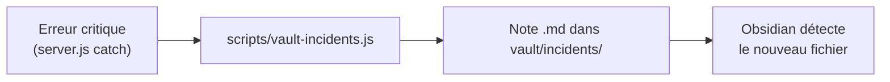

# Spec — vault-incidents.js

Génère une note d'incident dans le vault Obsidian quand une erreur critique survient (API down, crash, régression modèle).

## Fichier

scripts/vault-incidents.js

## Déclenchement

Appelé manuellement ou automatiquement depuis server.js en cas d'erreur critique :

```javascript
// Dans server.js, catch global ou bloc d'erreur critique :
if (ENV.VAULT_PATH) {
  const { spawn } = require('child_process');
  spawn('node', ['scripts/vault-incidents.js', '--title=API BSD Down', '--severity=high', '--desc=' + encodeURIComponent(err.message)]);
}
```

## Structure du script

Même pattern que les autres scripts :
- 'use strict'
- fs.readFileSync(.env)
- CLI args : --title, --severity, --desc, --type
- Frontmatter + corps de la note

## Flux



## Format de la note

vault/incidents/YYYY-MM-DD-slug.md

```yaml
---
type: incident
title: API BSD Down
severity: high        # low | medium | high | critical
date: 2026-06-13
resolved: false
resolved_at:
impact: Prédictions football indisponibles pendant 45 min
root_cause: Timeout API BSD (rate limit)
fix: Rotation de clé API + retry avec backoff
---
```

## Sections

### En-tête
```markdown
# 🚨 API BSD Down

**Date :** 2026-06-13 14:32 UTC  
**Sévérité :** 🔴 Haute  
**Statut :** ❌ Non résolu
```

### Chronologie
```markdown
## Chronologie

| Heure (UTC) | Événement |
|-------------|-----------|
| 14:32 | Première alerte (cron timeout) |
| 14:35 | Confirmé : API BSD retourne 429 |
| 14:40 | Rotation clé API |
| 14:45 | Retour à la normale |
```

### Impact
```markdown
## Impact

- **Matchs concernés :** 23 (toutes ligues BSD)
- **Durée d'indisponibilité :** ~13 minutes
- **Utilisateurs impactés :** ~12 (estimé via accès page live)
- **Données perdues :** Aucune (cache 12h)
```

### Investigation
```markdown
## Investigation

**Cause racine :** L'API BSD a changé son rate limit de 100 req/min à 60 req/min sans préavis.

**Détection :** Le cron de refresh match stats a échoué avec HTTP 429.

**Workaround :** Rotation vers une deuxième clé API.
```

### Leçons
```markdown
## Leçons

1. ✅ Le cache a absorbé le choc — aucun utilisateur n'a vu de page blanche
2. ❌ Pas d'alerte automatique quand une clé API approche du rate limit
3. 🔧 Ajouter monitoring des taux d'utilisation API
```

### Checklist résolution
- [x] Service restauré
- [x] Root cause identifiée
- [ ] Monitoring ajouté pour le rate limit
- [ ] Runbook mis à jour

## Edge cases

### Note déjà existante
- Date + slug déjà présents ? Ne pas écraser, ajouter un suffixe -2, -3

### Pas de VAULT_PATH
- Logger + exit 1

### Même incident signalé deux fois
- Vérifier si une note avec le même titre et la même date existe déjà → skip

## Execution

```bash
node scripts/vault-incidents.js --title="API BSD Down" --severity=high --desc="Timeout sur refresh match stats (429)"
node scripts/vault-incidents.js --dry --title="Test" --severity=low --desc="Test"
```

## Exit codes

- 0 = OK
- 1 = Erreur fatale
- 2 = Note déjà existante (skip)
