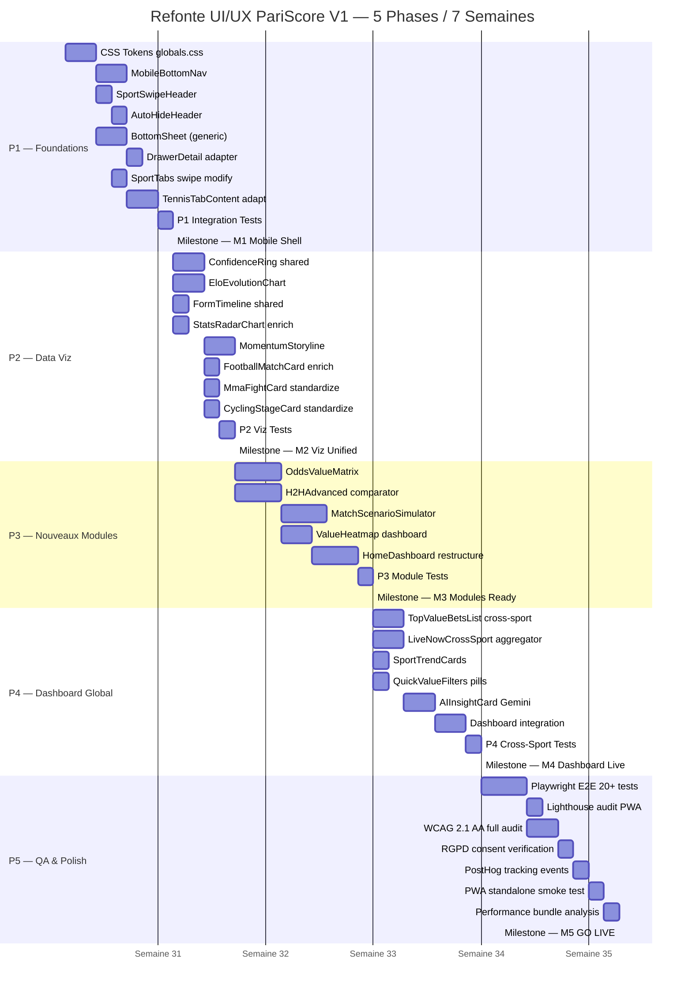

# Refonte UI/UX PariScore V1 — Plan d''Exécution Projet

> **Document:** Planning Gantt + Ressources + Chemin Critique + Jalons
> **Référence:** PROPOSITION_REFONTE_UI_UX_V1.md
> **Date:** 30/07/2026 | **Version:** 1.0

**Goal:** Exécuter la refonte UI/UX complète de PariScore en 5 phases sur 7 semaines, sans aucune nouvelle dépendance externe ni modification des routes API.

**Architecture:** Frontend-only — les 5 phases s''empilent : P1 (shell mobile) → P2 (viz) → P3 (nouveaux modules) → P4 (dashboard cross-sport) → P5 (QA). Chaque phase produit des composants indépendamment testables. Feature flags PostHog pour déploiement progressif.

**Tech Stack:** Next.js 16 + React 19 + TypeScript 5 + Tailwind CSS 4 + shadcn/ui + Recharts + Framer Motion + SWR + Zustand + PostHog Feature Flags

## Global Constraints
- **Zero nouvelle dépendance externe** — stack existant uniquement
- **Routes API inchangées** — consommation pure des endpoints actuels
- **Zero breaking change** — modifications additives uniquement
- **Dark-first obligatoire** — thème dark conçu, light fonctionnel
- **Tabular-nums obligatoire** sur toutes les données numériques
- **Feature flags PostHog** pour chaque nouveau composant (rollback rapide)
- **WCAG 2.1 AA minimum** — contraste, aria, focus visibles
- **PWA standalone** — bottom bar et drawers mobiles fonctionnels en mode installé
- **RGPD consent gating** — PostHog/Sentry respectent le consentement
- **Commits atomiques** — un commit par composant créé/modifié
- **Playwright E2E** — chaque nouveau composant a au moins 1 test


## 1. Diagramme de Gantt (Mermaid)




## 2. Planning Temporel Détaillé (Jour par Jour)

### S1 (03/08-08/08) : P1 Foundations

| Jour | Tâche | H/J | Sortie |
|------|-------|-----|--------|
| Lun 03 | CSS Tokens globals.css + tailwind.config.ts | 1 | Tokens confidence/edge/font-display actifs |
| Mar 04 | MobileBottomNav — 5 onglets, Framer Motion, useIsMobile | 1 | Bottom bar visible <=768px |
| Mer 05 | SportSwipeHeader touch + AutoHideHeader useScroll | 1 | Swipe sport + header auto-hide |
| Jeu 06 | BottomSheet générique — Radix Dialog + vaul Drawer | 1 | Bottom sheet réutilisable |
| Ven 07 | DrawerDetail adapter + SportTabs swipe modify | 1 | Modales->drawers mobile |
| Sam 08 | TennisTabContent adaptation bottom sheet filters + P1 tests | 1 | Filtres en drawer mobile |

### S2 (10/08-15/08) : P1 Fin + P2 Début

| Jour | Tâche | H/J | Sortie |
|------|-------|-----|--------|
| Lun 10 | P1 Integration tests Playwright commit final | 1 | **M1: Mobile Shell** |
| Mar 11 | ConfidenceRing — SVG double anneau, animation | 1 | Composant shared |
| Mer 12 | EloEvolutionChart — Recharts, /api/tennis/elo-history | 1 | Courbe Elo 12 mois |
| Jeu 13 | FormTimeline — poids temporel, indice 0-1 | 1 | Remplace FormDots |
| Ven 14 | StatsRadarChart enrich + MomentumStoryline debut | 1 | Radar 6 axes, storyline |
| Sam 15 | MomentumStoryline fin — narration + swings | 1 | Timeline narrative live |

### S3 (17/08-22/08) : P2 Suite + Standardisation

| Jour | Tâche | H/J | Sortie |
|------|-------|-----|--------|
| Lun 17 | FootballMatchCard enrich — ConfidenceRing + FormTimeline | 1 | Carte foot standard |
| Mar 18 | MmaFightCard standardize — viz partagés | 1 | Carte MMA standard |
| Mer 19 | CyclingStageCard standardize — viz partagés | 1 | Carte cyclisme standard |
| Jeu 20 | P2 Viz integration tests + snapshot tests | 1 | **M2: Viz Unified** |
| Ven 21 | Buffer / Retard rattrapage | 1 | Marge de sécurité |

### S4 (24/08-29/08) : P3 Nouveaux Modules

| Jour | Tâche | H/J | Sortie |
|------|-------|-----|--------|
| Lun 24 | OddsValueMatrix — TanStack Table + heatmap | 1 | Matrice bookmakers x matchs |
| Mar 25 | OddsValueMatrix fin + tests | 1 | Tests matrice |
| Mer 26 | H2HAdvanced — BSD API, filtres surface/période | 1 | Comparateur H2H |
| Jeu 27 | H2HAdvanced fin + MatchScenarioSimulator debut | 1 | Sliders interactifs |
| Ven 28 | MatchScenarioSimulator — engine.predict() client | 1 | Simulateur scénarios |
| Sam 29 | ValueHeatmap — heatmap cross-sport dashboard | 1 | Dashboard heatmap |


## 3. Matrice d'Affectation des Ressources

### 3.1 Rôles et Capacités

| Rôle | ID | H/J Max | Responsabilités |
|------|-----|---------|-----------------|
| Lead Frontend | LF | 0.5/j | Architecture composants, code review, décisions techniques |
| UI/UX Designer | UX | 0.5/j | Design tokens, direction artistique, validation visuelle |
| Frontend Dev 1 | FD1 | 1.0/j | Composants React/Tailwind, intégration API, layout |
| Frontend Dev 2 | FD2 | 1.0/j | Data viz Recharts, composants shared, SVG |
| QA Engineer | QA | 1.0/j | Playwright E2E, Lighthouse, WCAG, RGPD compliance |
| DevOps | DO | 0.2/j | Feature flags PostHog, PWA config, perf bundle |

### 3.2 Affectation par Tâche — Phase 1 (Foundations, 8 H/J)

| Tâche | H/J | Role | Qui | Dépend de |
|-------|-----|------|-----|-----------|
| CSS Tokens globals.css + tailwind.config.ts | 1.0 | UX+LF | UX design, LF code | — |
| MobileBottomNav | 1.0 | FD1 | Dev 1 | CSS tokens |
| SportSwipeHeader | 0.5 | FD1 | Dev 1 | — |
| AutoHideHeader | 0.5 | FD1 | Dev 1 | SportSwipeHeader |
| BottomSheet (generic) | 1.0 | FD2 | Dev 2 | CSS tokens |
| DrawerDetail adapter | 0.5 | FD2 | Dev 2 | BottomSheet |
| SportTabs swipe modify | 0.5 | FD1 | Dev 1 | SportSwipeHeader |
| TennisTabContent adapt | 1.0 | FD1 | Dev 1 | BottomSheet |
| P1 Integration Tests | 1.0 | QA | QA | Toutes tâches P1 |
| Review LF + Design validation UX | 1.0 | LF+UX | LF + UX | Toutes tâches P1 |
| **Total P1** | **8.0** | **FD1(4.5)+FD2(1.5)+UX(1.0)+LF(1.0)+QA(1.0)** | | |

### 3.3 Affectation par Tâche — Phase 2 (Data Viz, 10 H/J)

| Tâche | H/J | Role | Qui | Dépend de |
|-------|-----|------|-----|-----------|
| ConfidenceRing shared | 1.5 | FD2 | Dev 2 | M1 |
| EloEvolutionChart | 1.5 | FD2 | Dev 2 | M1, /api/elo-history |
| FormTimeline shared | 1.0 | FD2 | Dev 2 | M1 |
| StatsRadarChart enrich | 1.0 | FD2 | Dev 2 | — |
| MomentumStoryline | 1.5 | FD2 | Dev 2 | EloEvolutionChart |
| FootballMatchCard enrich | 1.0 | FD1 | Dev 1 | ConfidenceRing, FormTimeline |
| MmaFightCard standardize | 0.5 | FD1 | Dev 1 | ConfidenceRing |
| CyclingStageCard standardize | 0.5 | FD1 | Dev 1 | ConfidenceRing |
| P2 Viz Integration Tests | 1.0 | QA | QA | Toutes tâches P2 |
| Review LF + Snapshot validation UX | 0.5 | LF+UX | LF + UX | Toutes tâches P2 |
| **Total P2** | **10.0** | **FD2(6.5)+FD1(2.0)+QA(1.0)+LF(0.25)+UX(0.25)** | | |

### 3.4 Affectation par Tâche — Phase 3 (Nouveaux Modules, 10 H/J)

| Tâche | H/J | Role | Qui | Dépend de |
|-------|-----|------|-----|-----------|
| OddsValueMatrix | 2.0 | FD1 | Dev 1 | M2 |
| H2HAdvanced comparator | 2.0 | FD1 | Dev 1 | M2, BSD API /h2h |
| MatchScenarioSimulator | 2.0 | FD2 | Dev 2 | OddsValueMatrix, engine.predict() |
| ValueHeatmap dashboard | 1.5 | FD2 | Dev 2 | OddsValueMatrix |
| HomeDashboard restructure | 1.5 | FD1 | Dev 1 | ValueHeatmap |
| P3 Module Tests | 0.5 | QA | QA | Toutes tâches P3 |
| Review LF + UX validation | 0.5 | LF+UX | LF + UX | Toutes tâches P3 |
| **Total P3** | **10.0** | **FD1(5.5)+FD2(3.5)+QA(0.5)+LF(0.25)+UX(0.25)** | | |

### 3.5 Affectation par Tâche — Phase 4 (Dashboard Global, 8 H/J)

| Tâche | H/J | Role | Qui | Dépend de |
|-------|-----|------|-----|-----------|
| TopValueBetsList cross-sport | 1.5 | FD1 | Dev 1 | M3 |
| LiveNowCrossSport aggregator | 1.5 | FD1 | Dev 1 | M3 |
| SportTrendCards | 1.0 | FD2 | Dev 2 | M3 |
| QuickValueFilters pills | 0.5 | FD2 | Dev 2 | M3 |
| AIInsightCard Gemini | 1.5 | FD2 | Dev 2 | TopValueBetsList |
| Dashboard full integration | 1.0 | FD1 | Dev 1 | AIInsightCard |
| P4 Cross-Sport Tests | 0.5 | QA | QA | Toutes tâches P4 |
| Review LF + UX validation | 0.5 | LF+UX | LF + UX | Toutes tâches P4 |
| **Total P4** | **8.0** | **FD1(4.0)+FD2(3.0)+QA(0.5)+LF(0.25)+UX(0.25)** | | |

### 3.6 Affectation par Tâche — Phase 5 (QA & Polish, 7 H/J)

| Tâche | H/J | Role | Qui | Dépend de |
|-------|-----|------|-----|-----------|
| Playwright E2E 20+ tests | 2.0 | QA | QA | M4 |
| Lighthouse audit PWA | 0.5 | QA | QA | Playwright E2E |
| WCAG 2.1 AA full audit | 1.5 | QA | QA | Playwright E2E |
| RGPD consent verification | 0.5 | QA | QA | WCAG |
| PostHog tracking events | 0.5 | DO | DevOps | RGPD |


## 4. Chemin Critique (Critical Path) & Jalons de Validation

### 4.1 Chemin Critique

Le chemin critique traverse les dépendances strictes entre phases. Tout retard sur une tâche critique retarde la date de livraison.

```
CSS Tokens
    |
    ├──→ MobileBottomNav ──→ TennisTabContent ──→ P1 Tests ──→ [M1]
    |                                                              |
    ├──→ BottomSheet ──→ DrawerDetail ─────────────────────────────┘
    |                                                              |
    └──→ ConfidenceRing ──→ FootballMatchCard ──→ P2 Tests ──→ [M2]
                                    |                              |
                                    └──→ OddsValueMatrix ──→ ValueHeatmap
                                                                    |
                                                    HomeDashboard ─┘
                                                                    |
                                                    P3 Tests ──→ [M3]
                                                                    |
                                        TopValueBetsList ───────────┘
                                                                    |
                                        AIInsightCard ──────────────┘
                                                                    |
                                        Dashboard Integration ──────┘
                                                                    |
                                        P4 Tests ──→ [M4]
                                                       |
                                        Playwright E2E ──→ WCAG ──→ RGPD
                                                                       |
                                        PostHog ──→ PWA Smoke ──→ Perf
                                                                       |
                                        Revue Finale ──→ [M5 GO LIVE]
```

**Longueur du chemin critique : 43 H/J** (sur 43 H/J totaux — le projet est majoritairement séquentiel entre phases)

### 4.2 Analyse des Dépendances

| Dépendance | Type | Risque | Mitigation |
|------------|------|--------|------------|
| M1 → M2 | Séquentiel dur | P1 retard bloque P2 | Buffer 1j en S2 |
| ConfidenceRing → FootballMatchCard | Composant shared | FD2 bloqué → FD1 bloqué | FD1 peut avancer sur SportTabs |
| M2 → OddsValueMatrix | Séquentiel dur | P2 retard bloque P3 | Buffer 1j en S3 |
| ValueHeatmap → HomeDashboard | Composant shared | FD2 bloqué → FD1 bloqué | FD1 peut avancer sur H2HAdvanced |
| M3 → TopValueBetsList | Séquentiel dur | P3 retard bloque P4 | Buffer 2j en S6 |
| M4 → Playwright E2E | Séquentiel dur | P4 retard bloque P5 | Buffer 2j en S6 |
| WCAG → RGPD → PostHog | Chaîne QA | Dépendances linéaires | QA full-time S7 |

### 4.3 Tâches Parallélisables (Non-Critiques)

| Tâches Parallèles | Phase | Exécutées par |
|-------------------|-------|---------------|
| SportSwipeHeader + BottomSheet | P1 | FD1 + FD2 |
| EloEvolutionChart + FormTimeline | P2 | FD2 (séquentiel mais indépendant) |
| OddsValueMatrix + H2HAdvanced | P3 | FD1 + FD1 (séquentiel) |
| SportTrendCards + QuickValueFilters | P4 | FD2 (peuvent être parallélisés si 2 devs) |
| Lighthouse + RGPD | P5 | QA (séquentiel) |

**Opportunité de compression :** Si 3 devs disponibles en P4, SportTrendCards et QuickValueFilters peuvent être parallélisés, gagnant 1 jour.

### 4.4 Jalons de Validation (Milestones)

| Jalon | Date Cible | Critères d'Acceptation | Validation | GO/NO-GO |
|-------|-----------|----------------------|------------|----------|
| **M1 — Mobile Shell** | Lun 10/08 | Bottom bar visible <=768px, swipe sport fonctionnel, header auto-hide, drawers remplacent modales, P1 tests verts | LF + UX + QA | GO → P2 |
| **M2 — Viz Unified** | Jeu 20/08 | ConfidenceRing + FormTimeline sur Tennis/Foot/MMA/Cycling, EloChart + MomentumStoryline fonctionnels, snapshot tests OK | LF + UX | GO → P3 |
| **M3 — Modules Ready** | Mar 01/09 | OddsValueMatrix rendu, H2HAdvanced avec filtres, ScenarioSim interactif, HomeDashboard multi-sport, tests P3 verts | LF + UX + QA | GO → P4 |
| **M4 — Dashboard Live** | Mer 09/09 | TopValueBets cross-sport, LiveNow agrégé, AIInsightCard Gemini, dashboard intégré complet, tests P4 verts | LF + UX + QA | GO → P5 |
| **M5 — GO LIVE** | Sam 19/09 | E2E >85% couverture, Lighthouse mobile >90, WCAG AA OK, RGPD conforme, PostHog events OK, PWA smoke OK, bundle <500KB gzip | LF + UX + QA + DO | GO → Déploiement VPS |

### 4.5 Plan de Contingence

| Scénario | Impact | Plan B |
|----------|--------|--------|
| Retard P1 > 2j | Décalage global | Supprimer CyclingStageCard standardize (P2, -0.5j), merger P4 SportTrendCards+QuickValueFilters |
| Retard P3 > 2j | M3 repoussé | Mettre ScenarioSim en feature flag OFF, livrer en P4.1 |
| Retard P5 > 2j | M5 repoussé | Prioriser E2E + WCAG, repousser Lighthouse/perf en hotfix post-livraison |
| FD1 ou FD2 absent | Perte 1j/j | LF prend le relais sur les tâches critiques (max 0.5j/j compensé) |
| Bug bloquant découvert | Blocage phase | Rollback feature flag du composant, continuer les autres tâches |

---

## 5. Synthèse Décisionnelle

| Métrique | Valeur |
|----------|--------|
| **Charge totale** | 43 H/J (8.6 sem-homme) |
| **Durée calendaire** | 7 semaines (03/08 — 19/09/2026) |
| **Équipe requise** | 2 devs frontend + 1 QA + 0.5 UX + 0.5 Lead + 0.2 DevOps |
| **Nouvelles dépendances** | 0 (zéro) |
| **Routes API modifiées** | 0 (zéro) |
| **Composants créés** | 17 nouveaux |
| **Composants modifiés** | 8 existants |
| **Tests E2E ajoutés** | 20+ |
| **Feature flags** | 7 PostHog flags |
| **Risque principal** | Retard P1 (Mobile Shell) → décale tout le projet |
| **Marge de sécurité** | 3 jours buffers (S3-Ven, S6-Jeu/Ven) |

---

*Document généré le 30/07/2026 — Planning V1 — Prêt pour validation GO/NO-GO.*

| PWA standalone smoke test | 0.5 | DO+QA | DO + QA | PostHog |
| Performance bundle analysis | 0.5 | DO | DevOps | PWA smoke |
| Revue finale GO/NO-GO | 1.0 | LF+UX+DO | Tous | Toutes tâches P5 |
| **Total P5** | **7.0** | **QA(4.5)+DO(1.5)+LF(0.5)+UX(0.5)** | | |

### 3.7 Synthèse Globale des Ressources

| Rôle | P1 | P2 | P3 | P4 | P5 | **Total H/J** | **Charge (7 sem)** |
|------|-----|-----|-----|-----|-----|------------|-----------------|
| FD1 (Dev 1) | 4.5 | 2.0 | 5.5 | 4.0 | 0.0 | **16.0** | 3.2 sem |
| FD2 (Dev 2) | 1.5 | 6.5 | 3.5 | 3.0 | 0.0 | **14.5** | 2.9 sem |
| QA | 1.0 | 1.0 | 0.5 | 0.5 | 4.5 | **7.5** | 1.5 sem |
| LF (Lead) | 0.5 | 0.25 | 0.25 | 0.25 | 0.5 | **1.75** | 0.35 sem |
| UX (Designer) | 0.5 | 0.25 | 0.25 | 0.25 | 0.5 | **1.75** | 0.35 sem |
| DO (DevOps) | 0.0 | 0.0 | 0.0 | 0.0 | 1.5 | **1.5** | 0.3 sem |
| **Total** | **8.0** | **10.0** | **10.0** | **8.0** | **7.0** | **43.0 H/J** | **8.6 sem-homme** |


### S5 (31/08-05/09) : P3 Fin + P4 Début

| Jour | Tâche | H/J | Sortie |
|------|-------|-----|--------|
| Lun 31 | HomeDashboard restructure page.tsx | 1 | Dashboard multi-sport |
| Mar 01 | HomeDashboard fin + P3 Module Tests | 1 | **M3: Modules Ready** |
| Mer 02 | TopValueBetsList — SWR cross-sport aggregator | 1 | Top picks tous sports |
| Jeu 03 | LiveNowCrossSport — WebSocket multiplexeur | 1 | Live cross-sport |
| Ven 04 | SportTrendCards + QuickValueFilters | 1 | Cards tendances + pills |

### S6 (07/09-12/09) : P4 Fin

| Jour | Tâche | H/J | Sortie |
|------|-------|-----|--------|
| Lun 07 | AIInsightCard — Gemini API, Markdown render | 1 | Carte insight AI |
| Mar 08 | AIInsightCard fin + Dashboard integration complète | 1 | Dashboard intégré |
| Mer 09 | P4 Cross-sport integration tests | 1 | **M4: Dashboard Live** |
| Jeu 10 | Buffer / Retard rattrapage | 1 | Marge |
| Ven 11 | Buffer / Revue design finale | 1 | Marge |

### S7 (14/09-19/09) : P5 QA & Polish

| Jour | Tâche | H/J | Sortie |
|------|-------|-----|--------|
| Lun 14 | Playwright E2E — 20+ nouveaux tests | 1 | Suite E2E |
| Mar 15 | Playwright E2E suite | 1 | Couverture >85% |
| Mer 16 | Lighthouse audit + WCAG 2.1 AA full audit | 1 | Score >90 mobile |
| Jeu 17 | RGPD consent verification + PostHog tracking | 1 | Tracking conforme |
| Ven 18 | PWA standalone smoke test + perf bundle analysis | 1 | Bundle <500KB gzip |
| Sam 19 | Revue finale + GO/NO-GO déploiement | 1 | **M5: GO LIVE** |
