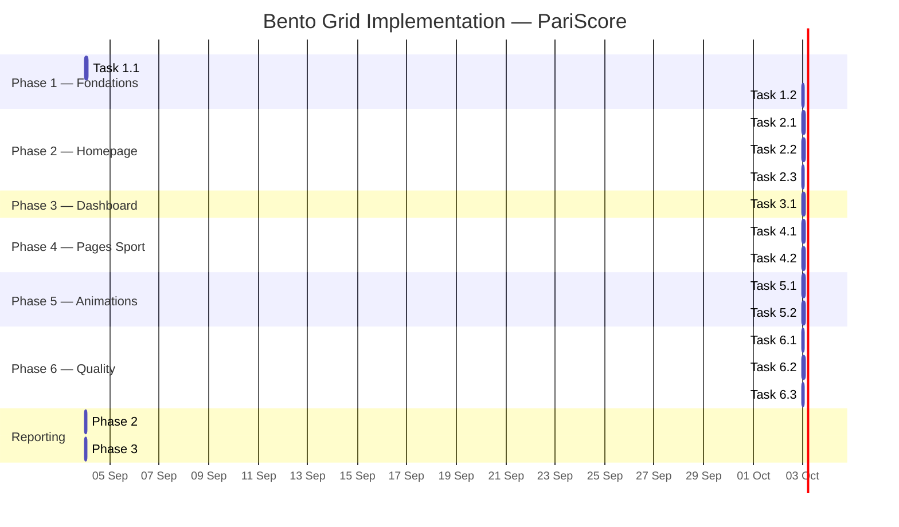

# Bento Grid Layout System — Plan d'Implémentation

> **For agentic workers:** REQUIRED SUB-SKILL: Use superpowers:subagent-driven-development (recommended) or superpowers:executing-plans to implement this plan task-by-task. Steps use checkbox (`- [ ]`) syntax for tracking.

**Goal:** Refonte du layout principal de ParisScore en Bento Grid — homepage, dashboard, et pages sport — pour créer une hiérarchie visuelle naturelle, améliorer l'information density, et aligner le design sur les standards 2024-2026 (Apple, Linear, Datadog, Vercel).

**Architecture:** Le Bento Grid repose sur CSS Grid natif (pas de Flexbox pour le macro-layout). Chaque cellule a une taille proportionnelle à son importance : hero tile 2×2 pour les données critiques, tiles larges 2×1 pour les graphiques, tiles standard 1×1 pour les KPIs. Responsive 4→2→1 colonnes. Intégration avec le système Liquid Glass existant.

**Tech Stack:** Next.js 16, React 19, Tailwind CSS 4, Framer Motion, CSS Grid natif

---

## Phase 1 : Fondations (Composants Bento de base)

### Task 1.1 : Composant `<BentoGrid>` + `<BentoTile>`

**Files:**
- Create: `src/components/ui/bento-grid.tsx`
- Modify: `src/app/globals.css`

**Interfaces:**
- Produces: `<BentoGrid>`, `<BentoTile>` composants réutilisables
- Tiles: `size="hero"` (2×2), `size="wide"` (2×1), `size="standard"` (1×1), `size="tall"` (1×2), `size="small"` (1×1)

- [ ] **Step 1: Define Bento tokens in globals.css**

```css
/* Bento Grid tokens */
--bento-gap: 16px;
--bento-radius: 20px;
--bento-radius-sm: 16px;
--bento-transition: 0.3s cubic-bezier(0.4, 0, 0.2, 1);

/* Bento tile sizes — base unit 100px */
--bento-tile-sm: 100px;
--bento-tile-md: 216px;
--bento-tile-lg: 432px;
--bento-tile-xl: 648px;

/* Bento glass layers */
--bento-surface: rgba(255, 255, 255, 0.03);
--bento-surface-hover: rgba(255, 255, 255, 0.06);
--bento-border: rgba(255, 255, 255, 0.06);
```

- [ ] **Step 2: Create BentoGrid component**

```tsx
// src/components/ui/bento-grid.tsx
import { cn } from "@/lib/utils";

interface BentoGridProps extends React.HTMLAttributes<HTMLDivElement> {
  cols?: 2 | 3 | 4;
  rows?: "auto" | "fixed";
}

export function BentoGrid({
  cols = 4,
  rows = "auto",
  className,
  children,
  ...props
}: BentoGridProps) {
  return (
    <div
      className={cn(
        "grid gap-[var(--bento-gap)]",
        cols === 2 && "grid-cols-1 sm:grid-cols-2",
        cols === 3 && "grid-cols-1 sm:grid-cols-2 lg:grid-cols-3",
        cols === 4 && "grid-cols-1 sm:grid-cols-2 md:grid-cols-4",
        rows === "fixed" && "auto-rows-[200px]",
        rows === "auto" && "auto-rows-min",
        className
      )}
      {...props}
    >
      {children}
    </div>
  );
}
```

- [ ] **Step 3: Create BentoTile component**

```tsx
interface BentoTileProps extends React.HTMLAttributes<HTMLDivElement> {
  size?: "hero" | "wide" | "standard" | "tall" | "small";
  variant?: "glass" | "solid" | "accent";
  interactive?: boolean;
}

export function BentoTile({
  size = "standard",
  variant = "glass",
  interactive = false,
  className,
  children,
  ...props
}: BentoTileProps) {
  return (
    <div
      className={cn(
        // Grid spanning
        size === "hero" && "md:col-span-2 md:row-span-2",
        size === "wide" && "md:col-span-2",
        size === "tall" && "md:row-span-2",
        size === "standard" && "col-span-1 row-span-1",
        size === "small" && "col-span-1 row-span-1",
        // Visual
        "rounded-[var(--bento-radius)] p-6",
        "transition-all duration-[var(--bento-transition)]",
        // Glass variant
        variant === "glass" && "liquid-glass--clear",
        variant === "solid" && "bg-card border border-border",
        variant === "accent" && "bg-accent/10 border border-accent/20",
        // Interactive
        interactive && "cursor-pointer hover:scale-[1.02] hover:shadow-2xl",
        className
      )}
      {...props}
    >
      {children}
    </div>
  );
}
```

- [ ] **Step 4: Verify build**

Run: `bun run build`

- [ ] **Step 5: Commit**

```bash
git add src/components/ui/bento-grid.tsx src/app/globals.css
git commit -m "feat(ui): add BentoGrid and BentoTile base components"
```

---

## Phase 2 : Homepage Bento Layout

### Task 2.1 : Hero Section → Bento Hero Tile

**Files:**
- Modify: `src/components/dashboard/hero-stats.tsx`
- Modify: `src/app/page.tsx`

**Interfaces:**
- Consumes: `<BentoGrid>`, `<BentoTile>` from Task 1.1
- Produces: Hero section en tile 2×2 dans la grille bento

- [ ] **Step 1: Refactor hero-stats.tsx to BentoTile hero**

Wrap the existing hero content (gradient, counters, quick links) in a `<BentoTile size="hero" variant="glass">`. Remove standalone gradient background (handled by tile).

- [ ] **Step 2: Wrap homepage sections in BentoGrid**

In `page.tsx`, replace the sequential `<section>` blocks with a `<BentoGrid cols={4}>` structure:
- Hero → `<BentoTile size="hero">`
- Feature cards → `<BentoTile size="wide">` (2 cols)
- Best matches → `<BentoTile size="wide">`
- AI insights → `<BentoTile size="standard">`
- Quick stats → `<BentoTile size="small">` (×4)

- [ ] **Step 3: Responsive testing**

Verify: 4 cols desktop → 2 cols tablet → 1 col mobile. Tile stacking order = priority order.

- [ ] **Step 4: Commit**

```bash
git add src/components/dashboard/hero-stats.tsx src/app/page.tsx
git commit -m "feat(homepage): refactor hero and sections into Bento Grid layout"
```

### Task 2.2 : Feature Cards → Bento Tiles

**Files:**
- Modify: `src/components/dashboard/feature-cards.tsx`

**Interfaces:**
- Consumes: `<BentoTile>` from Task 1.1
- Produces: Feature cards as mixed-size bento tiles

- [ ] **Step 1: Refactor feature cards to bento tiles**

Replace the uniform 3-column grid with asymmetric bento tiles:
- "Match of the Day" → wide tile (2×1) with image + stats
- "AI Predictions" → standard tile (1×1) with icon + count
- "Value Bets" → standard tile (1×1) with green accent
- "Live Now" → small tile (1×1) with pulse animation
- "Rankings" → small tile (1×1)
- "Bankroll" → small tile (1×1)

- [ ] **Step 2: Commit**

```bash
git add src/components/dashboard/feature-cards.tsx
git commit -m "feat(homepage): transform feature cards into asymmetric Bento tiles"
```

### Task 2.3 : Best Matches + Upcoming → Bento Grid

**Files:**
- Modify: `src/components/dashboard/best-matches-tabs.tsx`
- Modify: `src/components/dashboard/upcoming-ten-matches-table.tsx`

- [ ] **Step 1: Wrap match sections in BentoTile wide**

Both sections become `<BentoTile size="wide">` within the homepage grid.

- [ ] **Step 2: Commit**

```bash
git add src/components/dashboard/best-matches-tabs.tsx src/components/dashboard/upcoming-ten-matches-table.tsx
git commit -m "feat(homepage): integrate match sections into Bento Grid layout"
```

---

## Phase 3 : Dashboard Bento

### Task 3.1 : Personal Dashboard → Bento KPI Grid

**Files:**
- Modify: `src/app/(protected)/dashboard/page.tsx`
- Modify: `src/components/dashboard/personal-dashboard.tsx`

- [ ] **Step 1: Refactor dashboard to BentoGrid**

Replace the 2-column `grid-cols-1 lg:grid-cols-2` with a 4-column bento:
- Primary KPI → hero tile (2×2)
- Secondary KPIs → standard tiles (1×1) ×3
- Chart → wide tile (2×1)
- Feed → tall tile (1×2)
- Quick actions → small tiles (1×1) ×2

- [ ] **Step 2: Commit**

```bash
git add src/app/\(protected\)/dashboard/page.tsx src/components/dashboard/personal-dashboard.tsx
git commit -m "feat(dashboard): refactor to Bento KPI grid layout"
```

---

## Phase 4 : Pages Sport Bento

### Task 4.1 : Tennis Tab → Bento Layout

**Files:**
- Modify: `src/components/tennis/tennis-tab-content.tsx`

- [ ] **Step 1: Refactor tennis tab to BentoGrid**

- Featured match → hero tile (2×2) with live score + prediction
- Tournament highlights → wide tile (2×1)
- Player rankings → tall tile (1×2)
- Quick stats → small tiles (1×1) ×4

- [ ] **Step 2: Commit**

```bash
git add src/components/tennis/tennis-tab-content.tsx
git commit -m "feat(tennis): refactor tab content to Bento Grid layout"
```

### Task 4.2 : Football Tab → Bento Layout

**Files:**
- Modify: `src/components/football/football-tab-content.tsx`

- [ ] **Step 1: Refactor football tab to BentoGrid**

Same pattern as tennis: hero match + tournament + rankings + stats.

- [ ] **Step 2: Commit**

```bash
git add src/components/football/football-tab-content.tsx
git commit -m "feat(football): refactor tab content to Bento Grid layout"
```

---

## Phase 5 : Animations & Polish

### Task 5.1 : Scroll Reveal Animations

**Files:**
- Modify: `src/components/ui/bento-grid.tsx`

- [ ] **Step 1: Add Framer Motion scroll reveal**

```tsx
"use client";
import { motion } from "framer-motion";

// Stagger children on viewport enter
const container = {
  hidden: { opacity: 0 },
  show: {
    opacity: 1,
    transition: { staggerChildren: 0.06 }
  };
};

const item = {
  hidden: { opacity: 0, y: 20 },
  show: { opacity: 1, y: 0, transition: { duration: 0.4, ease: "easeOut" } }
};
```

- [ ] **Step 2: Add hover micro-interactions on interactive tiles**

Scale 1.02 + shadow elevation on hover. Respect `prefers-reduced-motion`.

- [ ] **Step 3: Commit**

```bash
git add src/components/ui/bento-grid.tsx
git commit -m "feat(ui): add scroll reveal and hover animations to Bento Grid"
```

### Task 5.2 : Responsive Polish

**Files:**
- Modify: `src/app/globals.css`

- [ ] **Step 1: Fine-tune mobile stacking**

Ensure tiles stack in priority order on mobile (1 col). Verify no tile is orphaned or visually broken.

- [ ] **Step 2: Tablet optimization**

2-column tablet layout with selective spanning. Hero always 2 cols on tablet.

- [ ] **Step 3: Commit**

```bash
git add src/app/globals.css
git commit -m "feat(ui): polish responsive Bento Grid breakpoints for mobile and tablet"
```

---

## Phase 6 : Quality Gates

### Task 6.1 : Lint + TypeCheck

- [ ] **Step 1:** Run `bun run lint` — fix any errors
- [ ] **Step 2:** Run `bun run typecheck` — fix any errors
- [ ] **Step 3:** Run `bun run build` — verify production build succeeds

### Task 6.2 : Visual QA

- [ ] **Step 1:** Manual test on Chrome, Firefox, Safari
- [ ] **Step 2:** Mobile test (375px, 768px, 1024px, 1280px)
- [ ] **Step 3:** Verify dark mode consistency
- [ ] **Step 4:** Verify Liquid Glass integration on bento tiles

### Task 6.3 : Session Trace

- [ ] **Step 1:** Create `.context/session-bento-grid-2026-09-04.md` with full journal
- [ ] **Step 2:** Create `.superpowers/sdd/2026-09-04-bento-grid-implementation/progress.md` SDD ledger

---

## Constraints

- **CSS Grid natif** — pas de react-grid-layout ou deps lourdes
- **Tailwind utilities** — `col-span-*`, `row-span-*`, `gap-*`, responsive prefixes
- **Liquid Glass intégré** — les tiles utilisent `liquid-glass--clear` par défaut
- **Accessibility** — DOM order = visual order, `prefers-reduced-motion`, WCAG 2.1 AA contrast
- **Dark-first** — tokens conçus pour le dark navy `#0b0e17`
- **Feature flag** —rollout progressif via PostHog si nécessaire
- **Zero new deps** — Framer Motion déjà installé, CSS Grid natif

---

## Gantt Chart



---

## File Structure

```
src/
├── components/
│   ├── ui/
│   │   └── bento-grid.tsx          # NEW — BentoGrid + BentoTile
│   ├── dashboard/
│   │   ├── hero-stats.tsx          # MODIFY — wrap in BentoTile hero
│   │   ├── feature-cards.tsx       # MODIFY — asymmetric bento tiles
│   │   ├── best-matches-tabs.tsx   # MODIFY — wrap in BentoTile wide
│   │   ├── personal-dashboard.tsx  # MODIFY — Bento KPI grid
│   │   └── upcoming-ten-matches-table.tsx  # MODIFY — wrap in BentoTile
│   ├── tennis/
│   │   └── tennis-tab-content.tsx  # MODIFY — Bento layout
│   └── football/
│       └── football-tab-content.tsx # MODIFY — Bento layout
├── app/
│   ├── page.tsx                    # MODIFY — BentoGrid container
│   ├── (protected)/dashboard/page.tsx  # MODIFY — Bento KPI grid
│   └── globals.css                 # MODIFY — bento tokens
```
