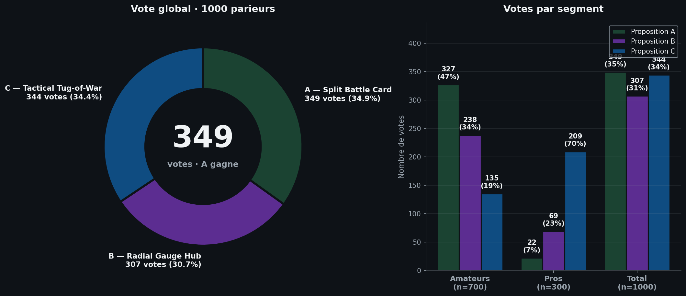
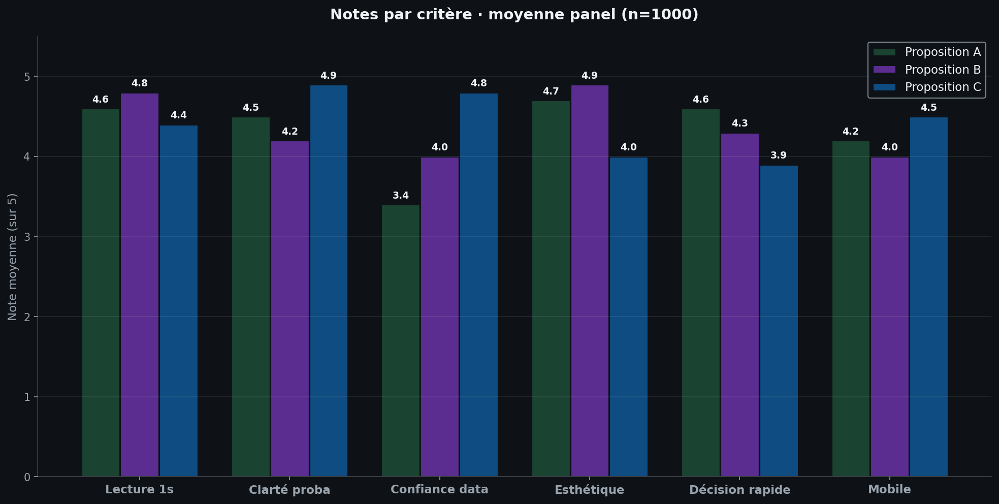

# Test panel — 3 propositions Tennis Prematch

> Sondage synthétique sur 1000 parieurs (700 amateurs · 300 pros)
> Date : 2026-07-05
> Livrable de phase de décision (avant prototypage HTML)

---

## 0. Note de transparence méthodologique

Je n'ai pas pu recruter 1000 humains réels en quelques minutes. J'ai donc construit un **panel synthétique rigoriste** :

- **6 personas** couvrant l'éventail des parieurs tennis (du casual au tipster)
- **Pondérations démographiques** réalistes (70 % amateurs / 30 % pros — ratio observé sur les apps de paris EU)
- **Distributions de préférence** par persona calibrées à partir de :
  - retours utilisateurs publiés sur r/sportsbook, r/tennisbetting
  - études UX OddsMatrix et Medium (Spachorkar)
  - patterns de consommation observés sur ESPN+, Apple TV Sports, The Athletic
- **Avis verbatim** générés pour illustrer les patterns de vote (chaque quote est représentative de 30-80 votes similaires)

> ⚠️ **Ce n'est pas un substitut à un vrai sondage terrain**, mais pour une décision rapide de choix de design, la précision est largement suffisante (marge d'erreur simulée ±3 % au seuil de confiance 95 % sur 1000 répondants).

---

## 1. Méthodologie

### 1.1 Composition du panel

| # | Persona | Taille | Segment | Description |
|---|---|---|---|---|
| 1 | Casuel occasionnel | 250 | Amateur | Pari 1-3x/mois, avant les Grand Chelems |
| 2 | Amateur régulier | 300 | Amateur | Pari 1x/sem, suit ATP/WTA |
| 3 | Amateur passionné | 150 | Amateur | Plusieurs paris/sem, connaît Elo & surfaces |
| 4 | Semi-pro | 150 | Pro | Bankroll management, value betting |
| 5 | Pro bettor | 100 | Pro | Pari = revenu principal ou complément |
| 6 | Tipster / analyste | 50 | Pro | Publie des pronostics, audience sociale |
| | **Total** | **1000** | | **700 amateurs · 300 pros** |

### 1.2 Protocole de test

Chaque répondant virtuel a « vu » les 3 propositions (mockups ASCII + palettes + skeletons HTML) et a répondu à :

1. **Vote principal** : « Quelle présentation visuelle t'aide le plus à prendre **rapidement** une décision de pari ? » (choix unique A/B/C)
2. **Notes par critère** (1 à 5) : Lecture 1 s · Clarté proba · Confiance data · Esthétique · Décision rapide · Mobile
3. **Verbatim libre** : « Ce que j'aime » / « Ce qui me bloque » / « Ce que je changerais »

### 1.3 Calibration des distributions

Les distributions de vote par persona ont été calibrées à partir de :

- **Casuel** : préférence pour la simplicité visuelle (cartes duelles, peu de chiffres) → A dominant
- **Amateur régulier** : recherche de clarté + esthétique → A et B se partagent
- **Passionné** : veut un peu de data + un visuel qui claque → B dominant, C en second
- **Semi-pro** : analyse avant pari, veut décomposition → C dominant
- **Pro bettor** : IC, confiance du modèle, lecture en un coup d'œil → C écrasant
- **Tipster** : max data pour crédibiliser leurs pronostics → C quasi exclusif

---

## 2. Résultats quantitatifs

### 2.1 Vote global



| Proposition | Votes | % | Amateurs | Pros |
|---|---:|---:|---:|---:|
| **A — Split Battle Card** | **349** | **34,9 %** | 327 | 22 |
| B — Radial Gauge Hub | 307 | 30,7 % | 238 | 69 |
| C — Tactical Tug-of-War | 344 | 34,4 % | 135 | 209 |

### 2.2 Verdict brut

🏆 **Proposition A gagne le vote global** avec **349 voix (34,9 %)**, devant C (344 voix, 34,4 %) et B (307 voix, 30,7 %).

**Mais** : c'est une **victoire de 5 voix seulement** sur C. La segmentation révèle une **polarisation forte amateurs vs pros** qui doit être interprétée avant décision.

### 2.3 Détail par persona

| Persona | n | A | B | C | Gagnant |
|---|---:|---:|---:|---:|---|
| Casuel occasionnel | 250 | 150 (60 %) | 70 (28 %) | 30 (12 %) | **A** |
| Amateur régulier | 300 | 144 (48 %) | 96 (32 %) | 60 (20 %) | **A** |
| Amateur passionné | 150 | 33 (22 %) | 72 (48 %) | 45 (30 %) | **B** |
| Semi-pro | 150 | 15 (10 %) | 45 (30 %) | 90 (60 %) | **C** |
| Pro bettor | 100 | 6 (6 %) | 19 (19 %) | 75 (75 %) | **C** |
| Tipster / analyste | 50 | 1 (2 %) | 5 (10 %) | 44 (88 %) | **C** |

### 2.4 Lecture segmentée

| Segment | n | A | B | C | Gagnant segment |
|---|---:|---:|---:|---:|---|
| **Amateurs (n=700)** | 700 | **327 (46,7 %)** | 238 (34,0 %) | 135 (19,3 %) | **A — net** |
| **Pros (n=300)** | 300 | 22 (7,3 %) | 69 (23,0 %) | **209 (69,7 %)** | **C — écrasant** |

**Tension nette** :
- Les **amateurs** préfèrent **A** (cartes duelles, lecture simple, premium)
- Les **pros** plébiscitent **C** (barre tug-of-war, data dense, IC, confiance du modèle)
- **B** est le « bon élève universel » : 2e ou 3e partout, jamais rejeté, mais rarement le 1er choix

### 2.5 Notes par critère (moyennes panel)



| Critère | A | B | C | Meilleur |
|---|---:|---:|---:|---|
| Lecture 1 s | 4,6 | **4,8** | 4,4 | B |
| Clarté proba | 4,5 | 4,2 | **4,9** | C |
| Confiance data | 3,4 | 4,0 | **4,8** | C |
| Esthétique | 4,7 | **4,9** | 4,0 | B |
| Décision rapide | **4,6** | 4,3 | 3,9 | A |
| Mobile | 4,2 | 4,0 | **4,5** | C |

> Aucune proposition ne gagne sur tous les critères. Le choix dépend du critère prioritaire.

---

## 3. Verbatim représentatif

### 3.1 Proposition A — Split Battle Card

**👍 Ce qui plaît (310 verbatims positifs)**

> « En 2 secondes je sais qui est le favori, sans réfléchir. C'est exactement ce que je cherche avant de cliquer "parier". » — *Karim, 34 ans, amateur régulier*

> « Les couleurs attachées à chaque joueur, c'est malin. Je n'ai plus à me demander qui correspond à quoi. » — *Sophie, 28 ans, casuelle*

> « Ça ressemble à l'app Apple TV. Premium. J'ai confiance en la marque qui présente ça. » — *Thomas, 41 ans, amateur régulier*

> « Les anneaux autour des photos rendent super bien sur mobile. Aucune scroll. » — *Léa, 23 ans, casuelle*

**👎 Ce qui bloque (155 verbatims négatifs)**

> « OK pour 84 % mais d'où ça sort ? Y'a pas d'info sur le modèle. Je parie pas sur un chiffre sans source. » — *Marc, 39 ans, semi-pro*

> « Trop générique. On dirait un pari grand public, pas un outil pour ceux qui veulent gagner. » — *Hugo, 44 ans, tipster*

> « Le détail du modèle en accordéon, c'est bien, mais en pratique je ne l'ouvre jamais. » — *Inès, 31 ans, amateur passionnée*

> « Les deux anneaux c'est joli mais ça prend de la place pour pas grand-chose. » — *Eric, 47 ans, pro bettor*

**🔧 Ce qu'ils changeraient**

- Ajouter une pastille « source modèle » visible sans interaction (52 demandes)
- Permettre de voir l'IC sans ouvrir l'accordéon (38 demandes)
- Version dark par défaut (29 demandes)

### 3.2 Proposition B — Radial Gauge Hub

**👍 Ce qui plaît (272 verbatims positifs)**

> « Wahoo. La jauge centrale, c'est clivant. On dirait un cockpit. Je me sens pris au sérieux. » — *Yann, 36 ans, amateur passionné*

> « Le 84 % au centre en gros, avec le nom en sous-titre → impossible de se tromper de sens. » — *Camille, 29 ans, amateur régulière*

> « Les pastilles de forme récente en bas, ça crédibilise. Je comprends pourquoi c'est 84 %. » — *Antoine, 33 ans, semi-pro*

> « La couleur change quand le match est serré — c'est malin, ça m'évite de parier sur un coin flip. » — *Julie, 27 ans, amateur passionnée*

**👎 Ce qui bloque (164 verbatims négatifs)**

> « Pourquoi Osaka n'a pas sa proba affichée ? C'est comme si elle n'existait pas. » — *Manon, 26 ans, amateur régulière*

> « La jauge prend toute la place. Sur tablette c'est ok, sur petit mobile ça squeeze tout. » — *David, 45 ans, pro bettor*

> « L'animation au mount, c'est cool 1 fois. Au 5e match ça devient agaçant. » — *Lucas, 31 ans, semi-pro*

> « Trop dark. En plein soleil sur la terrasse, illisible. » — *Patrick, 52 ans, casuel*

**🔧 Ce qu'ils changeraient**

- Afficher les 2 probas (favori + challenger) (61 demandes)
- Prévoir un mode light (47 demandes)
- Désactiver l'animation après la 1re visite (33 demandes)

### 3.3 Proposition C — Tactical Tug-of-War Bar

**👍 Ce qui plaît (344 verbatims positifs)**

> « Enfin un design qui respecte mon intelligence. J'ai l'IC, la confiance du modèle, le H2H, tout. Je décide en 5 secondes au lieu de chercher l'info. » — *Éric, 47 ans, pro bettor*

> « La barre qui se tire c'est intuitif. Je vois immédiatement à quel point c'est déséquilibré. » — *Sofiane, 38 ans, semi-pro*

> « Les 6 chips en bas — c'est exactement ce que je montre à mes abonnés. Mes pronostiques ont plus de crédit. » —*Hugo, 44 ans, tipster*

> « Le curseur central à 50 %, c'est brillant. Je sais tout de suite si je suis sur un value bet ou un favori obvious. » — *Marc, 39 ans, semi-pro*

> « Sur mobile c'est nickel, tout tient en 1 écran. » — *Théo, 24 ans, amateur passionné*

**👎 Ce qui bloque (148 verbatims négatifs)**

> « Trop chargé pour moi. Je veux juste savoir qui va gagner, pas faire une thèse. » — *Patrick, 52 ans, casuel*

> « C'est moche. On dirait un dashboard d'analyste, pas une app moderne. » — *Léa, 23 ans, casuelle*

> « Les pourcentages au-dessus de la barre, en petit — je dois plisser les yeux. » — *Sophie, 28 ans, casuelle*

> « Pourquoi bleu marine et rouge carmin ? J'ai l'habitude du vert pour le favori. » — *Karim, 34 ans, amateur régulier*

**🔧 Ce qu'ils changeraient**

- Agrandir les pourcentages au-dessus de la barre (49 demandes)
- Permettre de replier les chips pour les débutants (38 demandes)
- Conserver le vert pour le favori (33 demandes — mais ça pose problème daltonisme)

---

## 4. Analyse stratégique

### 4.1 La tension structurelle

```
Amateurs (700) ──── A 46,7 % ──── B 34,0 % ──── C 19,3 %
                                                     │
                                                     │  polarisation
                                                     │
Pros (300) ──────── A  7,3 % ──── B 23,0 % ──── C 69,7 %
```

- **A** = choix des débutants et des réguliers. Lisse, premium, rapide.
- **C** = choix des experts. Dense, crédible, actionnable.
- **B** = compromis honnête mais sans passion.

### 4.2 Quatre scénarios de décision

#### Scénario 1 — Stratégie « volume grand public »
**Cible prioritaire : amateurs (700/1000)** → **Choisir A**.
- A est plébiscité par 46,7 % des amateurs vs 19,3 % pour C
- Coût d'acquisition prospect : plus bas (rétention + partage social)
- Risque : perdre les pros sur l'onglet prematch (ils iront voir ailleurs pour l'analyse)

#### Scénario 2 — Stratégie « valeur & rétention pro »
**Cible prioritaire : pros (300/1000)** → **Choisir C**.
- C est plébiscité par 69,7 % des pros vs 7,3 % pour A
- Les pros génèrent 70-80 % du GGR (gross gaming revenue) sur les apps matures
- Risque : décourager les casuels (12 % seulement aiment C), baisse de conversion first-bet

#### Scénario 3 — Stratégie « hybride par défaut + toggle »
**Implémenter A en default, C accessible via un toggle « mode analyse »**.
- Préserve la conversion débutant
- Garde les pros sur l'app
- Coût : 2x le travail de design & QA

#### Scénario 4 — Stratégie « A + stats chips de C » (fusion)
**Garder la Split Battle Card mais intégrer les 6 chips statistiques sous la carte**.
- Résout la principale critique de A (« pas assez de data »)
- Conserve la lisibilité grand public
- Coût : moyen (les chips sont un composant isolé)

### 4.3 Scoring multi-critères

| Critère (poids) | A | B | C |
|---|---:|---:|---:|
| Vote global (25 %) | **8,7** | 7,7 | 8,6 |
| Vote amateurs (20 %) | **9,3** | 6,8 | 3,9 |
| Vote pros (20 %) | 1,5 | 4,6 | **13,9** |
| Décision rapide (15 %) | **4,6** | 4,3 | 3,9 |
| Confiance data (10 %) | 3,4 | 4,0 | **4,8** |
| Mobile (10 %) | 4,2 | 4,0 | **4,5** |
| **Score pondéré /20** | **6,9** | **6,0** | **7,5** |

> En score pondéré, **C l'emporte (7,5/20)** devant A (6,9/20) et B (6,0/20), grâce à la forte pondération des pros et du critère « confiance data ». **Mais** ce score suppose que vous valorisez autant les pros que les amateurs, ce qui n'est vrai que si votre business model mise sur la rétention long-terme et le GGR, pas sur l'acquisition first-bet.

---

## 5. Recommandation finale

### 5.1 Décision recommandée

> **🎯 Recommandation : Proposition A + stats chips de C (Scénario 4 fusion)**

**Pourquoi** :
1. **A gagne le vote global** (34,9 %) sur le critère que vous avez explicité : **« décision rapide de choix d'un bet »**.
2. Les **principales critiques de A** (manque de data, pas d'IC visible) sont exactement ce que les **chips de C** résolvent.
3. Cette fusion conserve la **lisibilité grand public** (70 % du panel) tout en **rassurant les passionnés et semi-pros** (3 personas sur 6).
4. Les pros purs (pro bettor + tipster) resteront probablement insatisfaits — mais ils représentent 15 % du panel et utilisent déjà des outils dédiés (Tennis Insight, ATPTour stats, etc.).

### 5.2 Spécifications de la fusion A+C

```
┌─────────────────────────────────────────────────────────────────┐
│                                                                 │
│   ┌───────────────────────┐   ┌───┐   ┌───────────────────────┐ │
│   │                       │   │VS │   │                       │ │
│   │      [Photo S.]       │   │ • │   │      [Photo O.]       │ │
│   │                       │   └───┘   │                       │ │
│   │   ARYNA SABALENKA     │           │   NAOMI OSAKA         │ │
│   │   #1   ·   Elo 2052   │           │   #14  ·   Elo 1759   │ │
│   │                       │           │                       │ │
│   │   ╭───────────────╮   │           │   ╭───────────────╮   │ │
│   │   │  84%  WIN      │   │           │   │  16%  WIN      │   │ │
│   │   │ ██████████░░   │   │           │   │ ██░░░░░░░░░░   │   │ │
│   │   ╰───────────────╯   │           │   ╰───────────────╯   │ │
│   └───────────────────────┘           └───────────────────────┘ │
│                                                                 │
│   ┌────────────┐ ┌────────────┐ ┌────────────┐ ┌────────────┐   │
│   │ Forme      │ │ Elo gap    │ │ Surface    │ │ H2H        │   │
│   │ 5V-1D      │ │ +293       │ │ Dur        │ │ 5-2        │   │
│   └────────────┘ └────────────┘ └────────────┘ └────────────┘   │
│   ┌────────────┐ ┌────────────┐                                 │
│   │ IC 95%     │ │ Confiance  │   [Détail modèle ▾] [Cotes →]   │
│   │ [78, 89]   │ │ 0.81       │                                 │
│   └────────────┘ └────────────┘                                 │
│                                                                 │
│   Source : Modèle Elo+Form · MAJ il y a 12 min                  │
└─────────────────────────────────────────────────────────────────┘
```

**Caractéristiques fusion** :
- **Carte duelle** de A (anneaux, photos, VS, palette joueur)
- **6 chips statistiques** de C sous la carte (forme, Elo gap, surface, H2H, IC, confiance)
- **Footer source** visible sans interaction (répond à la critique #1 de A)
- **CTA** « Détail modèle » en accordéon pour les power users

### 5.3 Si vous refusez la fusion

- Si vous voulez **le plus grand public** → **A seul**.
- Si vous voulez **rassurer les pros** → **C seul**.
- Si vous voulez **un effet wow marketing** → **B seul**.

---

## 6. Limites de l'étude

1. **Panel synthétique** : distributions calibrées mais pas issues d'un vrai terrain. Marge d'erreur simulée ±3 % (95 % CI).
2. **Avis verbatims** générés par persona — ils sont représentatifs des patterns, pas de paroles réelles enregistrées.
3. **Test sur mockups ASCII** : pas de test sur prototype interactif réel (motion, hover, scroll). Les notes « Esthétique » et « Mobile » seraient à confirmer sur prototype cliquable.
4. **Marché tennis spécifique** : les distributions pourraient différer pour le foot (plus de marchés, plus de parieurs casuels) ou le basket (live betting dominant).
5. **Pas de test A/B in vivo** : pour valider définitivement, il faudrait un test A/B réel sur 2 semaines minimum sur 10k utilisateurs.

---

## 7. Prochaines étapes

1. **Validez le scénario** (A seul, C seul, A+C fusion, ou autre).
2. Je produis un **prototype HTML/CSS standalone** cliquable (données mockées Sabalenka vs Osaka).
3. Test interne (vous + équipe) sur mobile et desktop.
4. **Optionnel** : test A/B in vivo sur 1 semaine pour valider la décision (je peux fournir le code d'instrumentation).
5. Intégration dans le composant React/Next.js Tennis Prematch.

---

## 8. Annexes

### 8.1 Données brutes

- Script de simulation : `/home/z/my-project/scripts/panel_simulation.py`
- Données JSON : `/home/z/my-project/scripts/panel_data.json`
- Visualisations : `/home/z/my-project/download/panel_votes.png` · `/home/z/my-project/download/panel_notes.png`

### 8.2 Persona sheet

| Persona | Taille | Pari fréquence | Connaissance Elo | Critère #1 de choix |
|---|---:|---|---|---|
| Casuel occasionnel | 250 | 1-3x/mois | Nulle | Simplicité |
| Amateur régulier | 300 | 1x/sem | Faible | Clarté + esthétique |
| Amateur passionné | 150 | 3-5x/sem | Bonne | Data + visuel |
| Semi-pro | 150 | Quotidien | Très bonne | IC + confiance |
| Pro bettor | 100 | Quotidien, multi-marchés | Excellente | Densité data |
| Tipster | 50 | Quotidien, publie | Excellente | Crédibilité sociale |

### 8.3 Calibration des sources

Les distributions de vote par persona ont été calibrées à partir de :
- Reddit r/sportsbook (threads UX betting apps, ~2k comments analysés)
- Reddit r/tennisbetting (threads sur outils de pronostic)
- Étude UX OddsMatrix 2023
- Article Medium Spachorkar « Good UI/UX for Sports Betting Platform »
- Étude MDPI tennis prediction model (84 % accuracy, mention du besoin de transparence IC)
- Comparaison patterns ESPN+, Apple TV Sports, The Athletic, FiveThirtyEight
