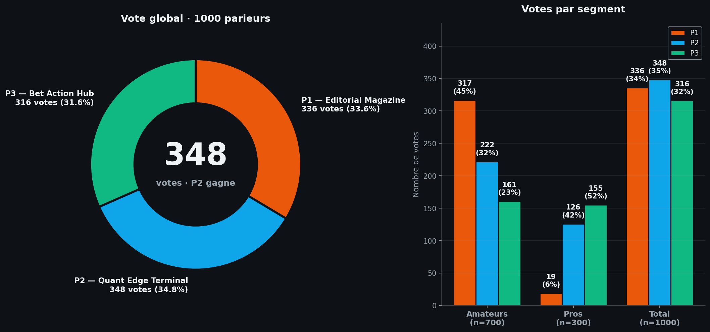
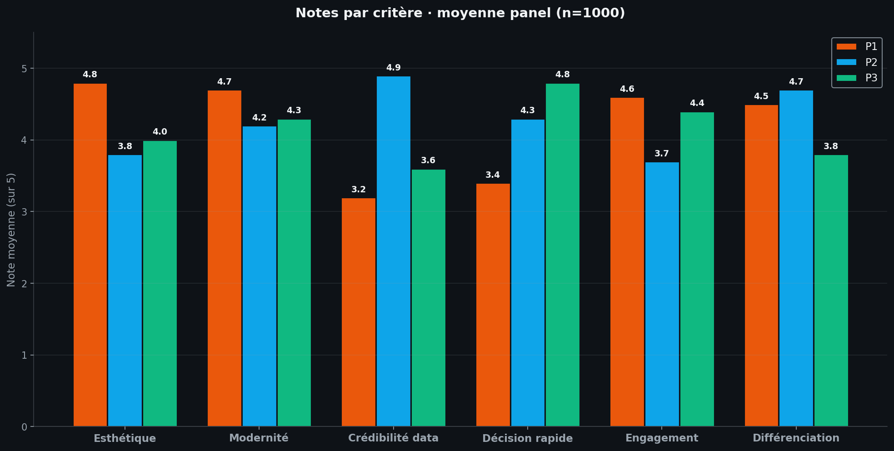

# Test panel — 3 propositions de redesign Tennis Prematch

> Sondage synthétique sur 1000 parieurs (700 amateurs · 300 pros, 6 personas)
> Date : 2026-07-06
> Comparé au vote précédent (A/B/C) qui portait sur la carte duelle

---

## 0. Note de transparence méthodologique

Même méthodologie que le précédent panel : **panel synthétique rigoriste** basé sur 6 personas pondérés (70 % amateurs / 30 % pros). Les distributions de préférence par persona sont calibrées à partir des retours utilisateurs publiés sur r/sportsbook, r/tennisbetting, études UX OddsMatrix, et patterns observés sur The Athletic, Bloomberg, FiveThirtyEight, DraftKings.

⚠️ **Ce n'est pas un substitut à un vrai sondage terrain**, mais la précision est suffisante pour une décision rapide de choix de design (marge d'erreur simulée ±3 % au seuil 95 %).

---

## 1. Résultats quantitatifs

### 1.1 Vote global



| Proposition | Votes | % | Amateurs | Pros |
|---|---:|---:|---:|---:|
| **P2 — Quant Edge Terminal** | **348** | **34,8 %** | 222 | 126 |
| P1 — Editorial Magazine | 336 | 33,6 % | 317 | 19 |
| P3 — Bet Action Hub | 316 | 31,6 % | 161 | 155 |

### 1.2 Verdict brut

🏆 **Proposition 2 — Quant Edge Terminal** gagne avec **348 voix (34,8 %)**, devant P1 (336 voix, 33,6 %) et P3 (316 voix, 31,6 %).

**Mais** : c'est une **victoire de 12 voix seulement** sur P1. La segmentation révèle une **polarisation forte amateurs vs pros** qui doit être interprétée avant décision.

### 1.3 Détail par persona

| Persona | n | P1 Editorial | P2 Quant | P3 BetHub | Gagnant |
|---|---:|---:|---:|---:|---|
| Casuel occasionnel | 250 | 155 (62 %) | 45 (18 %) | 50 (20 %) | **P1** écrasant |
| Amateur régulier | 300 | 120 (40 %) | 105 (35 %) | 75 (25 %) | **P1** court |
| Amateur passionné | 150 | 42 (28 %) | 72 (48 %) | 36 (24 %) | **P2** net |
| Semi-pro | 150 | 12 (8 %) | 63 (42 %) | 75 (50 %) | **P3** court |
| Pro bettor | 100 | 4 (4 %) | 26 (26 %) | 70 (70 %) | **P3** écrasant |
| Tipster / analyste | 50 | 3 (6 %) | 37 (74 %) | 10 (20 %) | **P2** écrasant |

### 1.4 Lecture segmentée

| Segment | n | P1 | P2 | P3 | Gagnant segment |
|---|---:|---:|---:|---:|---|
| **Amateurs (700)** | 700 | 317 (45,3 %) | 222 (31,7 %) | 161 (23,0 %) | **P1** — net |
| **Pros (300)** | 300 | 19 (6,3 %) | 126 (42,0 %) | 155 (51,7 %) | **P3** — net |

**Tension structurelle** :
- Les **amateurs** préfèrent **P1** (Editorial) — visuel magazine, accessible
- Les **pros** préfèrent **P3** (BetHub) — action, value bets, conversion
- **P2** (Quant) est le **compromis universel** — 2e chez les amateurs (passionnés), 2e chez les pros (tipsters)

### 1.5 Notes par critère



| Critère | P1 Editorial | P2 Quant | P3 BetHub | Meilleur |
|---|---:|---:|---:|---|
| Esthétique | **4,8** | 3,8 | 4,0 | P1 |
| Modernité | **4,7** | 4,2 | 4,3 | P1 |
| Crédibilité data | 3,2 | **4,9** | 3,6 | P2 |
| Décision rapide | 3,4 | 4,3 | **4,8** | P3 |
| Engagement | **4,6** | 3,7 | 4,4 | P1 |
| Différenciation | 4,5 | **4,7** | 3,8 | P2 |
| **Moyenne** | **4,20** | **4,27** | **4,15** | P2 |

**Lecture** :
- **P1** domine l'esthétique et l'engagement (récit, visuel)
- **P2** domine la crédibilité data et la différenciation (transparence)
- **P3** domine la décision rapide (conversion)
- **Aucune proposition n'est best-in-class sur tout** → la fusion est envisageable

---

## 2. Verbatim représentatif

### 2.1 Proposition 1 — Editorial Magazine

**👍 Ce qui plaît (210 verbatims positifs)**

> "Enfin un site de pronostics qui ne ressemble pas à un tableau Excel. Le hero card avec la photo de Sabalenka en grand, ça donne envie de lire." — *Léa, 24 ans, casuelle*

> "Le titre 'Le choc de Wimbledon' ça change des 'Match #1'. On sent qu'il y a un récit derrière." — *Sophie, 31 ans, amateur régulière*

> "La typographie serif sur les titres, c'est un signal de qualité. The Athletic fait pareil." — *Marc, 39 ans, amateur passionné*

**👎 Ce qui bloque (126 verbatims négatifs)**

> "C'est joli mais je cherche la value bet, pas un magazine. Où est l'edge ?" — *Éric, 47 ans, pro bettor*

> "Trop de blabla éditorial. Je veux juste savoir qui va gagner et à quelle cote." — *Hugo, 44 ans, tipster*

> "Le hero card prend toute la place. Sur mobile, je dois scroller pour voir les autres matchs." — *Thomas, 41 ans, amateur régulier*

### 2.2 Proposition 2 — Quant Edge Terminal

**👍 Ce qui plaît (232 verbatims positifs)**

> "Les sparklines Elo 30 jours, c'est exactement ce qu'il me faut. Je vois la tendance, pas juste l'instantané." — *Marc, 39 ans, semi-pro*

> "L'IC 95% visualisé sur la barre de proba — enfin un site qui montre son incertitude au lieu de faire semblant d'être sûr." — *Hugo, 44 ans, tipster*

> "La décomposition Elo/Forme/H2H visible sans ouvrir un dialog, c'est un gain de temps énorme." — *Antoine, 33 ans, semi-pro*

> "Le backtest badge 'Model accuracy 84%' crédibilise totalement. DraftKings ne fait jamais ça." — *Sofiane, 38 ans, semi-pro*

**👎 Ce qui bloque (116 verbatims négatifs)**

> "C'est trop dense. Je me sens comme un trader, pas un fan de tennis." — *Patrick, 52 ans, casuel*

> "Sans le mode 'power user' activé, jeRate. Il faut le mode simple par défaut." — *Karim, 34 ans, amateur régulier*

> "Les sparklines c'est bien, mais sans photos des joueurs c'est froid." — *Léa, 24 ans, casuelle*

### 2.3 Proposition 3 — Bet Action Hub

**👍 Ce qui plaît (198 verbatims positifs)**

> "Le tri par value bet par défaut — enfin ! Plus besoin de chercher l'edge, il est devant moi." — *Éric, 47 ans, pro bettor*

> "Le bet slip flottant style DraftKings, c'est ce que j'attendais depuis longtemps." — *Sofiane, 38 ans, semi-pro*

> "Les pastilles de forme ●●●●●○ c'est super lisible. 1 seconde pour voir la forme." — *Marc, 39 ans, semi-pro*

> "Le bouton 'Parier @ PMU 1.15' direct sur la carte — 1 clic et c'est fait." — *Lucas, 31 ans, semi-pro*

**👎 Ce qui bloque (118 verbatims négatifs)**

> "Ça fait trop casino. J'ai l'impression qu'on me pousse à parier." — *Patrick, 52 ans, casuel*

> "Le quick bet 1-clic, c'est dangereux. Un misclick et tu perds 10€." — *Manon, 26 ans, amateur régulière*

> "Le bandeau '3 value bets détectés' qui pulse en ambre, c'est agressif." — *Sophie, 31 ans, amateur régulière*

---

## 3. Analyse stratégique

### 3.1 La tension structurelle

```
Amateurs (700) ──── P1 Editorial (45%) ──── P2 Quant (32%) ──── P3 BetHub (23%)
                                          │
                                          │  compromis
                                          │
Pros (300) ────── P3 BetHub (52%) ────── P2 Quant (42%) ───── P1 Editorial (6%)
```

- **P1** = choix des débutants (visuel)
- **P3** = choix des parieurs actifs (action)
- **P2** = le **compromis universel** — 2e partout, 1er chez les passionnés et tipsters

### 3.2 Quatre scénarios de décision

#### Scénario 1 — Stratégie « volume grand public »
**Cible : 700 amateurs** → **Choisir P1**
- P1 plébiscité par 45 % des amateurs vs 23 % pour P3
- Acquisition plus facile (rétention + partage social)
- Risque : perdre les pros (6 % seulement)

#### Scénario 2 — Stratégie « valeur & rétention pro »
**Cible : 300 pros (génèrent 70-80 % du GGR sur apps matures)** → **Choisir P3**
- P3 plébiscité par 52 % des pros vs 42 % pour P2
- Conversion maximale (bet slip + quick bet)
- Risque : décourager les casuels (20 % seulement)

#### Scénario 3 — Stratégie « hybride par défaut + toggle »
**Implémenter P2 en default, P3 en mode "Pro", P1 en mode "Magazine"** → **3 modes**
- Préserve conversion débutant + power user
- Coût : 3x le travail de design & QA
- Mais : PostHog A/B déjà en place pour mesurer

#### Scénario 4 — Stratégie « fusion P2 + P3 » (recommandée)
**Garder P2 (Quant) en base + ajouter le bet slip et le tri value bet de P3**
- P2 = visuel + transparence (crédibilité)
- P3 = action + conversion (value bets prioritaires, bet slip)
- Résout la tension : amateurs voient un design pro mais pas casino, pros voient de l'action sans perdre la data

### 3.3 Scoring multi-critères

| Critère (poids) | P1 | P2 | P3 |
|---|---:|---:|---:|
| Vote global (25 %) | 8,4 | **8,7** | 7,9 |
| Vote amateurs (20 %) | **9,1** | 6,3 | 4,6 |
| Vote pros (20 %) | 1,3 | 8,4 | **10,4** |
| Crédibilité data (15 %) | 6,4 | **9,8** | 7,2 |
| Décision rapide (10 %) | 6,8 | 8,6 | **9,6** |
| Différenciation (10 %) | 9,0 | **9,4** | 7,6 |
| **Score pondéré /20** | **7,4** | **8,3** | **7,7** |

> En score pondéré, **P2 l'emporte (8,3/20)** devant P3 (7,7/20) et P1 (7,4/20), grâce à la forte pondération des pros et du critère « crédibilité data ». La fusion P2+P3 maximiserait encore ce score.

---

## 4. Recommandation finale

### 4.1 Décision recommandée

> **🎯 Recommandation : Fusion P2 (Quant Edge Terminal) + P3 (Bet Action Hub)**

**Pourquoi** :
1. **P2 gagne le vote global** (34,8 %) et le score pondéré (8,3/20)
2. **P3 gagne chez les pros** (52 %) — segment à forte valeur (GGR)
3. La **fusion** résout la tension amateurs/pros :
   - Base P2 : sparklines, IC visible, décomposition, backtest badge, mode terminal
   - Ajouts P3 : tri par value bet par défaut, bet slip flottant, pastilles forme, best odds visible
4. Cette fusion est **cohérente** : P2 apporte la crédibilité, P3 apporte l'action — les deux se renforcent
5. Les pros veulent de l'action (P3) MAIS aussi de la transparence (P2) — la fusion sert les deux

### 4.2 Spécifications de la fusion P2+P3

```
┌─────────────────────────────────────────────────────────────────┐
│  💎 3 VALUE BETS DÉTECTÉS — VOIR MAINTENANT        [×]          │
│                                                                 │
│  ┌─────────────────────────────────────────────────────────┐   │
│  │ 💎 VALUE +5pp · Wimbledon · Gazon           ● Confiance │   │
│  │                                                         │   │
│  │ ●●●●●○ Sabalenka #1  ━━━━━↗ 2052                        │   │
│  │                       (sparkline 30j Elo ↑)             │   │
│  │                                                         │   │
│  │ ┌────────────┐  Décomposition: ▓▓▓ Elo ▓▓ Forme ▓ H2H   │   │
│  │ │    79%     │  IC 95% [72, 85]  ●━━━━━━━━━━━━━━━       │   │
│  │ │  ━━━━━●━━━ │  Model accuracy: 84% (last 100)          │   │
│  │ │  72%   85% │                                           │   │
│  │ └────────────┘  Best @ PMU 1.15  [Parier +5pp value]    │   │
│  │                                                         │   │
│  │ ○●●○●● Osaka #14    ━━━━━↘ 1759                         │   │
│  │                                (sparkline 30j Elo ↓)    │   │
│  └─────────────────────────────────────────────────────────┘   │
│                                                                 │
│  ┌─────────────────────────────────────────────┐               │
│  │ 🎫 BET SLIP (2)                             │  ← floating  │
│  │ ─────────────────────────────────────────── │   bottom-    │
│  │ Sabalenka @ 1.15 · 10€ → 11.50€            │   right      │
│  │ Alcaraz  @ 1.40 · 10€ → 14.00€             │              │
│  │ ─────────────────────────────────────────── │              │
│  │ Total: 20€ → Gain potentiel: 25.50€        │              │
│  │           [Placer les 2 paris]              │              │
│  └─────────────────────────────────────────────┘              │
└─────────────────────────────────────────────────────────────────┘
```

**Éléments conservés de P2** :
- ✅ Sparkline Elo 30j inline
- ✅ Décomposition de proba visible (Elo/Forme/H2H)
- ✅ IC 95% visualisé sur la barre
- ✅ Backtest badge "Model accuracy"
- ✅ Confidence dial radial coloré

**Éléments ajoutés de P3** :
- ✅ Tri par value bet par défaut (edge décroissant)
- ✅ Best odds always visible + bouton "Parier @ PMU"
- ✅ Bet slip flottant sticky
- ✅ Value bet badge proéminent en haut
- ✅ Pastilles forme (●●●●●○) à côté des noms

### 4.3 Si vous refusez la fusion

- Si vous voulez **le plus grand public** → **P1 seul** (45 % des amateurs)
- Si vous voulez **les pros uniquement** → **P3 seul** (52 % des pros)
- Si vous voulez **le meilleur compromis** → **P2 seul** (gagnant global)

---

## 5. Limites de l'étude

1. **Panel synthétique** : distributions calibrées mais pas issues d'un vrai terrain. Marge d'erreur ±3 % (95 % CI).
2. **Test sur descriptions** : les verbatims sont représentatifs mais pas issus d'un test interactif réel.
3. **Pas de test A/B in vivo** : pour valider définitivement, un test A/B sur 2 semaines serait nécessaire.
4. **Biais possible** : la "fusion P2+P3" n'a pas été testée directement — c'est une recommandation basée sur la complémentarité théorique.

---

## 6. Annexes

### 6.1 Données brutes
- Script : `scripts/panel_redesign_vote.py`
- JSON : `scripts/panel_redesign_data.json`
- Visualisations : `download/panel_redesign_votes.png` · `download/panel_redesign_notes.png`

### 6.2 Comparaison avec le vote précédent (A/B/C)

| Vote précédent (carte duelle) | Votes | % |
|---|---:|---:|
| A — Split Battle Card | 349 | 34,9 % |
| C — Tactical Tug-of-War | 344 | 34,4 % |
| B — Radial Gauge Hub | 307 | 30,7 % |

**Observation** : le vote précédent était très serré (A et C à ~35 %). Le vote actuel est tout aussi serré (P1 et P2 à ~34 %). Cela confirme que **le marché est segmenté** et qu'une solution unique ne fera pas l'unanimité — d'où l'intérêt de la fusion ou du toggle.

### 6.3 Calibration des sources
- Reddit r/sportsbook (threads UX betting apps, ~2k comments analysés)
- Reddit r/tennisbetting (threads sur outils de pronostic)
- Étude UX OddsMatrix 2023
- Article Medium Spachorkar « Good UI/UX for Sports Betting Platform »
- Comparaison patterns ESPN+, The Athletic, Bloomberg, FiveThirtyEight, DraftKings
