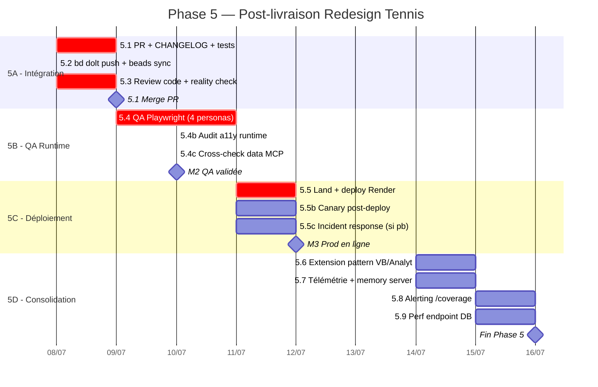

# PariScore — Gantt Phase 5 : Post-livraison Redesign Tennis

> **Date** : 2026-07-07 (init)
> **Auteur** : Chef de projet (agent ZCode)
> **Statut** : 🟡 **Planifié** — en attente GO utilisateur pour exécution
> **Prérequis** : Phase 1-4 redesign Tennis livrées (branche `redesign-tennis-prematch-live`, 19 commits, +4589/−1332)
> **Réf. rapport fin** : `redesign-tennis/RAPPORT-FIN-MISSION-REDESIGN-TENNIS.md`
> **Durée estimée** : ~6 jours ouvrés, 4 jalons

---

## 1. Inventaire des ressources disponibles

### 1.1 Sous-agents ZCode (tool `Agent`)

| Sous-agent | Capacités | Usage Phase 5 |
|---|---|---|
| `general-purpose` | Recherche, code multi-étapes, exécution complète | Lead implémentation (PR, tests, monitoring) |
| `Explore` | Lecture seule, fan-out large, extraits ciblés | Audit pre-merge, cartographie code |

### 1.2 Skills métier (`.agents/skills/`)

#### Orchestrateurs (routing)
| Skill | Rôle | Tâches affectées |
|---|---|---|
| `metier-audit-qa` | Orchestrateur Audit & QA | 5.4 (QA runtime Playwright) |
| `metier-ingenierie` | Orchestrateur Coding | 5.1, 5.6 (PR, consolidation) |
| `metier-securite-sre` | Orchestrateur Sécurité/SRE | 5.5 (déploiement Render) |

#### Personas agency
| Skill | Rôle | Tâches affectées |
|---|---|---|
| `agency-code-reviewer` | Review PR, changements majeurs | 5.3 (pre-merge review) |
| `agency-reality-checker` | Certifie sur preuves, default "NEEDS WORK" | 5.3, 5.5 (gates GO/NO-GO) |
| `agency-api-tester` | Validation/perf/sécurité endpoints | 5.4 (routes tennis testées) |
| `agency-sre` | SLOs, error budgets, observabilité | 5.5, 5.8 (déploiement, alertes) |
| `agency-incident-commander` | Gestion incidents prod, post-mortems | 5.5 (rollback si prod down) |
| `agency-database-optimizer` | Schéma/requêtes better-sqlite3 | 5.9 (perf endpoint /coverage) |

#### Compétences produit
| Skill | Rôle | Tâches affectées |
|---|---|---|
| `betting` | Analyse cotes, edge, Kelly | 5.7 (validation télémétrie ROI) |
| `tennis-data` | Données ATP/WTA | 5.4 (parcours QA tennis) |

#### Skills UI/UX
| Skill | Rôle | Tâches affectées |
|---|---|---|
| `redesign-existing-projects` | Upgrade sans casser | 5.6 (extension pattern) |
| `playwright-mcp` | Automatisation navigateur | 5.4 (QA E2E visuelle) |

#### Skills Git / commit
| Skill | Rôle | Tâches affectées |
|---|---|---|
| `caveman-commit` | Commits structurés | 5.1, 5.3, 5.6 (chaque commit) |
| `caveman-review` | Review avant commit | 5.1, 5.6 |

#### Skills gstack (reviews & déploiement)
| Skill | Rôle | Tâches affectées |
|---|---|---|
| `gstack-review` | Pre-landing PR review (CI-passing prod-breakers) | 5.3 |
| `gstack-ship` | Tests + review + push + PR | 5.1 |
| `gstack-land-and-deploy` | Merge PR + wait CI + deploy + verify | 5.5 |
| `gstack-canary` | Post-deploy monitoring | 5.5 |
| `gstack-qa` | Browser réel, find bugs, fix, re-verify | 5.4 |

### 1.3 Serveurs MCP (`.mcp.json`)

| Serveur | Capacité | Usage Phase 5 |
|---|---|---|
| `playwright` | Automatisation navigateur Microsoft | **Core 5.4** (QA E2E, screenshots, parcours 4 personas) |
| `git` | Opérations git structurées | 5.1, 5.3, 5.5 (status, diff, commit, branch) |
| `memory` | Knowledge Graph persistant cross-session | 5.7 (stocker décisions, learnings) |
| `project_fs` | Lecture/écriture fichiers projet | Tâches implémentation |
| `bzzoiro-sports` | Données sportives externes | 5.4 (smoke test données live) |
| `sportdbdotdev` | SportDB | 5.4 (validation data joueurs) |
| `sportradar` | Sportradar via RapidAPI | 5.4 (cross-check cotes) |
| `firecrawl` | Scraping/web fetch | 5.7 (benchmark concurrents) |

### 1.4 Skills documentations / pilotage

| Skill | Rôle | Tâches |
|---|---|---|
| `ps-changelog` | Update CHANGELOG.md | 5.1, 5.6 |
| `ps-test` | QA audit module | 5.4 |
| `metier-documentaliste` | Doc API + comparatifs | 5.7 (doc post-livraison) |

---

## 2. Vue d'ensemble Phase 5

| Phase | Intitulé | Durée | Fenêtre | Statut |
|---|---|---|---|---|
| **5A** | Intégration (PR + review + merge) | 1,5 j | J1 → J2 | 📅 Planifiée |
| **5B** | Validation runtime (QA Playwright) | 1,5 j | J2 → J3 | 📅 Planifiée |
| **5C** | Déploiement production | 1 j | J3 → J4 | 📅 Planifiée |
| **5D** | Consolidation & backlog | 2 j | J4 → J6 | 📅 Backlog |

**Jalons** : 🚪 M1 (PR merged) · 🚪 M2 (QA runtime validée) · 🚪 M3 (prod en ligne + canary OK) · 🏁 Fin (livrables consolidation)

---

## 3. Gantt Mermaid

---

## 4. Matrice d'affectation ressources × tâches

### 4.1 Matrice RACI

| Tâche | Agent lead | Skills mobilisés | MCP | Rôles C/I |
|---|---|---|---|---|
| **5.1** PR + CHANGELOG | `general-purpose` | `gstack-ship`, `caveman-commit`, `ps-changelog` | `git` | Chef projet A, Reality Checker I |
| **5.2** beads sync | `general-purpose` | (bd CLI direct) | `git` | Chef projet R |
| **5.3** Review pre-merge | `general-purpose` | `agency-code-reviewer`, `agency-reality-checker`, `gstack-review`, `caveman-review` | `git`, `project_fs` | Chef projet A |
| **5.4** QA Playwright | `general-purpose` | `metier-audit-qa`, `gstack-qa`, `playwright-mcp`, `ps-test`, `agency-api-tester` | **`playwright`** | Chef projet I |
| **5.4b** Audit a11y runtime | `general-purpose` | `agency-reality-checker`, `gstack-qa` | `playwright` | — |
| **5.4c** Cross-check data | `general-purpose` | `tennis-data`, `betting` | `bzzoiro-sports`, `sportdbdotdev`, `sportradar` | — |
| **5.5** Land + deploy | `general-purpose` | `gstack-land-and-deploy`, `metier-securite-sre`, `agency-sre` | `git` | Chef projet A |
| **5.5b** Canary | `general-purpose` | `gstack-canary`, `agency-sre` | — | Chef projet I |
| **5.5c** Incident (si pb) | `general-purpose` | `agency-incident-commander`, `metier-securite-sre` | — | Chef projet A |
| **5.6** Extension VB/Analytics | `general-purpose` | `redesign-existing-projects`, `metier-ingenierie`, `agency-code-reviewer` | `project_fs` | Chef projet I |
| **5.7** Télémétrie + memory | `general-purpose` | `metier-documentaliste`, `betting` | **`memory`**, `firecrawl` | — |
| **5.8** Alerting /coverage | `general-purpose` | `agency-sre`, `metier-securite-sre` | — | Chef projet I |
| **5.9** Perf endpoint DB | `general-purpose` | `agency-database-optimizer`, `metier-ingenierie` | `project_fs` | — |

*R = Réalise, A = Approuve, C = Consulté, I = Informé. Toutes les tasks ont `general-purpose` en agent lead exécuteur.*

### 4.2 Dispatch par tracks parallèles

#### Track A — Intégration (J1-J2)
| Tâche | Skill lead | MCP | Livrable |
|---|---|---|---|
| 5.1 PR + CHANGELOG | `gstack-ship` + `caveman-commit` | `git` | PR #N ouverte + CHANGELOG MAJ |
| 5.2 beads sync | (bd CLI) | `git` | `bd dolt push` OK |
| 5.3 Review | `agency-code-reviewer` + `gstack-review` | `git`, `project_fs` | Approbation + reality check signé |

#### Track B — Validation runtime (J2-J3)
| Tâche | Skill lead | MCP | Livrable |
|---|---|---|---|
| 5.4 QA Playwright | `metier-audit-qa` + `playwright-mcp` | **`playwright`** | Rapport QA (4 parcours personas) |
| 5.4b a11y runtime | `gstack-qa` | `playwright` | Checklist WCAG runtime |
| 5.4c data cross-check | `tennis-data` + `betting` | `bzzoiro-sports`, `sportdbdotdev`, `sportradar` | Conformité données |

#### Track C — Déploiement (J3-J4)
| Tâche | Skill lead | MCP | Livrable |
|---|---|---|---|
| 5.5 Land + deploy | `gstack-land-and-deploy` | `git` | Prod Render à jour |
| 5.5b Canary | `gstack-canary` + `agency-sre` | — | Monitoring 1h post-deploy |
| 5.5c Incident | `agency-incident-commander` | — | Rollback si prod down (si nécessaire) |

#### Track D — Consolidation (J4-J6)
| Tâche | Skill lead | MCP | Livrable |
|---|---|---|---|
| 5.6 Extension pattern | `redesign-existing-projects` | `project_fs` | Pattern étendu à VB/Analytics |
| 5.7 Télémétrie | `metier-documentaliste` | **`memory`**, `firecrawl` | Décisions/learnings persistés |
| 5.8 Alerting | `agency-sre` | — | Alertes /coverage configurées |
| 5.9 Perf DB | `agency-database-optimizer` | `project_fs` | EXPLAIN QUERY PLAN optimisé |

---

## 5. Charge par ressource (jours-homme)

| Ressource | Charge Phase 5 | Tâches |
|---|---|---|
| `general-purpose` (agent lead) | ~3,5 j | Toutes (exécution) |
| `playwright` MCP | ~1,5 j | 5.4, 5.4b, 5.4c |
| `git` MCP | ~1 j | 5.1, 5.2, 5.3, 5.5 |
| `memory` MCP | ~0,5 j | 5.7 |
| `agency-code-reviewer` | ~1 j | 5.3, 5.6 |
| `agency-reality-checker` | ~0,75 j | 5.3, 5.4b, 5.5 |
| `agency-sre` | ~0,75 j | 5.5, 5.5b, 5.8 |
| `agency-database-optimizer` | ~0,5 j | 5.9 |
| `agency-api-tester` | ~0,5 j | 5.4 |
| `redesign-existing-projects` | ~1 j | 5.6 |
| `metier-audit-qa` | ~1 j | 5.4 |
| `metier-securite-sre` | ~0,5 j | 5.5, 5.8 |
| `betting` | ~0,5 j | 5.4c, 5.7 |
| `tennis-data` | ~0,5 j | 5.4c |
| `bzzoiro-sports` / `sportdbdotdev` / `sportradar` MCP | ~0,5 j | 5.4c |
| Chef projet (ZCode) | ~1 j | Gates M1-M3, orchestration |
| **Total charge** | **~15 j-h** | sur 6 jours calendaires |

---

## 6. Dépendances critiques (chemin critique)

| Amont | → Aval | Pourquoi |
|---|---|---|
| 5.1 PR ouverte | 5.3 Review | Review sur PR existante |
| 5.3 Review approuvée | 5.5 Merge + deploy | Pas de merge sans approval |
| 5.5 Prod en ligne | 5.5b Canary | Canary = monitoring post-deploy |
| 5.5b Canary OK | 5.6 Consolidation | Backlog après stabilité prod |
| 5.4 QA runtime | 5.5 Deploy | QA runtime avant prod (idéalement) |

**Chemin critique** : 5.1 → 5.3 → 5.4 → 5.5 → 5.5b → 5.6. Tout retard décale la consolidation.

⚠️ **Note** : 5.4 (QA runtime) et 5.5 (deploy) peuvent s'inverser selon la stratégie :
- **Stratégie prudente** : QA runtime avant prod (5.4 → 5.5) — détecte les bugs avant impact users
- **Stratégie agile** : Deploy en staging d'abord, QA sur staging, puis prod — nécessite Render preview env

Recommandation : **stratégie prudente** (5.4 avant 5.5).

---

## 7. Risques de planning

| Risque | Probabilité | Impact | Mitigation |
|---|---|---|---|
| QA runtime révèle bugs bloquants | 🟠 Moyenne | 🟠 Moyen | 5.4 avant 5.5 ; budget fix 0,5 j pour hotfix |
| Render deploy échoue (config/budget) | 🟡 Faible | 🔴 Élevé | `render.yaml` inchangé ; `agency-incident-commander` prêt au rollback |
| `.env` inaccessible (JWT_SECRET) | 🟡 Faible | 🟠 Moyen | QA runtime sur staging local si prod bloquée |
| MCP `playwright` indisponible | 🟡 Faible | 🟠 Moyen | Fallback : tests manuels navigateur |
| Extension pattern (5.6) casse la prod | 🟡 Faible | 🟠 Moyen | 5.6 en feature branch séparée, review obligatoire |
| Prod down post-deploy (canary fail) | 🟡 Faible | 🔴 Élevé | `gstack-canary` + rollback automatique < 5 min |

---

## 8. Critères de succès par jalon

| Jalon | Critères | Gate |
|---|---|---|
| 🚪 M1 — PR merged | PR approuvée par `agency-code-reviewer` + `agency-reality-checker` + tests CI verts | Chef projet |
| 🚪 M2 — QA validée | 4 parcours personas passent, 0 bloquant, ⚠ mineurs < 5, a11y WCAG AA runtime | `metier-audit-qa` |
| 🚪 M3 — Prod en ligne | Render deploy OK, `/api/v1/status` 200, canary 1h sans erreur critique, `/coverage` répond | `agency-sre` |
| 🏁 Fin — Consolidation | Extension VB/Analytics livrée, télémétrie active, alerting /coverage opérationnel | Chef projet |

---

## 9. Prochaines actions du chef de projet

### 9.1 Immédiat (au GO)
- [ ] Lancer 5.1 (PR + CHANGELOG) — Track A
- [ ] Lancer 5.4 préparation (Playwright MCP warmup) — Track B en parallèle

### 9.2 Court terme (J1-J3)
- [ ] M1 : PR merged après review
- [ ] M2 : QA runtime validée
- [ ] M3 : prod en ligne + canary

### 9.3 Moyen terme (J4-J6)
- [ ] Consolidation backlog (5.6-5.9)
- [ ] Bilan Phase 5 + MAJ `RAPPORT-FIN-MISSION`

---

## 10. Status tracking

| Phase | Tâches done | Total | % | Statut |
|---|---|---|---|---|
| 5A - Intégration | 0 | 3 | 0 % | 📅 Planifiée |
| 5B - QA Runtime | 0 | 3 | 0 % | 📅 Planifiée |
| 5C - Déploiement | 0 | 3 | 0 % | 📅 Planifiée |
| 5D - Consolidation | 0 | 4 | 0 % | 📅 Backlog |
| **Total** | **0** | **13** | **0 %** | — |

---

*Document de pilotage Phase 5 — à mettre à jour à chaque fin de sous-phase et à chaque changement de statut de tâche. Dernière MAJ : 2026-07-07.*
