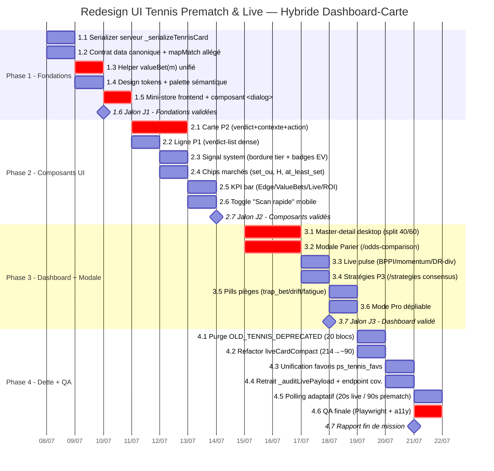

# PariScore — Gantt Redesign UI Tennis « Prematch & Live »

> **Date** : 2026-07-07 (init)
> **Auteur** : Chef de projet (agent ZCode)
> **Décision validée** : Hybride Dashboard-Carte (panel 1000 votants : P2 40,7 % · P3 34,8 % · P1 24,5 %)
> **Statut** : 🟡 **Planifié** — en attente GO utilisateur pour exécution Phase 1
> **Réf. design** : `redesign-tennis/DESIGN-DOC-REDESIGN-TENNIS.md`
> **Réf. source** : Cartes `premierCard` (`pariscore.html:25811`) · `liveCardCompact` (`pariscore.html:26066`)

---

## 1. Vue d'ensemble

| Phase | Intitulé | Durée estim. | Fenêtre calendaire | Statut |
|---|---|---|---|---|
| **Phase 0** | Cadrage & Design (terminé) | 2 j | 2026-07-05 → 07 | ✅ Terminée (cadrage, 4 expertises, vote 1000, design doc) |
| **Phase 1** | Fondations backend + Design system | 3 j | J+1 → J+3 | ⏳ Planifiée |
| **Phase 2** | Composants UI (carte P2 + liste P1) | 4 j | J+3 → J+7 | 📅 Planifiée |
| **Phase 3** | Master-detail desktop + Modale Parier + Live pulse | 4 j | J+7 → J+11 | 📅 Planifiée |
| **Phase 4** | Refactor dette + câblage routes dormantes + QA | 3 j | J+11 → J+14 | 📅 Backlog |

**Durée totale chantier** : ~14 jours ouvrés (Phases 1-4), 3 jalons de validation.

---

## 2. Gantt Mermaid

---

## 3. Dépendances critiques (chemin critique)

| Tâche amont | → Tâche aval | Pourquoi |
|---|---|---|
| 1.1 Serializer | 1.2 Contrat canonique | Le contrat fixe les types avant l'enrichissement |
| 1.3 `valueBet(m)` | 2.1 Carte P2 + 2.2 Ligne P1 | Les composants consomment le helper unifié |
| 1.5 Mini-store + `<dialog>` | 3.1 Master-detail + 3.2 Modale Parier | Le master-detail et la modale nécessitent un state partagé + dialog natif |
| 2.1 Carte P2 | 3.1 Master-detail | La carte P2 est réutilisée dans le panneau détail |
| 3.1 + 3.2 | 4.6 QA finale | Les features critiques doivent être en place avant QA |

**Chemin critique** : 1.3 → 2.1 → 3.1 → 3.2 → 4.6 → 4.7. Tout retard sur ces tâches décale la livraison finale.

---

## 4. Affectation des ressources

### Matrice RACI

| Phase / Tâche | Backend Architect | Webdesigner | Data Scientist | Data Engineer | Expert Paris | QA / Reality Checker | Chef de projet |
|---|---|---|---|---|---|---|---|
| 1.1-1.2 Contrat/serializer | **R** | C | C | **A** | I | I | I |
| 1.3 `valueBet(m)` | C | I | **R** | **A** | C | I | I |
| 1.4 Design tokens | I | **R/A** | I | I | C | I | C |
| 1.5 Mini-store + dialog | **A** | C | I | **R** | I | C | I |
| 2.1-2.6 Composants UI | C | **R/A** | C | I | C | I | C |
| 3.1 Master-detail | **A** | **R** | I | **R** | I | C | I |
| 3.2 Modale Parier | **A** | **R** | C | C | C | I | I |
| 3.3-3.6 Live/strat/pills/pro | C | **R/A** | C | C | C | I | I |
| 4.1-4.5 Refactor dette | **R/A** | C | C | **R** | I | C | I |
| 4.6 QA finale | C | C | I | C | C | **R/A** | I |

*R = Réalise, A = Approuve, C = Consulté, I = Informé.*

### Charge par rôle (jours-homme)

| Rôle | Charge estimée | Skills / agents affectés |
|---|---|---|
| Backend Architect | ~3,5 j | `agency-backend-architect`, `metier-ingenierie` |
| Webdesigner | ~6,5 j | `redesign-existing-projects` (lead UI), `ui-ux-pro-max`, `high-end-visual-design`, `frontend-design` |
| Data Scientist | ~1,5 j | (rôle data du brainstorming) |
| Data Engineer | ~4 j | `agency-backend-architect`, `agency-database-optimizer`, `metier-ingenierie` |
| Expert Paris | ~1,5 j | `betting`, `tennis-data` |
| QA / Reality Checker | ~2 j | `metier-audit-qa`, `agency-reality-checker`, `agency-api-tester`, `playwright-mcp` |
| Chef de projet | ~1 j | (orchestration ZCode) |
| **Total** | **~20 j-h** | sur ~14 jours calendaires (3 tracks parallèles) |

---

## 5. Dispatch des agents par tracks parallèles

### Track A — Backend & Data (Data Engineer + Backend Architect)

| Tâche | Agent / skill | Statut | Livrable |
|---|---|---|---|
| 1.1 Serializer `_serializeTennisCard` | `agency-backend-architect` | ⏳ | `server.js` (section tennis) |
| 1.2 Contrat data canonique | `agency-backend-architect` + `agency-database-optimizer` | ⏳ | Doc contrat + `mapMatch` allégé |
| 1.3 Helper `valueBet(m)` | Data Scientist (brainstorm) + `betting` | ⏳ | Helper front partagé |
| 4.4 Retrait `_auditLivePayload` + `/coverage` | `agency-backend-architect` | 📅 | Endpoint admin + logs structurés |
| 4.5 Polling adaptatif | `agency-backend-architect` | 📅 | `TennisScope.startAutoRefresh` modifié |

### Track B — Frontend & UI (Webdesigner + Frontend)

| Tâche | Agent / skill | Statut | Livrable |
|---|---|---|---|
| 1.4 Design tokens | `redesign-existing-projects` + `ui-ux-pro-max` | ⏳ | CSS variables `.sc-*` |
| 1.5 Mini-store + `<dialog>` | `agency-backend-architect` | ⏳ | Module `Scope.store` + dialog natif |
| 2.1-2.6 Composants UI | `redesign-existing-projects` (lead) + `high-end-visual-design` | 📅 | `premierCard` + `liveCard` réécrits |
| 3.1 Master-detail | `redesign-existing-projects` + `frontend-design` | 📅 | Layout split desktop |
| 3.2-3.6 Modale/Live/Strat/Pills/Pro | `redesign-existing-projects` + `betting` (consult) | 📅 | Modale Parier + overlays |
| 4.2 Refactor `liveCardCompact` | `redesign-existing-projects` | 📅 | 214 → ~90 lignes |

### Track C — Dette & QA (Data Engineer + Reality Checker)

| Tâche | Agent / skill | Statut | Livrable |
|---|---|---|---|
| 4.1 Purge `OLD_TENNIS_DEPRECATED` | `metier-ingenierie` + `agency-code-reviewer` | 📅 | Diff CSS (-~22 blocs) |
| 4.3 Unification favoris | `metier-ingenierie` | 📅 | `ps_tennis_favs` source unique |
| 4.6 QA finale | `metier-audit-qa` + `agency-reality-checker` + `playwright-mcp` | 📅 | Rapport QA + validation a11y |

---

## 6. Suivi et gouvernance

- **Cadence** : revue de fin de phase (J1, J2, J3) — le chef de projet clôture chaque jalon après validation QA.
- **Outils** : `bd` (beads) pour le suivi des tâches — chaque tâche du Gantt = 1 ticket beads.
- **Critères de MAJ du Gantt** : statut tâche, % avancement phase, dérive vs chemin critique (alerte si > 0,5 j de dérive sur 1.3, 2.1, 3.1, 3.2).
- **Gate utilisateur** : GO obligatoire après Phase 1 (fondations) et avant QA finale (Phase 4).

---

## 7. Risques de planning

| Risque | Probabilité | Impact | Mitigation |
|---|---|---|---|
| Contrat backend instable (proba parfois 0.65 parfois 65) casse le serializer | 🟠 Moyenne | 🔴 Élevé | Tâche 1.2 stabilise le contrat côté serveur AVANT tout composant |
| Master-detail mobile (bottom-sheet) génère de la dette a11y | 🔴 Élevée | 🔴 Élevé | Tâche 1.5 impose `<dialog>` natif + focus trap dès la fondation ; carte P2 par défaut sur mobile, master-detail desktop-only |
| Refactor `liveCardCompact` (214 lignes) régression silencieuse | 🟠 Moyenne | 🟠 Moyen | Extraction lazy-load incrémentale + screenshot diff à chaque étape |
| Routes dormantes (`/strategies`, `/odds-comparison`) renvoient 404/timeout | 🟠 Moyenne | 🟡 Faible | Modale Parier : timeout 6 s + retry + message "Préparation cotes" |
| Scalabilité carte P2 à 50 matchs (Slams) | 🟡 Faible | 🟠 Moyen | Toggle "Scan rapide" P1 dès Phase 2 ; liste P3 desktop dès Phase 3 |
| Dérive planning chemin critique | 🟡 Faible | 🔴 Élevé | Alertes sur 1.3 / 2.1 / 3.1 / 3.2 ; ré-estimation à chaque jalon |

---

## 8. Prochaines actions du chef de projet

### 8.1 Immédiat
- [ ] Obtenir le **GO utilisateur** sur le présent Gantt + design doc
- [ ] Créer les tickets beads pour chaque tâche (4.1 → 4.7)
- [ ] Affecter les agents Track A (1.1 + 1.2) en premier (chemin critique)

### 8.2 Court terme (Phase 1)
- [ ] Lancer le serializer + contrat canonique (Track A)
- [ ] Lancer design tokens + mini-store (Track B, parallèle)
- [ ] Jalon J1 : validation fondations

### 8.3 Moyen terme (Phases 2-4)
- [ ] Composants UI (Track B) dès J1 validé
- [ ] Master-detail + modale (Track B) dès J2
- [ ] Dette + QA (Track C) en parallèle dès J2
- [ ] Rapport fin de mission au jalon final

---

## 9. Status tracking

| Phase | Tâches done | Total | % | Statut |
|---|---|---|---|---|
| Phase 0 - Cadrage | 6 | 6 | 100 % | ✅ Terminée |
| Phase 1 - Fondations | 0 | 6 | 0 % | ⏳ Planifiée |
| Phase 2 - Composants | 0 | 7 | 0 % | 📅 Planifiée |
| Phase 3 - Dashboard | 0 | 7 | 0 % | 📅 Planifiée |
| Phase 4 - Dette + QA | 0 | 7 | 0 % | 📅 Backlog |
| **Total** | **6** | **32** | **19 %** | — |

---

*Document de pilotage — à mettre à jour à chaque fin de phase et à chaque changement de statut de tâche. Dernière MAJ : 2026-07-07.*
